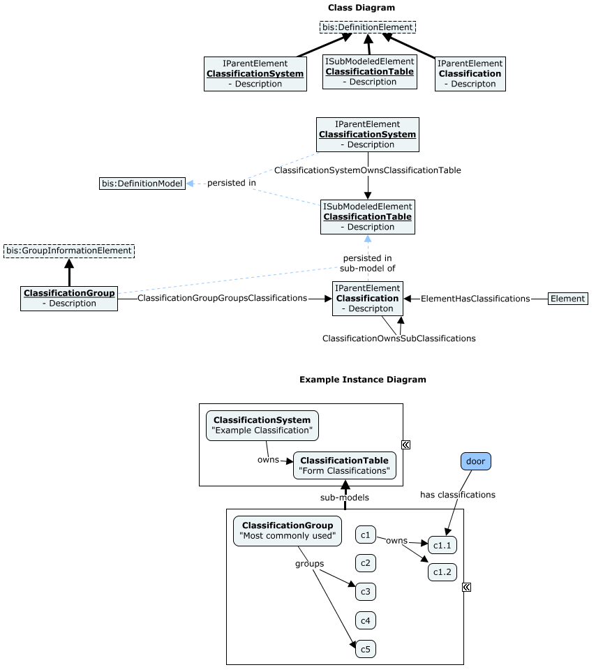

# ClassificationSystems

This schema contains classes for modeling classification systems, which are organized sets of definitions used for classifying or categorizing real-world Objects.

In BIS, a [ClassificationSystem](#classificationsystem) consists of one or more [ClassificationTables](#classificationtable). Each `ClassificationTable` is an `ISubModeledElement` whose sub-model holds [Classifications](#classification). Within the sub-model, the `Classifications` can be arranged in a hierarchy using the [ClassificationOwnsSubClassifications](#classificationownssubclassifications) parent-child relationship and grouped using [ClassificationGroup](#classificationgroup) and [ClassificationGroupGroupsClassifications](#classificationgroupgroupsclassifications).

## ClassificationSystem

`ClassificationSystem` identifies the classification system to which the individual `Classifications` belong.
For well-known and externally defined standards, the name (CodeValue) is typically enough to identify the classification system. A consuming application just needs to create or use an instance with the appropriate name. For these cases, the `ClassificationSystem` class can be used directly.
In other cases where the classification system is custom or not well known, subclassing `ClassificationSystem` might be necessary to identify a particular type of classification system.

See [Overview](#classificationsystems).

- It is recommended to put globally-applicable `ClassificationSystem` elements in the DictionaryModel. However, in cases where classification system is local for some purpose, it is reasonable to put the `ClassificationSystem` element in any other DefinitionModel.
- The Code for all global `ClassificationSystem` elements is expected to have the following components:
  - `CodeSpec.Id` - The Id of the CodeSpec with the name `"clsf:ClassificationSystem"`.
  - `CodeScope.Id` - The root SubjectId for global classification systems. If the classification system is not deemed global, this should be something other than the root SubjectId.
  - `CodeValue` - Should be set to `name + " " + edition`.
- UniClass 2015, UniClass 2018 and OmniClass are examples of classification systems. Organizations may have their own custom classification systems as well.

It is expected that any iModel will not contain all known classification systems. Instead, an iModel will only contain those classification systems that are used by that iModel and possibly only those parts of the classification system hierarchy that are used.

### Mapping to and from IFC

| From BIS    | Condition | To IFC    | Condition |
| ----------- | --------- | --------- | --------- |
| `ClassificationTable` + `ClassificationSystem`  | (none) | `IfcClassification` | (none) |

| From IFC  | Condition | To BIS    | Condition |
| --------- | --------- | --------- | --------- |
| `IfcClassification` | (none) | `ClassificationTable` + `ClassificationSystem` | (none) |

## ClassificationTable

`ClassificationTable` defines a table in a `ClassificationSystem` as defined in the original ClassificationSystem source. A Classification Table represents a division of classification system into classifications for different purposes.

- *OmniClass Construction Entities by Function - Table 11* and *UniClass 2015 En Entities* are examples of classification tables.
- The Code for all `ClassificationTable` elements is expected to have the following components:
  - `CodeSpec.Id` - The Id of the CodeSpec with the name `"clsf:ClassificationTable"`.
  - `CodeScope.Id` - The Id of the owning `ClassificationSystem` which should be the same as the `Parent.Id` property of the `ClassificationTable`.
  - `CodeValue` - The name of the classification table.

A `ClassificationTable` will contain `Classification` and `ClassificationGroup` elements in its sub-model.

See [Overview](#classificationsystems).

### Mapping to and from IFC

| From BIS    | Condition | To IFC    | Condition |
| ----------- | --------- | --------- | --------- |
| `ClassificationTable` + `ClassificationSystem`  | (none) | `IfcClassification` | (none) |

| From IFC  | Condition | To BIS    | Condition |
| --------- | --------- | --------- | --------- |
| `IfcClassification` | (none) | `ClassificationTable` + `ClassificationSystem` | (none) |

## ClassificationGroup

A `ClassificationGroup` is a group of `Classification` elements, as grouped originally in the source classification system. The `Classification` elements are assigned to a group via `ClassificationGroupGroupsClassifications` relationship.

- MasterFormat subdivisions and ASHRAE 62.1 Occupancy Category groupings are examples of classification groups.

A `ClassificationGroup` element is intended to be persisted in a `bis:DefinitionModel` that is the sub-model of the *owning* `ClassificationTable`.

See [Overview](#classificationsystems).

### Mapping to and from IFC

Is not mapped to or from IFC, as the group concept does not exist in IFC

## Classification

A `Classification` element represents one 'class' or 'category' into which the classification system classifies real-world Objects.

`Classification` elements are always persisted in a `bis:DefinitionModel` that is the sub-model of the *owning* `ClassificationTable`.

- OmniClass 11-13 11 11 and UniClass 2015 En_20_10_45 are examples of classifications
- The Code for classifications is expected to have the following components: is required to be in the form of (ClassificationTable.id, ClassificationName, CodeSpecId("Classification"))
  - `CodeSpec.Id` - The Id of the CodeSpec with the name `"clsf:Classification"`.
  - `CodeScope.Id` - The Id of the *parent* Element or *containing* Model which should be one of the following:
    - The Id of the containing `ClassificationTable` for top-level classifications of complex classification systems like OmniClass and UniClass.
    - The Id of the *parent* `Classification` in the case of a sub-classification, unless the classification system requires all sub-classifications to be unique within a table (in which case the Id of the containing `ClassificationTable`)
  - `CodeValue` - The name of the classification.

A `Classification` may specialize another `Classification` element via the `ClassificationOwnsSubClassifications` relationship.

- MasterFormat: 00 31 13 Preliminary Schedules -> 00 31 13.13 Preliminary Project Schedule and OmniClass Table 13: 13-11 00 00 Space Planning Types -> 13-11 11 00 Planned Work Space are examples of classification specialization.

An element may be classified as multiple Classifications through the `ElementHasClassifications` relationship.

See [Overview](#classificationsystems).

### Mapping to and from IFC

| From BIS    | Condition | To IFC    | Condition |
| ----------- | --------- | --------- | --------- |
| `Classification`  | (none) | `IfcClassificationReference` | (none) |

| From IFC  | Condition | To BIS    | Condition |
| --------- | --------- | --------- | --------- |
| `IfcClassificationReference` | (none) | `Classification` | (none) |

## ClassificationSystemOwnsClassificationTable

Following the naming convention, this relationship class should have been named `ClassificationSystemOwnsClassificationTables` (plural), but was released with the a non-compliant name that would be disruptive to change post-release.
