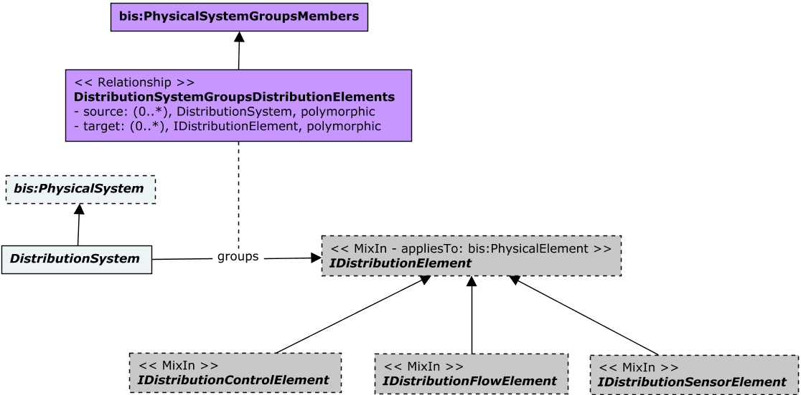

# DistributionSystems

This schema contains classes for physical modeling of distribution systems - networks designed to receive, store, maintain, distribute, or control the flow of a distribution media. The primary goal of this schema, however, is not to model network connectivity but to model physical properties of elements participating in a distribution system and their physical connections or connection points.

A BIS [DistributionSystem](#distributionsystem) consists of [IDistributionElements](#idistributionelement), which can be either [IDistributionFlowElements](#idistributionflowelement) that direct flow, [IDistributionControlElements](#idistributioncontrolelement) that control [IDistributionFlowElements](#idistributionflowelement), or [IDistributionSensorElements](#idistributionsensorelement), which make observations relevant to the [DistributionSystem](#distributionsystem).

A given bis:PhysicalElement can implement more that one of [IDistributionFlowElement](#idistributionflowelement), [IDistributionControlElement](#idistributioncontrolelement), and [IDistributionFlowElement](#idistributionflowelement).

The following class-diagrams depict the main classes and relationships in the DistributionSystems schema:

## Entity Classes

### DistributionSystem

A common example is a heating hot water system that consists of a pump, a tank, and an interconnected piping system for distributing hot water to terminals.

A DistributionSystem groups [DistributionElements](#IDistributionElement) via the `DistributionSystemGroupsDistributionElements` relationship.

Equivalent to [IfcDistributionSystem](https://standards.buildingsmart.org/IFC/RELEASE/IFC4_3/HTML/lexical/IfcDistributionSystem.htm).

### IDistributionElement

`IDistributionElement` is a generalization of all elements that participate in a distribution system. Typical examples of IDistributionElement are (among others):

- elements within heating systems
- elements within cooling systems
- elements within ventilation systems
- elements within plumbing systems
- elements within electrical systems
- elements within communication network systems

It defines occurence of any HVAC, electrical, sanitary or other element within a distribution system. An `IDistributionElement` is expected to own at least one `DistributionPort` via the `DistributionElementOwnsDistributionPorts` relationship class.

Equivalent to [IfcDistributionElement](https://standards.buildingsmart.org/IFC/RELEASE/IFC4_3/HTML/lexical/IfcDistributionElement.htm).

The distribution element should be assigned to the finest granularity [SpatialStructureElement](./spatialcomposition.ecschema/#spatialstructureelement) element it is fully contained in.

- [Space](./buildingspatial.ecschema/#space) is the default container for a distributionElement
- [Story](./buildingspatial.ecschema/#story) is the container if distribution element spans multiple spaces
- [Building](./buildingspatial.ecschema/#building) is the default container when a distribution element spans multiple stories.

### IDistributionFlowElement

See [DistributionSystems](#distributionsystems).

Equivalent to [IfcDistributionFlowElement](https://standards.buildingsmart.org/IFC/RELEASE/IFC4_3/HTML/lexical/IfcDistributionFlowElement.htm).

### IDistributionControlElement

These elements are typically used to control distribution system elements and variables such as temperature, pressure, power, lighting levels and similar.

See [DistributionSystems](#distributionsystems).

Equivalent to [IfcDistributionControlElement](https://standards.buildingsmart.org/IFC/RELEASE/IFC4_3/HTML/lexical/IfcDistributionControlElement.htm) for controlling predefined types.

### IDistributionSensorElement

Distribution sensor elements could be used to measure variables such as temperature, humidity, pressure or flow.

See [DistributionSystems](#distributionsystems).

Equivalent to [IfcDistributionControlElement](https://standards.buildingsmart.org/IFC/RELEASE/IFC4_3/HTML/lexical/IfcDistributionControlElement.htm) for sensing predefined types and <b><u>not</u></b> `IfcSensor`.

### DistributionPort

A distribution port is a flow connection point of a distribution element through which a particular substance may flow.
Distribution ports define the physical connection and substance, electricity or data flow points of a distribution flow element. Subclasses of DistributionPort should specialize distributionport in a given domain by adding relevant properties like FlowVolume for plumbing, or RatedVoltage for electrical. Even though `DistributionPort`, as a subclass of `bis:SpatialLocationElement`, may have geometry on its own if needed, Ports typically do not have any visible geometry. Such geometry is usually captured by the parent distribution element. However, `DistributionPort` instances must have their _Origin_ and _Placement_ properties set in order to indicate their position and orientation.

Distribution ports are owned by a `DistributionElement` as they are essentially part of the whole definition of such element, similar to openings in a wall. `DistributionElementOwnsDistributionPorts` relationship is used for `DistributionElement` owning `DistributionPorts`.

Equivalent to [IfcDistributionPort](https://standards.buildingsmart.org/IFC/RELEASE/IFC4_3/HTML/lexical/IfcDistributionPort.htm).

### PortConnection

A `PortConnection` instance objectifies a physical connection between 2 or more DistributionPorts when needed. That is typically the case when the level of granularity being modeled includes any physical element(s) that realize a connection. In that case, the realizing element(s) could be found using the `PortConnectionIsRealizedByPhysicalElements` relationship.

## Relationships

### PortConnectsToPort

The connection between two or more DistributionPorts can be objectified by associating a `PortConnection` instance via the `PortConnectionObjectifiesConnection` relationship. Objectifying a connection is needed when there is data (identity or business-related) to be captured about a connection, or when the level of granularity being modeled includes any physical element(s) that realize it.

BIS domains extending the rules and patterns in the DistributionSystems schema are expected to subclass the `PortConnectsToPort` relationship in order to provide specific semantics and multiplicity applicable to how DistributionPort instances connect in such domain.

Equivalent to [IfcRelConnectsPorts](https://standards.buildingsmart.org/IFC/RELEASE/IFC4_3/HTML/lexical/IfcRelConnectsPorts.htm).

### PhysicalElementRealizesConnection

When the Connection between DistributionPorts needs to be objectified, a `PortConnection` instance could be introduced, referenced by the `PortConnectsToPort` relationship via its _PortConnection_ navigation property. The `PhysicalElementRealizesConnection` relationship can then be used to associate Physical Elements with such `PortConnection` instance.

Note that Physical Elements realizing a Connection are not directly enabling the flow of matter in a DistributionSystem. Thus, they are typically not `IDistributionElement`s themselves. 

Examples include bolts, rings or cement used on Connections between Pipes.

Equivalent to the _RealizingElement_ property of [IfcRelConnectsPorts](https://standards.buildingsmart.org/IFC/RELEASE/IFC4_3/HTML/lexical/IfcRelConnectsPorts.htm).