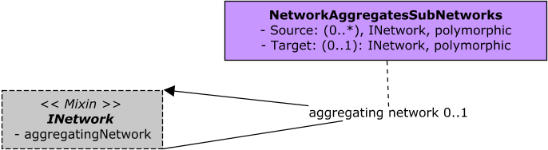
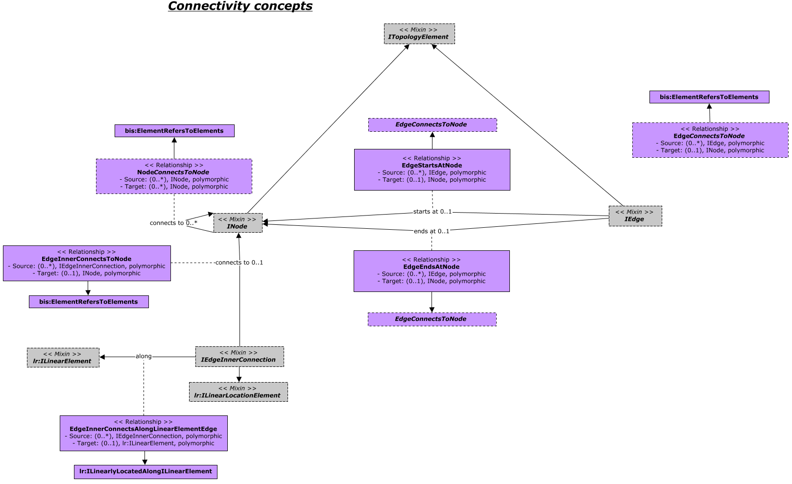
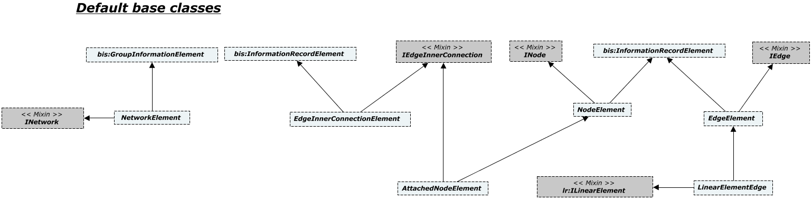

# NetworkTopology

Contains the core mix-ins and base classes used by specialized BIS Domain schemas involving graphs consisting of nodes and edges, such as Utilities (Water, Wastewater, Electric, Gas, Comms, etc) and Transportation Networks.

A given Network Topology implementation can be defined in a separate InformationRecordPartition if the mix-ins contained in this schema cannot be implemented directly by a specialized BIS Domain schema, or its classes model its concepts at a different granularity than what is needed for Network Topology purposes.

Base classes in terms of bis:InformationRecordElement implementing Network Topology mix-ins are provided. They can be used as examples of how to properly mix-ins the Network Topology interfaces in BIS schemas targetting different modeling perspectives.

The following class-diagram depicts the core mix-ins that address hierarchy of networks.

The following class-diagram shows the core mix-ins that target connectivity among topology elements.

The following class-diagram summarizes the default base classes implementing the provided mix-ins in this schema.

## Entity Classes

### ITopologyElement

An net:ITopologyElement implementation can signal to be the entry-point of a sub-network at a finer granularity by also mixing-in bis:ISubModeledElement.
