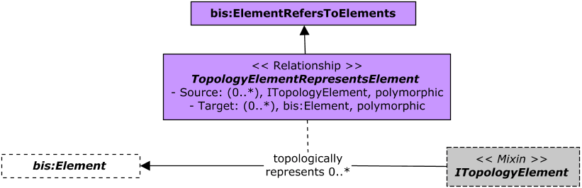

# NetworkTopology

Contains the core mix-ins and base classes used by specialized BIS Domain schemas involving graphs consisting of nodes and edges, such as Utilities (Water, Wastewater, Electric, Gas, Comms, etc) and Transportation Networks.

A given Network Topology implementation can be defined in a separate InformationRecordPartition if the mix-ins contained in this schema cannot be implemented directly by a specialized BIS Domain schema, or its classes model its concepts at a different granularity than what is needed for Network Topology purposes.

Base classes in terms of bis:InformationRecordElement implementing Network Topology mix-ins are provided. They can be used as examples of how to properly mix-ins the Network Topology interfaces in BIS schemas targetting different modeling perspectives.

The following class-diagram depicts the core mix-ins that address hierarchy of networks.

The following class-diagrams depict the two ways that Topology elements can be associated to a network.

The following class-diagram shows the core mix-ins that target connectivity among topology elements.

The following class-diagram shows the relationship class to define a topological representation among elements.

The following class-diagram summarizes the default base classes implementing the provided mix-ins in this schema.

## Entity Classes

### INetwork

An `INetwork` instance is associated to its `ITopologyElement`s either by the latter being contained in its submodel - the most typical situation - or via `NetworkConsistsOfTopologyElements` relationships between them, but not both. 

### ITopologyElement

An `ITopologyElement` instance is associated to only one `INetwork` instance either by being contained in its submodel - the most typical situation - or via a `NetworkConsistsOfTopologyElements` relationship between them, but not both. In the former case, the class mixing-in the `INetwork` interface is also expected to mix-in the `bis:ISubModeledElement` interface. Therefore, in that case, the _ModeledElement_ of the `ITopologyElement`'s _Model_ is also its associated `INetwork` instance.

### IEdge

A concrete implementation of this schema shall mix-in the `IEdge` interface when it needs to capture and track links in a graph as _Elements_. That is, Objects with identity and business properties. Another reason leading to the choosing of the `IEdge` interface involves the need of capturing intermediate nodes connected along a link. 

On the other hand, the `NodeConnectsToNode` relationship could be used for simple links with no need to track identity, other business data or intermediate nodes.

An `IEdge` instance connects to its two end-nodes in a graph via the `EdgeStartsAtNode` and `EdgeEndsAtNode` relationships respectively. Intermediate nodes can be connected along an `IEdge` instance by using concepts, rules and patterns defined in the _LinearReferencing_ BIS schema. In that case, the `IEdge` is treated as a _Linear-Element_ along which nodes are linearly-located. To achieve that, the class mixing-in the `IEdge` interface needs to also mix-in the `lr:ILinearElement` interface.

### INode

Connectivity among `INode` instances can be defined via any one of the following three relationships:

- `NodeConnectsToNode`
- `EdgeConnectsToNode` (abstract), with two concrete relationship classes: `EdgeStartsAtNode` and `EdgeEndsAtNode`.
- `EdgeInnerConnectsToNode`

### IEdgeInnerConnection

Instances of a class mixing-in the `IEdgeInnerConnection` interface shall be linearly-located along instances of classes mixing-in both `IEdge` and `lr:ILinearElement` interfaces by using the `EdgeInnerConnectsAlongLinearElementEdge` relationship. 

An instance of a class mixing-in `IEdgeInnerConnection` is associated to the `INode` that it linearly-locates via the `EdgeInnerConnectsToNode` relationship.

## Relationship Classes

### NetworkAggregatesSubNetworks

Note that aggregated `INetwork` instances can be contained in the same or different model(s) as their aggregating `INetwork` instance.

### NetworkConsistsOfTopologyElements

The `NetworkConsistsOfTopologyElements` relationship shall only be used when the organization of `ITopologyElement` instances into models is not driven by their associated `INetwork` instances. Since `ITopologyElement`s may be very numerous, creating one of this relationship for each one of those instances increases storage requirements.

### EdgeConnectsToNode

The `EdgeConnectsToNode` relationship can be used to query for any `IEdge` instance connected to an `INode`, disregarding if it is considered as its start or end node.

### NodeConnectsToNode

The `NodeConnectsToNode` relationship could be used to model simple links in a graph, with no need to track identity, other business data or intermediate nodes along them.

### TopologyElementRepresentsElement

`ITopologyElement` instances can be found via the `TopologyElementRepresentsElement` relationship in workflows and trace-operations where the former are not directly manipulated.