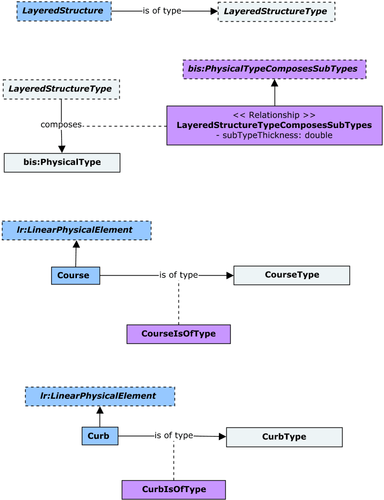

# CivilPhysical

This schema contains classes that are commonly used in various types of Civil projects, including Road, Rail and Site-related.



## Entity Classes

### CourseType

`CourseType` is the most common kind of `PhysicalType` that a `LayeredStructureType` is composed of.

Instances of `CourseType` provide an additional classification that can be applied to `Course`s. Examples include Wearing Course, Base and Sub-base. An instance of `CourseType` can optionally specify a single *Physical Material* via its `PhysicalMaterial` property.

Equivalent to [IfcCourseType](http://ifc43-docs.standards.buildingsmart.org/IFC/RELEASE/IFC4x3/HTML/lexical/IfcCourseType.htm).

### Course

`Course` is the most common kind of `PhysicalElement` assembled by a `LayeredStructure`.

A `Course` is distinctive from an earthworks element in that a course is a graded granular material (which can be bound or unbound) that is generally processed in some fashion, where as earthworks elements are soil earthen based structure that can be formed by removal and transport of general ground material. Structurally a `Course` does not have capacity to carry loads over open span, or to be removed or replaced as a single unit.

`Course`s shall have their *Volume* stored in their `GeometryStream` as a *Polyface*. Further classification of `Course` instances can be achieved via instances of `CourseType`. A `Course` instance can override the *Physical Material* specified by its corresponding `CourseType` via its `PhysicalMaterial` property.

The _thickness_ of a `Course` instance shall be captured in the `LayeredStructureTypeComposesSubTypes` relationship, between its `CourseType` and the `LayeredStructureType` associated with its parent element. That relationship also provides its _order_ with respect to the overall `LayeredStructure` it is part of.

`Course`s must be contained in `PhysicalModel`s and can be linearly located, typically along an *Alignment*.

Equivalent to [IfcCourse](http://ifc43-docs.standards.buildingsmart.org/IFC/RELEASE/IFC4x3/HTML/lexical/IfcCourse.htm).

### CurbType

Instances of `CurbType` provide an additional classification that can be applied to `Curb`s. An instance of `CurbType` can optionally specify a single *Physical Material* via its `PhysicalMaterial` property.

Equivalent to [IfcKerbType](http://ifc43-docs.standards.buildingsmart.org/IFC/RELEASE/IFC4x3/HTML/lexical/IfcKerbType.htm).

### Curb

A `Curb` is typically a border of stone, concrete or other rigid material formed at the edge of a roadway or footway (Kerb, UK).

`Curb`s shall have their *Volume* stored in their `GeometryStream` as a *Polyface*. Further classification of `Curb` instances can be achieved via instances of `CurbType`. A `Curb` instance can override the *Physical Material* specified by its corresponding `CurbType` via its `PhysicalMaterial` property.

`Curb`s must be contained in `PhysicalModel`s and can be linearly located, typically along an *Alignment*. Instances of `Curb`, by default, shall use the Domain-ranked `cvphys:Curb` category.

Equivalent to [IfcKerb](http://ifc43-docs.standards.buildingsmart.org/IFC/RELEASE/IFC4x3/HTML/lexical/IfcKerb.htm).

### PavementType

Instances of `PavementType` provide an additional classification that can be applied to `Pavement`s.

Equivalent to [IfcPavementType](http://ifc43-docs.standards.buildingsmart.org/IFC/RELEASE/IFC4x3/HTML/lexical/IfcPavementType.htm).

### Pavement

`Pavement` instances must be contained in `PhysicalModel`s.

Equivalent to [IfcPavement](http://ifc43-docs.standards.buildingsmart.org/IFC/RELEASE/IFC4x3/HTML/lexical/IfcPavement.htm).

### LayeredStructureType

A `LayeredStructureType` associates the `bis:PhysicalType`s modeling the layers that it is composed of via the `LayeredStructureTypeComposesSubTypes` relationship. The _thickness_ and _order_ of each layer that a specifc `LayeredStructureType` is composed of is captured by the _SubTypeThickness_ and _MemberPriority_ properties of the `LayeredStructureTypeComposesSubTypes` table-relationship respectively.

Therefore, individual `bis:PhysicalType`s (e.g. `CourseType`) composing a `LayeredStructureType` do not capture a _thickness_ measurement by themselves; one needs to introduce the larger context (i.e. a `LayeredStructureType` they are composing - e.g. `PavementType`) in order to capture their _thickness_ and _order_ with respect to the overall structure.

## Relationship Classes

### LayeredStructureTypeComposesSubTypes

An instance of `LayeredStructureTypeComposesSubTypes` captures the _thickness_ and _order_ of a `bis:PhysicalType` at its target end-point (e.g. a `CourseType`) in context of a `LayeredStructureType` instance at its source end-point. They are captured on its _SubTypeThickness_ and _MemberPriority_ properties.

By convention, the top-layer of a `LayeredStructureType` shall have the _MemberPriority_ property of this relationship set to 0 (zero). The subsequent layer down shall have this property set to 1 (one), and so on.

## Sample ECSQL queries

- Query for the _thickness_ of a particular layer (e.g. `Course`) in a `LayeredStructure` (e.g. Pavement).

```sql
SELECT
    comp.SubTypeThickness [Layer Thickness]
FROM 
    bis.PhysicalElement layer INNER JOIN bis.PhysicalType pt ON layer.TypeDefinition.Id = pt.ECInstanceId
    INNER JOIN cvphys.LayeredStructure structure ON structure.ECInstanceId = layer.Parent.Id
    INNER JOIN cvphys.LayeredStructureType structType ON structure.TypeDefinition.Id = structType.ECInstanceId
    INNER JOIN cvphys.LayeredStructureTypeComposesSubTypes comp ON comp.TargetECInstanceId = pt.ECInstanceId
        AND comp.SourceECInstanceId = structType.ECInstanceId
WHERE
    layer.ECInstanceId = :layerId
```

- Compute the overall _thickness_ of a particular `LayeredStructure` (e.g. Pavement).

```sql
SELECT
    SUM(comp.SubTypeThickness) [Overall Thickness]
FROM
    cvphys.LayeredStructure structure 
    INNER JOIN cvphys.LayeredStructureType structType ON structure.TypeDefinition.Id = structType.ECInstanceId
    INNER JOIN cvphys.LayeredStructureTypeComposesSubTypes comp ON comp.SourceECInstanceId = structType.ECInstanceId
WHERE
    structure.ECInstanceId = :layeredStructureId
```
