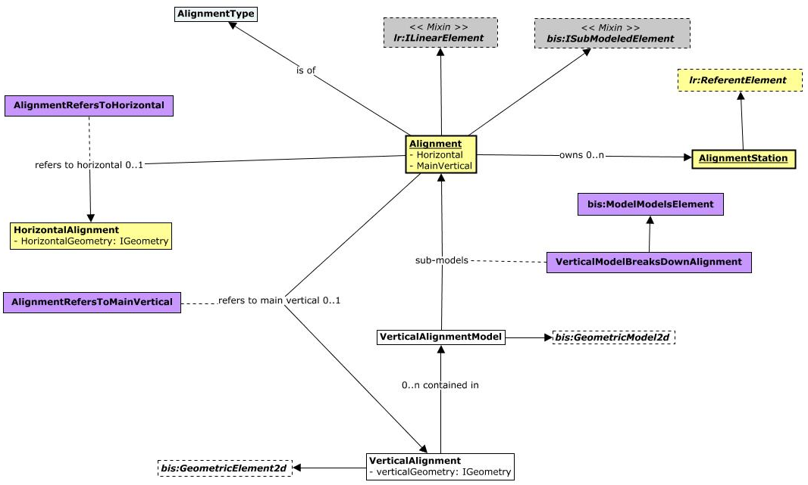

# RoadRailAlignment

This schema contains the main classes to capture Alignment information primarily used in Road & Rail disciplines.

The following class-diagram depicts the main classes and relationships in the RoadRailAlignment schema:

The following instance-diagram depicts an example of a typical usage of the classes from the RoadRailAlignment schema:

## Entity Classes

### Alignment

`Alignment` instances shall be contained in a `SpatialLocationModel` or a `PhysicalModel`, that typically submodel a `SpatialLocationPartition` or a `PhysicalPartition` respectively. 

If there is any need to organize `Alignment` instances that drive the design of a linear asset (i.e. *Design Alignments*) into a separate model further down the model-hierarchy of a BIS repository, it can be done by using a `SpatialLocationModel` model that submodels a `DesignAlignments` instance at a higher level.

If there is a need to standardize the categories associated with `Alignment` instances in an organization, the RoadRailAlignment BIS domain suggests the usage of the Domain-ranked `Alignment` and `Linear` categories for *Design* and *Secondary* Alignments respectively.

An `Alignment` shall always have one and only one associated `HorizontalAlignment`, but `VerticalAlignment`s are optional. When an `Alignment` has one or more associated `VerticalAlignment`s, it refers to the one used to describe its profile as being the *Main Vertical*.

The `Alignment` class inherits its `LengthValue` property from the `ILinearElement` mix-in. In the case of `Alignment`s, such property shall store its horizontal length rather than its 3D length. Such horizontal length is computed from the associated `HorizontalAlignment` instance and cached into the `LengthValue` property of the `Alignment`.

An `Alignment` stores its visible geometry, typically a 3D approximation calculated as a stroked line-string, in its `GeometryStream` encoded as a *Path*.

Equivalent to [IfcAlignment](https://standards.buildingsmart.org/IFC/RELEASE/IFC4_3/HTML/lexical/IfcAlignment.htm). The 3D approximation stored in its `GeometryStream` is equivalent to an [IfcGradientCurve](https://standards.buildingsmart.org/IFC/RELEASE/IFC4_3/HTML/lexical/IfcGradientCurve.htm).

### AlignmentType

Instances of `AlignmentType` provide an additional classification that can be applied to `Alignment`s.

Equivalent to [IfcAlignmentTypeEnum](https://standards.buildingsmart.org/IFC/RELEASE/IFC4_3/HTML/lexical/IfcAlignmentTypeEnum.htm).

### DesignAlignments

A `DesignAlignments` instance shall be used when there is a need to organize `Alignment` instances that drive the design of a linear asset (i.e. *Design Alignments*) into a separate model further down the model-hierarchy of a BIS repository. In that case, `Alignment`s are organized into a `SpatialLocationModel` model that submodels a `DesignAlignments` instance at a higher level.

A `DesignAlignments` instance, by default, shall use the Domain-ranked `Alignment` category.

### HorizontalAlignments

A `HorizontalAlignments` instance shall be used when there is a need to organize `HorizontalAlignment` instances into a separate model further down the model-hierarchy of a BIS repository. In that case, `HorizontalAlignment` instances can be contained in a `SpatialLocationModel` model that submodels a `HorizontalAlignments` instance at a higher level.

Each `HorizontalAlignments` instance shall set its `CodeValue` property to "Horizontal Alignments", and by default, shall use the Domain-ranked `Alignment` category.

### HorizontalAlignment

A `HorizontalAlignment` instance shall be contained in a *Plan-projection* `SpatialLocationModel` submodel of either a `SpatialLocationPartition` or a `HorizontalAlignments` instance. It shall be associated with one `Alignment` instance via the `AlignmentRefersToHorizontal` relationship.

A `HorizontalAlignment` typically has the same `CodeValue` and Category as its associated `Alignment` instance.

A `HorizontalAlignment` stores its visual geometry separately from geometry used for linear-referencing and design purposes, although the two could be identical. The former shall be stored either in its `GeometryStream` or via child `GraphicalElement3d` instances, whereas the latter shall be stored in the `HorizontalGeometry` property, encoded as a [Path](https://www.itwinjs.org/reference/core-geometry/curve/path/). Each curve primitive in such *Path* describes a segment along the `HorizontalAlignment` as follows:

- Linear segments shall be encoded as [LineSegment3d](https://www.itwinjs.org/reference/core-geometry/curve/linesegment3d/)s.
- Circular arc segments shall be encoded as [Arc3d](https://www.itwinjs.org/reference/core-geometry/curve/arc3d/)s.
- Transition segments (spirals) shall be encoded as [TransitionSpiral3d](https://www.itwinjs.org/reference/core-geometry/curve/transitionspiral3d/)s.

The Z-coordinate of all of these primitives shall be zero.

Equivalent to [IfcAlignment.Axis](https://standards.buildingsmart.org/IFC/RELEASE/IFC4_3/HTML/lexical/IfcAlignment.htm) set to either an [IfcGradientCurve](https://standards.buildingsmart.org/IFC/RELEASE/IFC4_3/HTML/lexical/IfcGradientCurve.htm) (via its `BaseCurve` attribute), an [IfcCompositeCurve](https://standards.buildingsmart.org/IFC/RELEASE/IFC4_3/HTML/lexical/IfcCompositeCurve.htm) or an [IfcPolyline](https://standards.buildingsmart.org/IFC/RELEASE/IFC4_3/HTML/lexical/IfcPolyline.htm).

Individual segments along the `HorizontalAlignment` encoded as a *Path* are equivalent to [IfcCompositeCurveSegment](https://standards.buildingsmart.org/IFC/RELEASE/IFC4_3/HTML/lexical/IfcCompositeCurveSegment.htm)s with the following *Parent Curve*s:

- Linear segments encoded as *LineSegment3d* are equivalent to [IfcPolyline](https://standards.buildingsmart.org/IFC/RELEASE/IFC4_3/HTML/lexical/IfcPolyline.htm).
- Circular arc segments encoded as *Arc3d* are equivalent to [IfcTrimmedCurve](https://standards.buildingsmart.org/IFC/RELEASE/IFC4_3/HTML/lexical/IfcTrimmedCurve.htm) based on an [IfcCircle](https://standards.buildingsmart.org/IFC/RELEASE/IFC4_3/HTML/lexical/IfcCircle.htm).
- Transition segments (spirals) encoded as *TransitionSpiral3d* are equivalent to the corresponding [IfcSpiral](https://standards.buildingsmart.org/IFC/RELEASE/IFC4_3/HTML/lexical/IfcSpiral.htm) subclasses as follows:

| *TransitionSpiral3d* subclass | *TransitionSpiral3d* subtype | IFC-equivalent |
| ----------------------------- | ---------------------------- | -------------- |
| *IntegratedSpiral3d* | "clothoid" | [IfcClothoid](https://standards.buildingsmart.org/IFC/RELEASE/IFC4_3/HTML/lexical/IfcClothoid.htm) |
| *IntegratedSpiral3d* | "cosine" | [IfcCosine](https://standards.buildingsmart.org/IFC/RELEASE/IFC4_3/HTML/lexical/IfcCosine.htm) |
| *IntegratedSpiral3d* | "sine" | [IfcSine](https://standards.buildingsmart.org/IFC/RELEASE/IFC4_3/HTML/lexical/IfcSine.htm) |
| *IntegratedSpiral3d* | "biquadratic" | [IfcSecondOrderPolynomialSpiral](https://standards.buildingsmart.org/IFC/RELEASE/IFC4_3/HTML/lexical/IfcSecondOrderPolynomialSpiral.htm) |
| *IntegratedSpiral3d* | "bloss" | [IfcThirdOrderPolynomialSpiral](https://standards.buildingsmart.org/IFC/RELEASE/IFC4_3/HTML/lexical/IfcThirdOrderPolynomialSpiral.htm) |
| *IntegratedSpiral3d* | "vienna" | [IfcSeventhOrderPolynomialSpiral](https://standards.buildingsmart.org/IFC/RELEASE/IFC4_3/HTML/lexical/IfcSeventhOrderPolynomialSpiral.htm) |
| *DirectSpiral3d* | any | Not Available |

### VerticalAlignment

A `VerticalAlignment` instance shall be contained in a `VerticalAlignmentModel` submodel of the `Alignment` instance it is associated with. Only one `VerticalAlignment` instance is considered being the Main Vertical for a given `Alignment`. Other `VerticalAlignment`s associated with the same `Alignment` are typically used to describe the profile of assets designed along the same `Alignment`, e.g. the profile of the bottom of a Road ditch.

A `VerticalAlignment` by default use the Domain-ranked `Vertical Alignment` Category.

A `VerticalAlignment` stores its visual geometry separately from geometry used for linear-referencing and design purposes, although the two could be identical. The former shall be stored either in its `GeometryStream` or via child `GraphicalElement2d` instances, whereas the latter shall be stored in the `VerticalGeometry` property, encoded as a [Path](https://www.itwinjs.org/reference/core-geometry/curve/path/). Each curve primitive in such *Path* describes a segment along the `VerticalAlignment` as follows:

- Linear segments shall be encoded as [LineSegment3d](https://www.itwinjs.org/reference/core-geometry/curve/linesegment3d/)s.
- Circular arc segments shall be encoded as [Arc3d](https://www.itwinjs.org/reference/core-geometry/curve/arc3d/)s.
- Transition segments (parabolic) shall be encoded as [BSplineCurve3d](https://www.itwinjs.org/reference/core-geometry/bspline/bsplinecurve3d/)s.

The X-coordinate of all of these primitives shall indicate *distance along* measurements in terms of the corresponding `HorizontalAlignment`. That is, an X-coordinate = 0.0 corresponds to the start location of its `HorizontalAlignment`. Y-coordinates shall indicate *elevation* at such location. Z-coordinate of all of these primitives shall be zero. 

It is not uncommon for a `VerticalAlignment` instance to capture *elevations* only for a partial range of its corresponding `HorizontalAlignment` instance. Note that the opposite situation, a `VerticalAlignment` instance capturing *elevations* before or after the range of its corresponding `HorizontalAlignment`, while possible in theory is typically considered invalid in practice. This schema leaves the decision to validate against such case to particular implementations, however.

Equivalent to [IfcAlignment.Axis](https://standards.buildingsmart.org/IFC/RELEASE/IFC4_3/HTML/lexical/IfcAlignment.htm) set to an [IfcGradientCurve](https://standards.buildingsmart.org/IFC/RELEASE/IFC4_3/HTML/lexical/IfcGradientCurve.htm) (via its `Segments` attribute).

Individual segments along the `VerticalAlignment` encoded as a *Path* are equivalent to [IfcCurveSegment](https://standards.buildingsmart.org/IFC/RELEASE/IFC4_3/HTML/lexical/IfcCurveSegment.htm)s.

### AlignmentStation

`AlignmentStation`s shall be used to map *distances along from start* measurements with *station values* along an `Alignment`, without forcing the use of relative linear-location measurements. That is, absolute measurements on or after the location of an `AlignmentStation` along an `Alignment` can still be mapped to *station values* at runtime without actually persisting them in the corresponding `lr:DistanceExpression.DistanceAlongFromReferent` attribute.

`AlignmentStation`s are linearly-located elements along an `Alignment`. They shall carry the *distance along* measurement in a `LinearlyReferencedAtLocation` aspect whereas the mapped *station value* shall be stored in their `Station` property. `Alignment`s shall define its initial *station value* in their `StartStation` property.

Equivalent to [IfcReferent](https://standards.buildingsmart.org/IFC/RELEASE/IFC4_3/HTML/lexical/IfcReferent.htm) with a non-zero `StartDistance` attribute and relative measurements used by linear-locations referencing it.

## Relationship Classes

### HorizontalAlignmentOwnsSegmentGraphics

The `HorizontalAlignmentOwnsSegmentGraphics` relationship is used when the visual geometry (also referred to as symbology) of a `HorizontalAlignment` is captured via child `bis:GraphicalElement3d` instances. That strategy enables control over symbology settings via the default `SubCategory` of the associated `SpatialCategory` for each graphical segment.

### VerticalAlignmentOwnsSegmentGraphics

The `VerticalAlignmentOwnsSegmentGraphics` relationship is used when the visual geometry (also referred to as symbology) of a `VerticalAlignment` is captured via child `bis:GraphicalElement2d` instances. That strategy enables control over symbology settings via the default `SubCategory` of the associated `DrawingCategory` for each graphical segment.