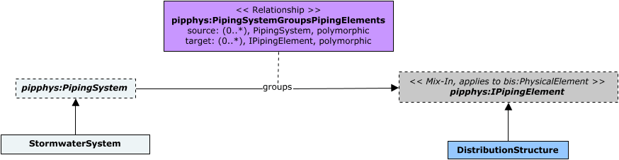
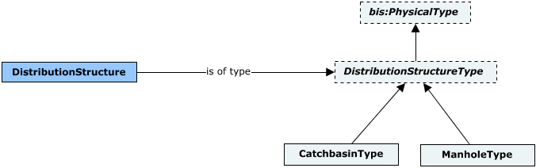
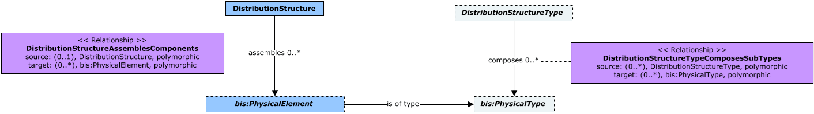

# StormSewerPhysical

This schema contains classes that model Stormwater and Sewage collection systems.

The following class-diagrams depict the main classes and relationships in the StormSewerPhysical schema:





The following instance-diagram depict a few examples of classes from the StormSewerPhysical schema:


## Entity Classes

### DistributionChamber

A `DistributionChamber` instance owns its `PipeworkPhysical:PipingPort`s via the `PipeworkPhysical:PipingElementOwnsPorts` relationship. _Invert Elevations_ at those `PipingPort`s can be computed as:

```
InvertElevation at a PipingPort = PipingPort.Origin.z - (PipingPort.PipingPortType.InnerDiameter / 2)
```

`DistributionChamber`s must be contained in `PhysicalModel`s. Further classification of `DistributionChamber` instances can be achieved via instances of `DistributionChamberType`.

Equivalent to [IfcDistributionChamberElement](https://standards.buildingsmart.org/IFC/RELEASE/IFC4_3/HTML/lexical/IfcDistributionChamberElement.htm).

### DistributionChamberType

An instance of `DistributionChamberType` can optionally specify a single *Physical Material* via its `PhysicalMaterial` property.

Equivalent to [IfcDistributionChamberElementType](https://standards.buildingsmart.org/IFC/RELEASE/IFC4_3/HTML/lexical/IfcDistributionChamberElementType.htm).

### ManholeType

Equivalent to [IfcDistributionChamberElementType](https://standards.buildingsmart.org/IFC/RELEASE/IFC4_3/HTML/lexical/IfcDistributionChamberElementType.htm) with PredefinedType = [IfcDistributionChamberElementTypeEnum.MANHOLE](https://standards.buildingsmart.org/IFC/RELEASE/IFC4_3/HTML/lexical/IfcDistributionChamberElementTypeEnum.htm).

### DistributionChamberTopType

An instance of `DistributionChamberTopType` can optionally specify a single *Physical Material* via its `PhysicalMaterial` property.

### DistributionChamberBottomType

An instance of `DistributionChamberBottomType` can optionally specify a single *Physical Material* via its `PhysicalMaterial` property.
