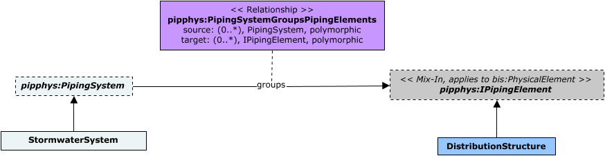
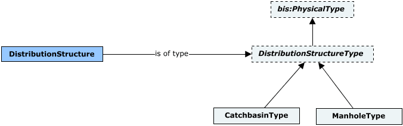
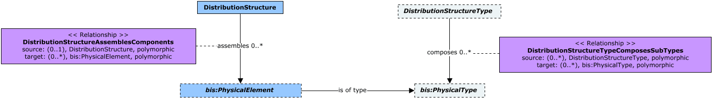
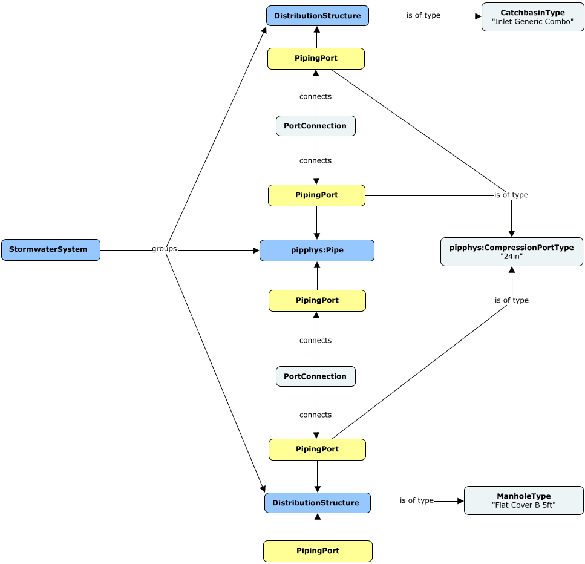

# StormSewerPhysical

This schema contains classes that model Stormwater and Sewage collection systems.

The following class-diagrams depict the main classes and relationships in the StormSewerPhysical schema:





The following instance-diagram depict an example of the classes from the StormSewerPhysical schema:



## Entity Classes

### DistributionStructure

A `DistributionStructure` instance owns its `PipeworkPhysical:PipingPort`s via the `PipeworkPhysical:PipingElementOwnsPorts` relationship. _Invert Elevations_ at those `PipingPort`s can be computed as:

```
InvertElevation at a PipingPort = PipingPort.Origin.z - (PipingPort.PipingPortType.InnerDiameter / 2)
```

`DistributionStructure`s must be contained in `PhysicalModel`s. Further classification of `DistributionStructure` instances can be achieved via instances of `DistributionStructureType`.

Equivalent to [IfcDistributionChamberElement](https://standards.buildingsmart.org/IFC/RELEASE/IFC4_3/HTML/lexical/IfcDistributionChamberElement.htm).

### DistributionStructureType

An instance of `DistributionStructureType` can optionally specify a single *Physical Material* via its `PhysicalMaterial` property.

Equivalent to [IfcDistributionChamberElementType](https://standards.buildingsmart.org/IFC/RELEASE/IFC4_3/HTML/lexical/IfcDistributionChamberElementType.htm).

### ManholeType

Equivalent to [IfcDistributionChamberElementType](https://standards.buildingsmart.org/IFC/RELEASE/IFC4_3/HTML/lexical/IfcDistributionChamberElementType.htm) with PredefinedType = [IfcDistributionChamberElementTypeEnum.MANHOLE](https://standards.buildingsmart.org/IFC/RELEASE/IFC4_3/HTML/lexical/IfcDistributionChamberElementTypeEnum.htm).

## Relationship Classes

### DistributionStructureTypeComposesSubTypes

`PhysicalType` instances composed by a `DistributionStructureType` are organized based on its vertical placement. That is, a `PhysicalType` instance at the *Bottom* of a `DistributionStructureType` shall be grouped with a `DistributionStructureTypeComposesSubTypes` relationship whose _memberPriority_ is set to 1. Similarly, a `PhysicalType` instance at its *Top* shall be composed with a _memberPriority_ is set to the highest number among the members grouped by a `DistributionStructureType`.

## Sample ECSQL queries

- Query for the dimensions of all Rectangular piping ports on a particular `DistributionStructure`.

```sql
SELECT
    recPortT.SmallerDimension,
    recPortT.LargerDimension
FROM
    stmswrphys.DistributionStructure ds
    INNER JOIN pipphys.PipingPort pp ON ds.ECInstanceId = pp.Parent.Id
    INNER JOIN pipphys.RectangularPortType recPortT ON pp.TypeDefinition.Id = recPortT.ECInstanceId
WHERE
    ds.ECInstanceId = :distributionStructureId
```

- Query for sub-types composed by Manholes and Catchbasins as PhysicalTypes.

```sql
SELECT
    dst.ECInstanceId [DistributionStructureId],
    pt.ECInstanceId [SubTypeId],
    pt.ECClassId [SubTypeClassId]
FROM
    stmswrphys.DistributionStructureType dst 
    INNER JOIN stmswrphys.DistributionStructureTypeComposesSubTypes comp ON comp.SourceECInstanceId = dst.ECInstanceId
    INNER JOIN bis.PhysicalType pt ON pt.ECInstanceId = comp.TargetECInstanceId
```