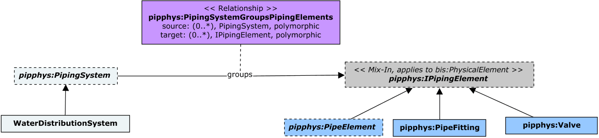

# WaterDistributionPhysical

This schema contains classes that model Water Distribution Systems.

The following class-diagram depicts the main classes and relationships in the WaterDistributionPhysical schema:

