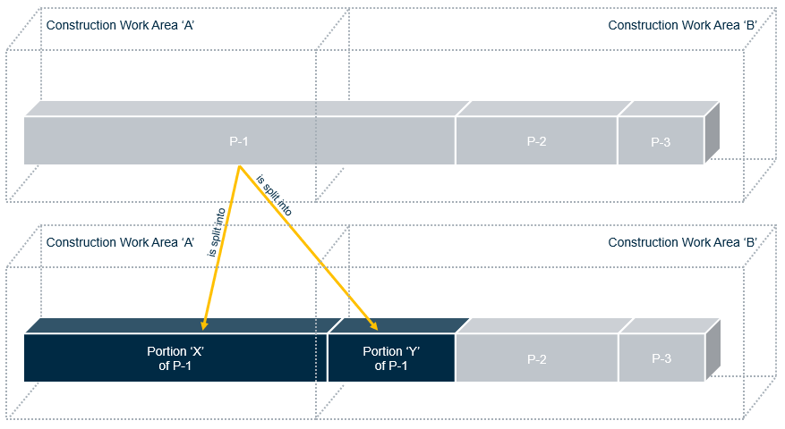
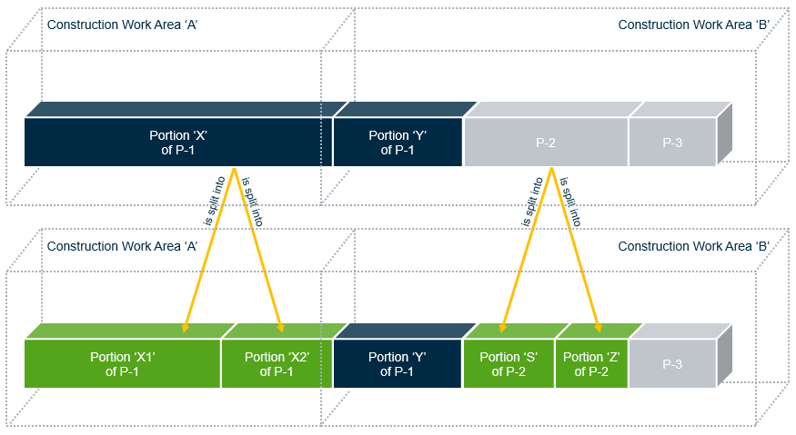
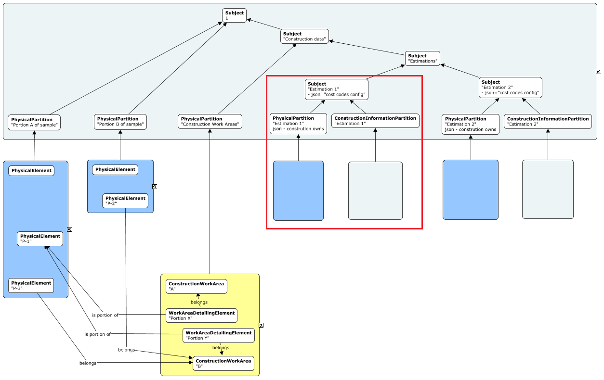
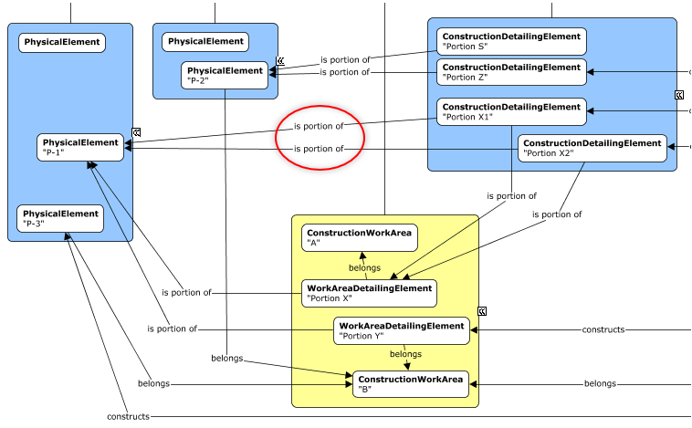
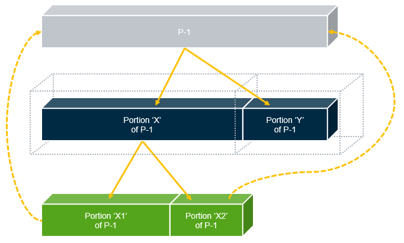

# Construction

This schema contains classes that are used to model real-world entities from the construction perspective. Supported workflows:

- project breakdown into the construction work areas;
- construction modeling - splitting up design data into smaller pieces suitable for construction;
- classification - cost codes assignment to the constructible components;
- quantity takeoff - work steps quantities calculation.

<h2>Project breakdown into construction work areas</h2>

Construction work areas are used throughout the entire construction project lifecycle: estimation, planning and sequencing, progress reporting and tracking. By breaking a project down into construction work areas some design elements may cross work area boundaries and as a result such elements are split into multiple pieces.

*Picture 1. Project breakdown into construction work areas*

A portion of a design element that got split because it crossed the construction work area boundary is modeled as `WorkAreaDetailingElement` (Portion 'X' and Portion 'Y' in the example above). This element may or may not be suitable for construction. In cases when engineer decides that it is too big or requires different means and methods assigned, then it will be split further during construction modeling step.

<h2>Construction modeling</h2>

During construction modeling step some design elements are split into smaller pieces suitable for construction. Such a sliced portion of a real-world object is modeled as `ConstructionDetailingElement` (Portion 'X1', Portion 'X2', Portion 'S' and Portion 'Z' in the example below).

*Picture 2. Construction modeling sample*

Note, that `ConstructionDetailingElement` does not cross the boundaries of `WorkAreaDetailingElement`.

If a real-world physical object crosses multiple construction work areas and different means and methods need to be assigned to its different parts (for example, bottom and top) then separate `ConstructionDetailingElement` instances representing each part will be created in each construction work area:

*Picture 3. Construction modeling*

<h2>Data organization in the repository</h2>

`ConstructionWorkArea` and `WorkAreaDetailingElement` instances are placed in a separate `SpatialLocationModel` under their own `PhysicalPartition`:

*Picture 4. Construction work areas persistence*

This data becomes a common input for all estimations in the project, regardless of who estimates: it can be multiple teams from the same organization estimating the same scope, or it can be multiple sub-contractors estimating work in the same or different construction work areas and etc.

The estimation data are split into `PhysicalModel` and `SpatialLocationModel` models under `PhysicalPartition` and `ConstructionInformationPartition` partitions respectively. In the bidding phase when multiple estimation teams (from the same organization or from multiple organizations when contractors are invited) are doing quantity takeoff, each team's data will be organized under a separate `Subject`.

*Picture 5. Estimation data partitioning*

The picture below illustrates the data persistence of the construction quantity takeoff results taking as an example construction modeling sample from Picture 2. It covers all 5 possible use cases:

1. Design element ("P-3") falls within the boundaries of a construction work area ("B") and is estimated as a whole.
2. Design element ("P-2") falls within the boundaries of a construction work area ("B") and is split into the smaller pieces ("Portion S" and "Portion Z") modeled as `ConstructionDetailingElement`. Each of them is classified and estimated separately.
3. Design element ("P-1") crosses construction work area boundaries and one of its portions ("Portion Y") is suitable for construction. Such a portion is estimated as a whole.
4. Design element ("P-1") crosses construction work area boundaries and one of its portions ("Portion X") is not suitable for construction. Such a portion is split further into the smaller pieces ("Portion X1" and "Portion X2") modeled as `ConstructionDetailingElement`. Each of them is classified and estimated separately.
5. Non-modeled element ("Manhole 102") is included in the estimation and related to the appropriate construction work area ("B"). This element does not yet have a graphical representation.

*Picture 6. Data persistence sample*

## Entity Classes

### ConstructionItem

`ConstructionItem` defines a constructible component which may or may not be modeled in the 3D model.

Often design models lack details and aren't mature enough to take off accurate quantities for a construction project. But these non-modeled elements still need to be taken into account for cost estimation and work planning later. Examples of such non-modeled elements: manholes, traffic signs…

When a constructible component is modeled in the 3D model, `ConstructionItem` refers to one or multiple (i.e. prefabricated component which is installed as a whole) geometric elements.

### ConstructionDetailingElementSplitsGeometricElement3d

Used to relate `ConstructionDetailingElement` instances to the source geometry element. Even though the source geometry can be any element of a class `bis:GeometricElement3d`, the application layer will control what elements are eligible for splitting. For instance, it doesn't make any sense to split geometric elements like `bis:TextAnnotation3d` and similar.

In the case (see Picture 8) when design element ("P-1") crosses construction work area boundaries and one of its portions ("Portion X", modeled as `WorkAreaDetailingElement`) is split further into smaller pieces suitable for construction ("Portion X1" and "Portion X2, modeled as `ConstructionDetailingElement`) in addition to the relationship between `ConstructionDetailingElement` and `WorkAreaDetailingElement` a relationship between `ConstructionDetailingElement` and "original" design element is created (see Picture 7). Conceptually these `ConstructionDetailingElement` instances each represent a portion of the original design element, the difference is the way in which these portions were created.

*Picture 7. Relationships between design element and its sliced portions*

*Picture 8. Sample of splitting a design element for multiple purposes
