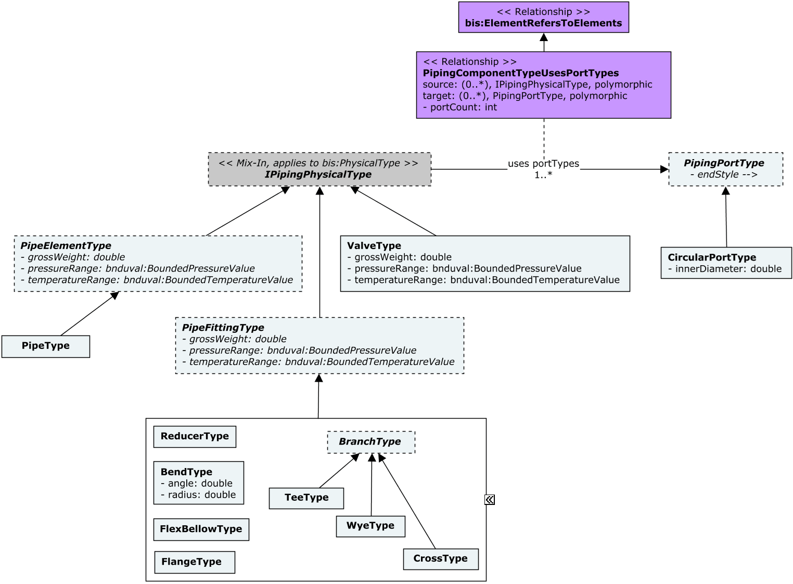
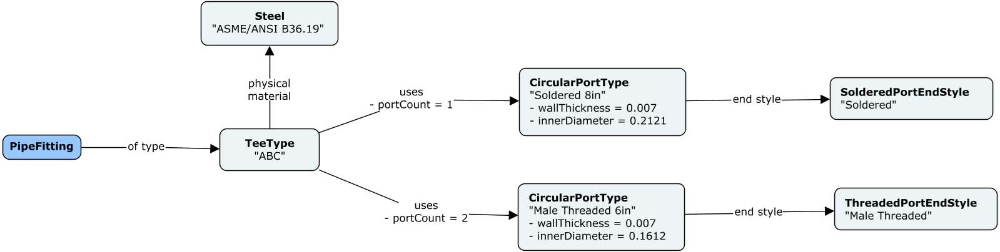
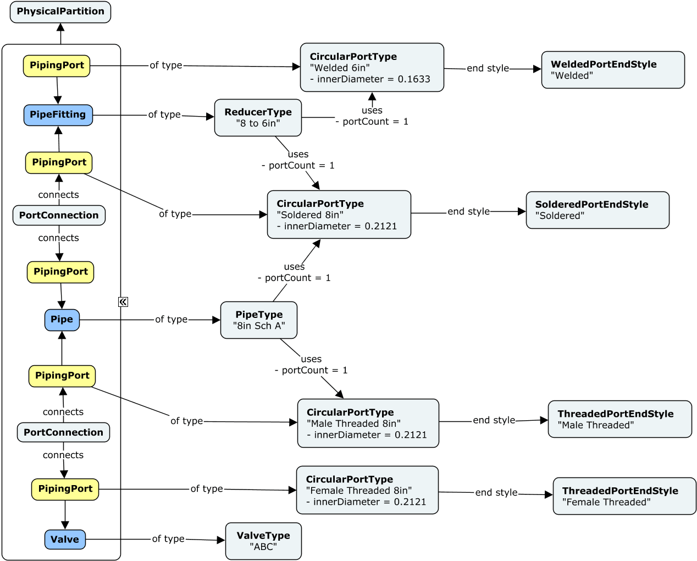

# PipeworkPhysical

This schema contains classes that are commonly used in various types of piping networks, designed for the distribution of matter (e.g. gases, liquids, fluidized solids or slurries).

The following class-diagrams depict the main classes and relationships in the PipeworkPhysical schema:

The following instance-diagram depict a few examples of classes from the PipeworkPhysical schema:

## Entity Classes

### BendType

A _Bend_ is a `PipeFitting` with typically two `PipingPort`s used to change the direction of flow between connected `IPipingElement`s.

`PipeFitting`s modeling _Bends_ shall be associated with an instance of `BendType` as its PhysicalType via the `PipeFittingIsOfType` relationship. `BendType`s must be contained in `DefinitionModel`s.

Equivalent to [IfcPipeFittingType](http://ifc43-docs.standards.buildingsmart.org/IFC/RELEASE/IFC4x3/HTML/lexical/IfcPipeFittingType.htm), with its _PredefinedType_ property set to _IfcPipeFittingTypeEnum.BEND_.

### CompressionPortType

A _CompressionPort_ is a `PipingPort` that allows connections among `Piping Element`s just by compression. Additional accessories may be used to further seal or strengthen each connection.

`PipingPort`s modeling _CompressionPorts_ shall be associated with an instance of `CompressionPortType` as its TypeDefinition via the `PipingPortIsOfType` relationship. `CompressionPortType`s must be contained in `DefinitionModel`s.

Equivalent to an [IfcDistributionPort](http://ifc43-docs.standards.buildingsmart.org/IFC/RELEASE/IFC4x3/HTML/lexical/IfcDistributionPort.htm), with its [Pset_DistributionPortTypePipe.ConnectionType](https://ifc43-docs.standards.buildingsmart.org/IFC/RELEASE/IFC4x3/HTML/lexical/Pset_DistributionPortTypePipe.htm) property set to _PEnum_PipeEndStyleTreatment.COMPRESSION_.

### CrossType

A _Cross_ is a `PipeFitting`with more than three `PipingPort`s used to redistribute flow among them and/or to change the direction of flow between connected `IPipingElement`s.

`PipeFitting`s modeling _Crosses_ shall be associated with an instance of `CrossType` as its PhysicalType via the `PipeFittingIsOfType` relationship. `CrossType`s must be contained in `DefinitionModel`s.

Equivalent to [IfcPipeFittingType](http://ifc43-docs.standards.buildingsmart.org/IFC/RELEASE/IFC4x3/HTML/lexical/IfcPipeFittingType.htm), with its _PredefinedType_ property set to _IfcPipeFittingTypeEnum.JUNCTION_.

### FlangedPortType

A _FlangedPort_ is a `PipingPort` that has a flange, typically with bolt holes, that enable connections among `IPipingElement`s.

`PipingPort`s modeling _FlangedPorts_ shall be associated with an instance of `FlangedPortType` as its TypeDefinition via the `PipingPortIsOfType` relationship. `FlangedPortType`s must be contained in `DefinitionModel`s.

Equivalent to an [IfcDistributionPort](http://ifc43-docs.standards.buildingsmart.org/IFC/RELEASE/IFC4x3/HTML/lexical/IfcDistributionPort.htm), with its [Pset_DistributionPortTypePipe.ConnectionType](https://ifc43-docs.standards.buildingsmart.org/IFC/RELEASE/IFC4x3/HTML/lexical/Pset_DistributionPortTypePipe.htm) property set to _PEnum_PipeEndStyleTreatment.FLANGED_.

### FlangeType

A _Flange_ is a `PipeFitting` that uses Flanged `PipingPort`s as their main connection mechanism.

`PipeFitting`s modeling _Flanges_ shall be associated with an instance of `FlangeType` as its PhysicalType via the `PipeFittingIsOfType` relationship. `FlangeType`s must be contained in `DefinitionModel`s.

Equivalent to [IfcPipeFittingType](http://ifc43-docs.standards.buildingsmart.org/IFC/RELEASE/IFC4x3/HTML/lexical/IfcPipeFittingType.htm), with its _PredefinedType_ property set to _IfcPipeFittingTypeEnum.CONNECTOR_.

### GroovedPortType

A _GroovedPort_ is a `PipingPort` that exhibits a groove that, by using additional accessories, enable connections among `IPipingElement`s.

`PipingPort`s modeling _GroovedPorts_ shall be associated with an instance of `GroovedPortType` as its TypeDefinition via the `PipingPortIsOfType` relationship. `GroovedPortType`s must be contained in `DefinitionModel`s.

Equivalent to an [IfcDistributionPort](http://ifc43-docs.standards.buildingsmart.org/IFC/RELEASE/IFC4x3/HTML/lexical/IfcDistributionPort.htm), with its [Pset_DistributionPortTypePipe.ConnectionType](https://ifc43-docs.standards.buildingsmart.org/IFC/RELEASE/IFC4x3/HTML/lexical/Pset_DistributionPortTypePipe.htm) property set to _PEnum_PipeEndStyleTreatment.GROOVED_.

### Pipe

The length of a `Pipe` instance can be obtained by calculating the distance between the two `PipingPort`s that it owns, via their _LocalOrigin_ properties.

`Pipe`s must be contained in `PhysicalModel`s and optionally associated with its corresponding `PipingSystem` instance via a `PipingSystemGroupsPipingElements` relationship.

`Pipe`s shall be associated with an instance of `PipeType` as its PhysicalType via the `PipeIsOfType` relationship.

Equivalent to [IfcPipeSegment](http://ifc43-docs.standards.buildingsmart.org/IFC/RELEASE/IFC4x3/HTML/lexical/IfcPipeSegment.htm).

### PipeFitting

`PipeFitting`s must be contained in `PhysicalModel`s and optionally associated with its corresponding `PipingSystem` instance via a `PipingSystemGroupsPipingElements` relationship.

`PipeFitting`s shall be associated with an instance of `PipeFittingType` as its PhysicalType via the `PipeFittingIsOfType` relationship.

Equivalent to [IfcPipeFitting](http://ifc43-docs.standards.buildingsmart.org/IFC/RELEASE/IFC4x3/HTML/lexical/IfcPipeFitting.htm).

### PipeFittingType

`PipeFittingType`s must be contained in `DefinitionModel`s.

Equivalent to [IfcPipeFittingType](http://ifc43-docs.standards.buildingsmart.org/IFC/RELEASE/IFC4x3/HTML/lexical/IfcPipeFittingType.htm).

### PipeType

`PipeType`s must be contained in `DefinitionModel`s.

Equivalent to [IfcPipeSegmentType](http://ifc43-docs.standards.buildingsmart.org/IFC/RELEASE/IFC4x3/HTML/lexical/IfcPipeSegmentType.htm).

### PipingPort

It is expected that the `LocalOrigin` property, inherited from `dsys:DistributionPort`, can be used to derive centerlines across `IPipingElement`s when needed.

`PipingPort`s shall be associated with an instance of `PipingPortType` as its TypeDefinition via the `PipingPortIsOfType` relationship. 

Equivalent to [IfcDistributionPort](http://ifc43-docs.standards.buildingsmart.org/IFC/RELEASE/IFC4x3/HTML/lexical/IfcDistributionPort.htm), with its _PredefinedType_ property set to _IfcDistributionPortTypeEnum.PIPE_.

### PipingPortType

The `PipingPortType` class captures two important concepts for a set of ports: 
1) Their diameter.
1) Their end-condition / end-style treatment.

The diameter of a `PipingPortType` is captured via its `DiameterDefinition` navigation property, whereas its end-condition is captured by specific subclasses of the `PipingPortType` class.

`PipingPortType`s can be associated with PhysicalTypes implementing the `IPipingPhysicalType` mix-in, via the `PipingPhysicalTypeUsesPortTypes` relationship. That way, catalogs of PhysicalTypes can include data about their PipingPortTypes: diameter and end-condition of their ports.

Concrete `PipingPortType` instances must be contained in `DefinitionModel`s.

### ReducerType

A _Reducer_ is a `PipeFitting` with typically two `PipingPort`s having different shapes or sizes. Reducers can also be used to change the direction of flow between connected `IPipingElement`s.

`PipeFitting`s modeling _Reducers_ shall be associated with an instance of `ReducerType` as its PhysicalType via the `PipeFittingIsOfType` relationship. `ReducerType`s must be contained in `DefinitionModel`s.

Equivalent to [IfcPipeFittingType](http://ifc43-docs.standards.buildingsmart.org/IFC/RELEASE/IFC4x3/HTML/lexical/IfcPipeFittingType.htm), with its _PredefinedType_ property set to _IfcPipeFittingTypeEnum.TRANSITION_.

### SolderedPortType

A _SolderedPort_ is a `PipingPort` that is connected with another `PipingPort` by using soldering.

`PipingPort`s modeling _SolderedPorts_ shall be associated with an instance of `SolderedPortType` as its TypeDefinition via the `PipingPortIsOfType` relationship. `SolderedPortType`s must be contained in `DefinitionModel`s.

Equivalent to an [IfcDistributionPort](http://ifc43-docs.standards.buildingsmart.org/IFC/RELEASE/IFC4x3/HTML/lexical/IfcDistributionPort.htm), with its [Pset_DistributionPortTypePipe.ConnectionType](https://ifc43-docs.standards.buildingsmart.org/IFC/RELEASE/IFC4x3/HTML/lexical/Pset_DistributionPortTypePipe.htm) property set to _PEnum_PipeEndStyleTreatment.SOLDERED_.

### TeeType

A _Tee_ is a `PipeFitting`with three `PipingPort`s used to redistribute flow among them and/or to change the direction of flow between connected `IPipingElement`s.

`PipeFitting`s modeling _Tees_ shall be associated with an instance of `TeeType` as its PhysicalType via the `PipeFittingIsOfType` relationship. `TeeType`s must be contained in `DefinitionModel`s.

Equivalent to [IfcPipeFittingType](http://ifc43-docs.standards.buildingsmart.org/IFC/RELEASE/IFC4x3/HTML/lexical/IfcPipeFittingType.htm), with its _PredefinedType_ property set to _IfcPipeFittingTypeEnum.JUNCTION_.

### ThreadedPortType

A _ThreadedPort_ is a `PipingPort` that exhibits either a male or female threaded end connection into which an opposite _ThreadedPort_ fits.

`PipingPort`s modeling _ThreadedPorts_ shall be associated with an instance of `ThreadedPortType` as its TypeDefinition via the `PipingPortIsOfType` relationship. `ThreadedPortType`s must be contained in `DefinitionModel`s.

Equivalent to an [IfcDistributionPort](http://ifc43-docs.standards.buildingsmart.org/IFC/RELEASE/IFC4x3/HTML/lexical/IfcDistributionPort.htm), with its [Pset_DistributionPortTypePipe.ConnectionType](https://ifc43-docs.standards.buildingsmart.org/IFC/RELEASE/IFC4x3/HTML/lexical/Pset_DistributionPortTypePipe.htm) property set to _PEnum_PipeEndStyleTreatment.THREADED_.

### Valve

`Valve`s must be contained in `PhysicalModel`s and optionally associated with its corresponding `PipingSystem` instance via a `PipingSystemGroupsPipingElements` relationship.

`Valve`s shall be associated with an instance of `ValveType` as its PhysicalType via the `ValveIsOfType` relationship.

Equivalent to [IfcValve](http://ifc43-docs.standards.buildingsmart.org/IFC/RELEASE/IFC4x3/HTML/lexical/IfcValve.htm).

### ValveType

`ValveType`s must be contained in `DefinitionModel`s.

Equivalent to [IfcValveType](http://ifc43-docs.standards.buildingsmart.org/IFC/RELEASE/IFC4x3/HTML/lexical/IfcValveType.htm).

### WeldedPortType

A _WeldedPort_ is a `PipingPort` that is connected to another `PipingPort` by welding means.

`PipingPort`s modeling _WeldedPorts_ shall be associated with an instance of `WeldedPortType` as its TypeDefinition via the `PipingPortIsOfType` relationship. `WeldedPortType`s must be contained in `DefinitionModel`s.

Equivalent to an [IfcDistributionPort](http://ifc43-docs.standards.buildingsmart.org/IFC/RELEASE/IFC4x3/HTML/lexical/IfcDistributionPort.htm), with its [Pset_DistributionPortTypePipe.ConnectionType](https://ifc43-docs.standards.buildingsmart.org/IFC/RELEASE/IFC4x3/HTML/lexical/Pset_DistributionPortTypePipe.htm) property set to _PEnum_PipeEndStyleTreatment.WELDED_.