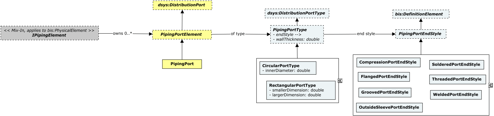
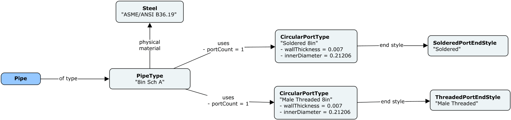
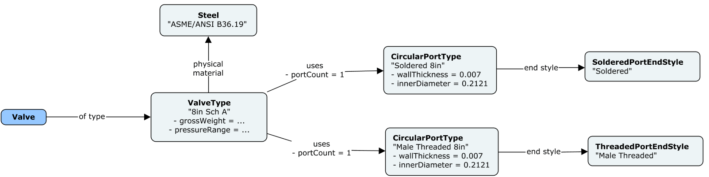
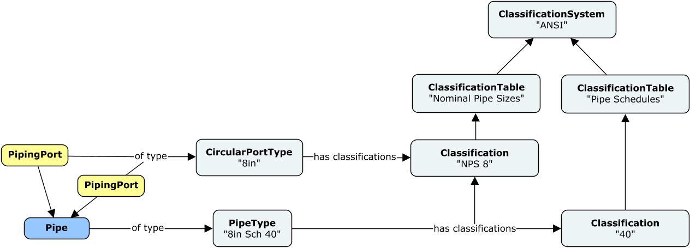

# PipeworkPhysical

This schema contains classes that are commonly used in various types of piping networks, designed for the distribution of matter (e.g. gases, liquids, fluidized solids or slurries).

The following class-diagrams depict the main classes and relationships in the PipeworkPhysical schema:




The following instance-diagram depict a few examples of classes from the PipeworkPhysical schema:






Rules and Patterns defined by the _ClassificationSystems_ schema are expected to be used in order to describe the classification of the PhysicalElement and PhysicalType sub-classes in this schema, in terms of International Classification Systems. The following instance-diagram depicts the classification of a `PipeType` instance by _Nominal Pipe Size_ and _Pipe Schedule_, two classification concepts standardized by the American National Standards Institute (ANSI).



The following instance-diagram depicts the classification of the `PipingPortType` instances in a `ReducerType` by _Nominal Pipe Size_, according to the American National Standards Institute (ANSI).


## Entity Classes

### BendType

A _Bend_ is a `PipeFitting` with typically two `PipingPort`s used to change the direction of flow between connected `IPipingElement`s.

`PipeFitting`s modeling _Bends_ shall be associated with an instance of `BendType` as its PhysicalType via the `PipeFittingIsOfType` relationship. `BendType`s must be contained in `DefinitionModel`s.

Equivalent to [IfcPipeFittingType](http://ifc43-docs.standards.buildingsmart.org/IFC/RELEASE/IFC4x3/HTML/lexical/IfcPipeFittingType.htm), with its _PredefinedType_ property set to _IfcPipeFittingTypeEnum.BEND_.

### CompressionEndStyle

A _Compression Port_ is a `PipingPort` that exhibits an _End-Style Treatment_ that allows connections among `Piping Element`s just by compression. Additional accessories may be used to further seal or strengthen each connection.

`PipingPort`s modeling _Compression Ports_ shall be associated with an instance of `CompressionPortType` as its TypeDefinition via the `PipingPortIsOfType` relationship, with its _EndStyle_ navigation property set to the appropriate instance of `CompressionEndStyle`. `CompressionEndStyle`s must be contained in `DefinitionModel`s.

Equivalent to an [IfcDistributionPort](http://ifc43-docs.standards.buildingsmart.org/IFC/RELEASE/IFC4x3/HTML/lexical/IfcDistributionPort.htm), with its [Pset_DistributionPortTypePipe.ConnectionType](https://ifc43-docs.standards.buildingsmart.org/IFC/RELEASE/IFC4x3/HTML/lexical/Pset_DistributionPortTypePipe.htm) property set to _PEnum_PipeEndStyleTreatment.COMPRESSION_.

### CrossType

A _Cross_ is a `PipeFitting` with more than three `PipingPort`s used to redistribute flow among them and/or to change the direction of flow between connected `IPipingElement`s.

`PipeFitting`s modeling _Crosses_ shall be associated with an instance of `CrossType` as its PhysicalType via the `PipeFittingIsOfType` relationship. `CrossType`s must be contained in `DefinitionModel`s.

Equivalent to [IfcPipeFittingType](http://ifc43-docs.standards.buildingsmart.org/IFC/RELEASE/IFC4x3/HTML/lexical/IfcPipeFittingType.htm), with its _PredefinedType_ property set to _IfcPipeFittingTypeEnum.JUNCTION_.

### FlangedPortEndStyle

A _Flanged Port_ is a `PipingPort` that exhibits an _End-Style Treatment_ based on a flange, typically with bolt holes, that enable connections among `IPipingElement`s.

`PipingPort`s modeling _Flanged Ports_ shall be associated with an instance of `PipingPortType` as its TypeDefinition via the `PipingPortIsOfType` relationship, with its _EndStyle_ navigation property set to the appropriate instance of `FlangedPortEndStyle`. `FlangedPortEndStyle`s must be contained in `DefinitionModel`s.

Equivalent to an [IfcDistributionPort](http://ifc43-docs.standards.buildingsmart.org/IFC/RELEASE/IFC4x3/HTML/lexical/IfcDistributionPort.htm), with its [Pset_DistributionPortTypePipe.ConnectionType](https://ifc43-docs.standards.buildingsmart.org/IFC/RELEASE/IFC4x3/HTML/lexical/Pset_DistributionPortTypePipe.htm) property set to _PEnum_PipeEndStyleTreatment.FLANGED_.

### FlangeType

A _Flange_ is a `PipeFitting` that uses Flanged `PipingPort`s as their main connection mechanism.

`PipeFitting`s modeling _Flanges_ shall be associated with an instance of `FlangeType` as its PhysicalType via the `PipeFittingIsOfType` relationship. `FlangeType`s must be contained in `DefinitionModel`s.

Equivalent to [IfcPipeFittingType](http://ifc43-docs.standards.buildingsmart.org/IFC/RELEASE/IFC4x3/HTML/lexical/IfcPipeFittingType.htm), with its _PredefinedType_ property set to _IfcPipeFittingTypeEnum.CONNECTOR_.

### GroovedPortEndStyle

A _GroovedPort_ is a `PipingPort` that exhibits an _End-Style Treatment_  with a groove that, by using additional accessories, enable connections among `IPipingElement`s.

`PipingPort`s modeling _Grooved Ports_ shall be associated with an instance of `PipingPortType` as its TypeDefinition via the `PipingPortIsOfType` relationship, with its _EndStyle_ navigation property set to the appropriate instance of `GroovedPortEndStyle`. `GroovedPortEndStyle`s must be contained in `DefinitionModel`s.

Equivalent to an [IfcDistributionPort](http://ifc43-docs.standards.buildingsmart.org/IFC/RELEASE/IFC4x3/HTML/lexical/IfcDistributionPort.htm), with its [Pset_DistributionPortTypePipe.ConnectionType](https://ifc43-docs.standards.buildingsmart.org/IFC/RELEASE/IFC4x3/HTML/lexical/Pset_DistributionPortTypePipe.htm) property set to _PEnum_PipeEndStyleTreatment.GROOVED_.

### OutsideSleevePortEndStyle

An _Outside Sleeve Port_ is a `PipingPort` that exhibits an _End-Style Treatment_ with a protective cover to safeguard the pipe.

`PipingPort`s modeling _Outside Sleeve Ports_ shall be associated with an instance of `PipingPortType` as its TypeDefinition via the `PipingPortIsOfType` relationship, with its _EndStyle_ navigation property set to the appropriate instance of `OutsideSleevePortEndStyle`. `OutsideSleevePortEndStyle`s must be contained in `DefinitionModel`s.

Equivalent to an [IfcDistributionPort](http://ifc43-docs.standards.buildingsmart.org/IFC/RELEASE/IFC4x3/HTML/lexical/IfcDistributionPort.htm), with its [Pset_DistributionPortTypePipe.ConnectionType](https://ifc43-docs.standards.buildingsmart.org/IFC/RELEASE/IFC4x3/HTML/lexical/Pset_DistributionPortTypePipe.htm) property set to _PEnum_PipeEndStyleTreatment.OUTSIDESLEEVE_.

### Pipe

The length of a `Pipe` instance can be obtained by calculating the distance between the two `PipingPort`s that it owns, via their _Origin_ properties.

`Pipe`s must be contained in `PhysicalModel`s and optionally associated with its corresponding `PipingSystem` instance via a `PipingSystemGroupsPipingElements` relationship.

`Pipe`s shall be associated with an instance of `PipeType` as its PhysicalType via the `PipeIsOfType` relationship.

Equivalent to [IfcPipeSegment](http://ifc43-docs.standards.buildingsmart.org/IFC/RELEASE/IFC4x3/HTML/lexical/IfcPipeSegment.htm).

### PipeFitting

`PipeFitting`s must be contained in `PhysicalModel`s and optionally associated with its corresponding `PipingSystem` instance via a `PipingSystemGroupsPipingElements` relationship.

`PipeFitting`s shall be associated with an instance of `PipeFittingType` as its PhysicalType via the `PipeFittingIsOfType` relationship.

Equivalent to [IfcPipeFitting](http://ifc43-docs.standards.buildingsmart.org/IFC/RELEASE/IFC4x3/HTML/lexical/IfcPipeFitting.htm).

### PipeFittingType

`PipeFittingType`s must be contained in `DefinitionModel`s.

Equivalent to [IfcPipeFittingType](http://ifc43-docs.standards.buildingsmart.org/IFC/RELEASE/IFC4x3/HTML/lexical/IfcPipeFittingType.htm).

### PipeType

`PipeType`s must be contained in `DefinitionModel`s.

Equivalent to [IfcPipeSegmentType](http://ifc43-docs.standards.buildingsmart.org/IFC/RELEASE/IFC4x3/HTML/lexical/IfcPipeSegmentType.htm).

### PipingPort

`PipingPort`s must be contained in `PhysicalModel`s and are owned by `IPipingElement` instances via the `PipingElementOwnsPorts` relationship.

Even though `PipingPort` instances are not generally expected to carry any Geometry, it is expected that their `Origin` property is assigned and can be used to derive centerlines across a parent `IPipingElement`s, when applicable. Furthermore, it is also expected that their *Placement angles* (`Yaw`, `Pitch` and `Roll`) are assigned accordingly in order to capture their orientation in 3D space. 

Note that it is assumed by convention that a `PipingPort` with no rotation around any axes is oriented perpendicular to the X-axis, as shown below.


`PipingPort`s shall be associated with an instance of `PipingPortType` as its TypeDefinition via the `PipingPortIsOfType` relationship. 

_Crown and Invert Elevations_ at individual `PipingPort` instances can be derived according to its _Shape_. For example, they can be computed on `CircularPortType`s as:

```
CrownElevation at a PipingPort = PipingPort.Origin.z + 
                                (PipingPort.CircularPortType.InnerDiameter / 2) * 
                                cos(PipingPort.Placement.Pitch)

InvertElevation at a PipingPort = PipingPort.Origin.z - 
                                (PipingPort.CircularPortType.InnerDiameter / 2) * 
                                cos(PipingPort.Placement.Pitch)
```

Equivalent to [IfcDistributionPort](http://ifc43-docs.standards.buildingsmart.org/IFC/RELEASE/IFC4x3/HTML/lexical/IfcDistributionPort.htm), with its _PredefinedType_ property set to _IfcDistributionPortTypeEnum.PIPE_.

### PipingPortType

The `PipingPortType` class captures two important concepts for a set of ports: 
1) Their shape and associated dimensions.
1) Their end-condition / end-style treatment.

For _Circular_ Port types, inner diameters are captured via the `InnerDiameter` property of the `CircularPortType` class.
For _Rectangular_ Port types, inner dimension values are captured via the `SmallerDimension` and `LargerDimension` properties of the `RectangularPortType` class.
The `WallThickness` property of the base `PipingPortType` class captures thickness values across all shapes.

End-Style Treatment is generally captured by the `PipePortType.EndStyle` navigation property.

`PipingPortType`s can be associated with PhysicalTypes implementing the `IPipingPhysicalType` mix-in, via the `PipingPhysicalTypeUsesPortTypes` relationship. That way, catalogs of PhysicalTypes can include data about their PipingPortTypes: diameters and end-condition of their ports.

Concrete `PipingPortType` instances must be contained in `DefinitionModel`s.

### ReducerType

A _Reducer_ is a `PipeFitting` with typically two `PipingPort`s having different shapes or sizes. Reducers can also be used to change the direction of flow between connected `IPipingElement`s.

`PipeFitting`s modeling _Reducers_ shall be associated with an instance of `ReducerType` as its PhysicalType via the `PipeFittingIsOfType` relationship. `ReducerType`s must be contained in `DefinitionModel`s.

Equivalent to [IfcPipeFittingType](http://ifc43-docs.standards.buildingsmart.org/IFC/RELEASE/IFC4x3/HTML/lexical/IfcPipeFittingType.htm), with its _PredefinedType_ property set to _IfcPipeFittingTypeEnum.TRANSITION_.

### SolderedPortEndStyle

A _Soldered Port_ is a `PipingPort` that exhibits an _End-Style Treatment_ connected with another `PipingPort` by using soldering.

`PipingPort`s modeling _Soldered Ports_ shall be associated with an instance of `PipingPortType` as its TypeDefinition via the `PipingPortIsOfType` relationship, with its _EndStyle_ navigation property set to the appropriate instance of `SolderedPortEndStyle`. `SolderedPortEndStyle`s must be contained in `DefinitionModel`s.

Equivalent to an [IfcDistributionPort](http://ifc43-docs.standards.buildingsmart.org/IFC/RELEASE/IFC4x3/HTML/lexical/IfcDistributionPort.htm), with its [Pset_DistributionPortTypePipe.ConnectionType](https://ifc43-docs.standards.buildingsmart.org/IFC/RELEASE/IFC4x3/HTML/lexical/Pset_DistributionPortTypePipe.htm) property set to _PEnum_PipeEndStyleTreatment.SOLDERED_.

### TeeType

A _Tee_ is a `PipeFitting` with three `PipingPort`s used to redistribute flow among them and/or to change the direction of flow between connected `IPipingElement`s.

`PipeFitting`s modeling _Tees_ shall be associated with an instance of `TeeType` as its PhysicalType via the `PipeFittingIsOfType` relationship. `TeeType`s must be contained in `DefinitionModel`s.

Equivalent to [IfcPipeFittingType](http://ifc43-docs.standards.buildingsmart.org/IFC/RELEASE/IFC4x3/HTML/lexical/IfcPipeFittingType.htm), with its _PredefinedType_ property set to _IfcPipeFittingTypeEnum.JUNCTION_.

### ThreadedPortEndStyle

A _Threaded Port_ is a `PipingPort` that exhibits either a male or female threaded _End-Style Treatment_ connection into which an opposite _Threaded Port_ fits.

`PipingPort`s modeling _Threaded Ports_ shall be associated with an instance of `PipingPortType` as its TypeDefinition via the `PipingPortIsOfType` relationship, with its _EndStyle_ navigation property set to the appropriate instance of `ThreadedPortEndStyle`. `ThreadedPortEndStyle`s must be contained in `DefinitionModel`s.

Equivalent to an [IfcDistributionPort](http://ifc43-docs.standards.buildingsmart.org/IFC/RELEASE/IFC4x3/HTML/lexical/IfcDistributionPort.htm), with its [Pset_DistributionPortTypePipe.ConnectionType](https://ifc43-docs.standards.buildingsmart.org/IFC/RELEASE/IFC4x3/HTML/lexical/Pset_DistributionPortTypePipe.htm) property set to _PEnum_PipeEndStyleTreatment.THREADED_.

### Valve

`Valve`s must be contained in `PhysicalModel`s and optionally associated with its corresponding `PipingSystem` instance via a `PipingSystemGroupsPipingElements` relationship.

`Valve`s shall be associated with an instance of `ValveType` as its PhysicalType via the `ValveIsOfType` relationship.

Equivalent to [IfcValve](http://ifc43-docs.standards.buildingsmart.org/IFC/RELEASE/IFC4x3/HTML/lexical/IfcValve.htm).

### ValveType

`ValveType`s must be contained in `DefinitionModel`s.

Equivalent to [IfcValveType](http://ifc43-docs.standards.buildingsmart.org/IFC/RELEASE/IFC4x3/HTML/lexical/IfcValveType.htm).

### WeldedPortEndStyle

A _Welded Port_ is a `PipingPort` that exhibits an _End-Style Treatment_ connected to another `PipingPort` by welding means.

`PipingPort`s modeling _Welded Ports_ shall be associated with an instance of `PipingPortType` as its TypeDefinition via the `PipingPortIsOfType` relationship, with its _EndStyle_ navigation property set to the appropriate instance of `WeldedPortEndStyle`. `WeldedPortEndStyle`s must be contained in `DefinitionModel`s.

Equivalent to an [IfcDistributionPort](http://ifc43-docs.standards.buildingsmart.org/IFC/RELEASE/IFC4x3/HTML/lexical/IfcDistributionPort.htm), with its [Pset_DistributionPortTypePipe.ConnectionType](https://ifc43-docs.standards.buildingsmart.org/IFC/RELEASE/IFC4x3/HTML/lexical/Pset_DistributionPortTypePipe.htm) property set to _PEnum_PipeEndStyleTreatment.WELDED_.

### WyeType

A _Wye_ is a `PipeFitting` with three `PipingPort`s used to split or merge flow among the connected `IPipingElement`s, and shaped like the letter 'Y' in order to significantly decrease friction and turbulence.

`PipeFitting`s modeling _Wyes_ shall be associated with an instance of `WyeType` as its PhysicalType via the `PipeFittingIsOfType` relationship. `WyeType`s must be contained in `DefinitionModel`s.

Equivalent to [IfcPipeFittingType](http://ifc43-docs.standards.buildingsmart.org/IFC/RELEASE/IFC4x3/HTML/lexical/IfcPipeFittingType.htm), with its _PredefinedType_ property set to _IfcPipeFittingTypeEnum.JUNCTION_.