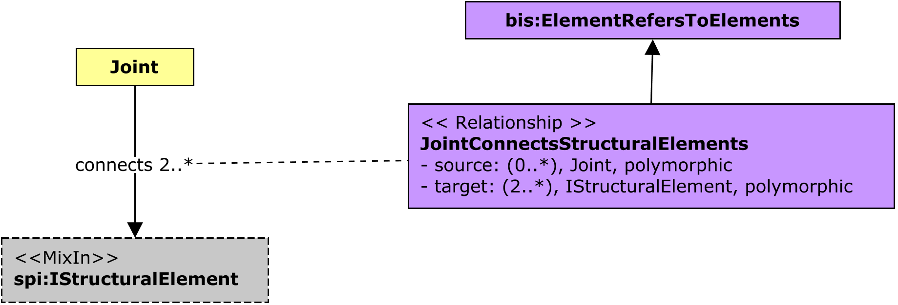

# StructuralConnections

This schema contains classes that are used to model the real-world physical entities that comprise the structural systems of infrastructure.

The following class-diagrams depict the main classes and relationships in the StructuralPhysical schema:

## Entity Classes

### Joint
