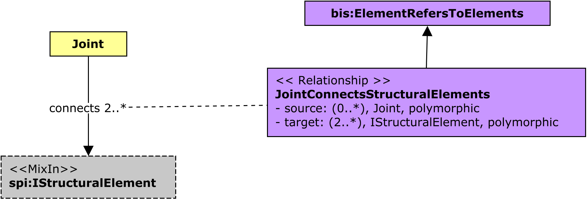

# StructuralConnections

This schema contains classes that are used to model the real-world physical entities that comprise the structural systems of infrastructure.

The following class-diagrams depict the main classes and relationships in the StructuralPhysical schema:



## Entity Classes

## Sample ECSQL queries

- Query for the _Structural elements_ connected by a particular `Joint`, returning their concrete classes.

```sql
SELECT
    se.ECInstanceId [Structural Element Id],
    ec_classname(se.ECClassId) [Class Name]
FROM
    sc.Joint j INNER JOIN sc.JointConnectsStructuralElements conn ON j.SourceECInstanceId = conn.ECInstanceId
    INNER JOIN spi.IStructuralElement se ON conn.TargetECInstanceId = se.ECInstanceId
WHERE
    j.ECInstanceId = :jointId
```