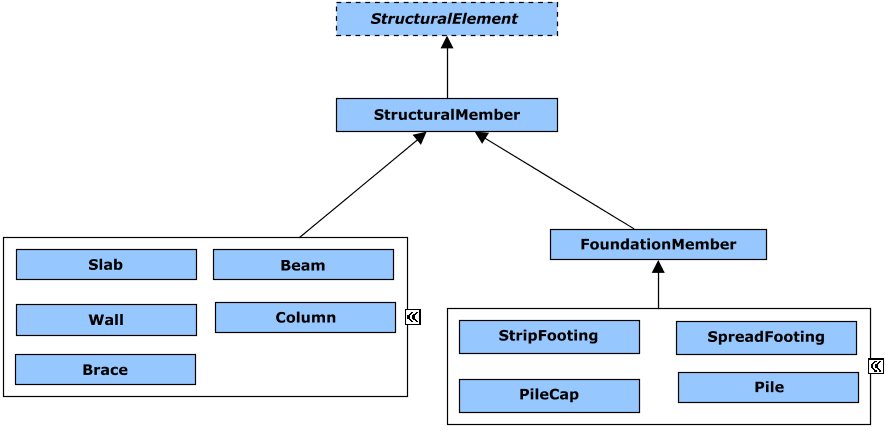

# StructuralPhysical

This schema contains classes that are used to model the real-world physical entities that comprise the structural systems of infrastructure.

The following class-diagrams depict the main classes and relationships in the StructuralPhysical schema:

## Entity Classes

### StructuralPhysicalModel

***This class has been deprecated. Do not use.***

Applications, services and components should never create instances of this class. Use `PhysicalModel` instead.

### StructuralElement

The abstract class `StructuralElement` is the generalization of `StructuralMember`.

Equivalent to [IfcStructuralItem](https://standards.buildingsmart.org/IFC/RELEASE/IFC4_3/HTML/lexical/IfcStructuralItem.htm).

### StructuralMember

The class `StructuralMember` is the base class of all structural items. This class is not abstract and could be used to define any generic structural element, but it is recommended to use any defined subclass if available. `StructuralMember` instances must be contained in `PhysicalModels`.

Classification of `StructuralMember` instances can be achieved via instances of `StructuralMemberType`.

`StructuralMember` should be used as a base of any specialized class.

Equivalent to [IfcStructuralMember](https://standards.buildingsmart.org/IFC/RELEASE/IFC4_3/HTML/lexical/IfcStructuralMember.htm).

### StructuralMemberType

`StructuralMemberType`s must be contained in `DefinitionModel`s.

Equivalent to [IfcMemberType](https://standards.buildingsmart.org/IFC/RELEASE/IFC4_3/HTML/lexical/IfcMemberType.htm).

### Slab

A `Slab` is a construction component that can enclose a space vertically. It may serve as the lower support (floor) or the upper structure (roof slab) in a building.

Classification of `Slab` instances can be achieved via instances of `SlabType`. `Slab`s must be contained in `PhysicalModel`s.

Equivalent to [IfcSlab](https://standards.buildingsmart.org/IFC/RELEASE/IFC4_3/HTML/lexical/IfcSlab.htm).

### SlabType

`SlabType`s must be contained in `DefinitionModel`s.

Equivalent to [IfcSlabType](https://standards.buildingsmart.org/IFC/RELEASE/IFC4_3/HTML/lexical/IfcSlabType.htm).

### Wall

A `Wall` is a vertical construction element that can enclose or divide spaces. Walls are typically vertical or nearly vertical, planar elements, often designed to bear structural loads.

Classification of `Wall` instances can be achieved via instances of `WallType`. `Wall`s must be contained in `PhysicalModel`s.

Equivalent to [IfcWall](https://standards.buildingsmart.org/IFC/RELEASE/IFC4_3/HTML/lexical/IfcWall.htm).

### WallType

`WallType`s must be contained in `DefinitionModel`s.

Equivalent to [IfcWallType](https://standards.buildingsmart.org/IFC/RELEASE/IFC4_3/HTML/lexical/IfcWallType.htm).

### Beam

A `Beam` is generally a horizontal, or almost horizontal, structural member intended to endure loads primarily by resisting bending.

Classification of `Beam` instances can be achieved via instances of `BeamType`. `Beam`s must be contained in `PhysicalModel`s

Equivalent to [IfcBeam](https://standards.buildingsmart.org/IFC/RELEASE/IFC4_3/HTML/lexical/IfcBeam.htm).

### BeamType

`BeamType`s must be contained in `DefinitionModel`s.

Equivalent to [IfcBeamType](https://standards.buildingsmart.org/IFC/RELEASE/IFC4_3/HTML/lexical/IfcBeamType.htm)

### Column

A `Column` is a vertical structural member typically aligned with a structural grid intersection. Generally, it serves as a vertical or nearly vertical structural member that transfers the weight of the structure above to other elements below through compression.

Classification of `Column` instances can be achieved via instances of `ColumnType`. `Column`s must be contained in `PhysicalModel`s.

Equivalent to [IfcColumn](https://standards.buildingsmart.org/IFC/RELEASE/IFC4_3/HTML/lexical/IfcColumn.htm).

### ColumnType

`ColumnType`s must be contained in `DefinitionModel`s.

Equivalent to [IfcColumnType](https://standards.buildingsmart.org/IFC/RELEASE/IFC4_3/HTML/lexical/IfcColumnType.htm)

### Brace

A `Brace` is a structural member designed to provide lateral support to a structure, ensuring stability by resisting sideways forces. It typically serves as a diagonal element, connecting to other members. As an `StructuralMember`, it contributes to the overall integrity and rigidity of the structural system for load-bearing purposes.

Classification of `Brace` instances can be achieved via instances of `BraceType`. `Brace`s must be contained in `PhysicalModel`s.

Equivalent to [IfcMember](https://standards.buildingsmart.org/IFC/RELEASE/IFC4_3/HTML/lexical/IfcMember.htm) with a PredefinedType equal to [IfcMemberTypeEnum](https://standards.buildingsmart.org/IFC/RELEASE/IFC4_3/HTML/lexical/IfcMemberTypeEnum.htm).BRACE.

### BraceType

`BraceType`s must be contained in `DefinitionModel`s.

Equivalent to [IfcMemberType](https://standards.buildingsmart.org/IFC/RELEASE/IFC4_3/HTML/lexical/IfcMember.htm) with a PredefinedType equal to [IfcMemberTypeEnum](https://standards.buildingsmart.org/IFC/RELEASE/IFC4_3/HTML/lexical/IfcMemberTypeEnum.htm).BRACE.

### FoundationMember

An `FoundationMember` is a foundational structural element designed to transfer building loads to the ground. It serves as a base class within the structural hierarchy, providing essential support and stability to the entire structure. This class is further specialized into specific types of foundation members, such as footings or piles, which are tailored to meet particular load-bearing and ground conditions. As a fundamental component, it ensures the safe and efficient transfer of loads from the structure above to the supporting ground below.

### StripFooting

A `StripFooting` is a type of shallow foundation element designed to support a linear structure, such as a wall. It is a continuous strip of concrete that spreads the load of the wall over a wider area, reducing the stress on the soil. This type of footing is used to ensure the stability and support of the wall, particularly in load-bearing walls, making it a critical component in building foundations.

Classification of `StripFooting` instances can be achieved via instances of `StripFootingType`. `StripFotting`s must be contained in `PhysicalModel`s.

Equivalent to [IfcFooting](https://standards.buildingsmart.org/IFC/RELEASE/IFC4_3/HTML/lexical/IfcFooting.htm) with a PredefinedType equal to [IfcFootingTypeEnum](https://standards.buildingsmart.org/IFC/RELEASE/IFC4_3/HTML/lexical/IfcFootingTypeEnum.htm).STRIP_FOOTING.

### StripFootingType

`StripFootingType`s must be contained in `DefinitionModel`s.

Equivalent to [IfcFootingType](https://standards.buildingsmart.org/IFC/RELEASE/IFC4_3/HTML/lexical/IfcFootingType.htm) with a PredefinedType equal to [IfcFootingTypeEnum](https://standards.buildingsmart.org/IFC/RELEASE/IFC4_3/HTML/lexical/IfcFootingTypeEnum.htm).STRIP_FOOTING.

### SpreadFooting

An `SpreadFooting` is a type of shallow foundation element that distributes the load of a column over a broad area. It usually consists of a concrete pad that spreads the weight of the column onto the ground below, reducing the stress on the soil. This type of footing is designed to ensure stability and support for the column, making it an essential component in building foundations.

Classification of `SpreadFooting` instances can be achieved via instances of `SpreadFootingType`. `SpreadFooting`s must be contained in `PhysicalModel`s.

Equivalent to [IfcFooting](https://standards.buildingsmart.org/IFC/RELEASE/IFC4_3/HTML/lexical/IfcFooting.htm) with a PredefinedType equal to [IfcFootingTypeEnum](https://standards.buildingsmart.org/IFC/RELEASE/IFC4_3/HTML/lexical/IfcFootingTypeEnum.htm).PAD_FOOTING.

### SpreadFootingType

`SpreadFootingType`s must be contained in `DefinitionModel`s.

Equivalent to [IfcFootingType](https://standards.buildingsmart.org/IFC/RELEASE/IFC4_3/HTML/lexical/IfcFootingType.htm) with a PredefinedType equal to [IfcFootingTypeEnum](https://standards.buildingsmart.org/IFC/RELEASE/IFC4_3/HTML/lexical/IfcFootingTypeEnum.htm).PAD_FOOTING.

### PileCap

A `PileCap` is a reinforced concrete slab that rests on top of multiple piles and distributes the loads from the superstructure evenly across the piles. It acts as a foundation component to ensure stable support by connecting the piles and transferring the load from the building or structure above to the deeper, more stable soil or rock layers beneath.

Classification of `PileCap` instances can be achieved via instances of `PileCapType`. `PileCap`s must be contained in `PhysicalModel`s.

Equivalent to [IfcFooting](https://standards.buildingsmart.org/IFC/RELEASE/IFC4_3/HTML/lexical/IfcFooting.htm) with a PredefinedType equal to [IfcFootingTypeEnum](https://standards.buildingsmart.org/IFC/RELEASE/IFC4_3/HTML/lexical/IfcFootingTypeEnum.htm).PILE_CAP.

### PileCapType

`PileCapType`s must be contained in `DefinitionModel`s.

Equivalent to [IfcFooting](https://standards.buildingsmart.org/IFC/RELEASE/IFC4_3/HTML/lexical/IfcFootingType.htm) with a PredefinedType equal to [IfcFootingTypeEnum](https://standards.buildingsmart.org/IFC/RELEASE/IFC4_3/HTML/lexical/IfcFootingTypeEnum.htm).PILE_CAP.

### Pile

A `Pile` is a slender structural element made of timber, concrete, or steel, driven, jetted, or embedded into the ground to support a load. It is classified as a deep foundation, transferring loads to deeper subsurface layers for enhanced stability and support.

Classification of `Pile` instances can be achieved via instances of `PileType`. `Pile`s must be contained in `PhysicalModel`s.

Equivalent to [IfcPile](https://standards.buildingsmart.org/IFC/RELEASE/IFC4_3/HTML/lexical/IfcPile.htm).

### PileType

`PileType`s must be contained in `DefinitionModel`s.

Equivalent to [IfcPileType](https://standards.buildingsmart.org/IFC/RELEASE/IFC4_3/HTML/lexical/IfcPileType.htm).

### SlabFoundation

A `SlabFoundation` is a flat, typically horizontal structural element made of reinforced concrete that spreads building loads over a wide area of ground. It is classified as a shallow foundation and is commonly used in residential and commercial construction where subsurface conditions are stable near the surface. 

Classification of `SlabFoundation` instances can be achieved via instances of `SlabFoundationType`. `SlabFoundation`s must be contained in `PhysicalModel`s.

Equivalent to [IfcSlab](https://standards.buildingsmart.org/IFC/RELEASE/IFC4_3/HTML/lexical/IfcSlab.htm) with a PredefinedType equal to [IfcSlabEnum](https://standards.buildingsmart.org/IFC/RELEASE/IFC4_3/HTML/lexical/IfcSlabTypeEnum.htm).BASESLAB.

### SlabFoundationType

`SlabFoundationTypes` must be contained in `DefinitionModel`s.

Equivalent to [IfcSlabType](https://standards.buildingsmart.org/IFC/RELEASE/IFC4_3/HTML/lexical/IfcSlabType.htm) with a PredefindeType equal to [IfcFootingTypeEnum](https://standards.buildingsmart.org/IFC/RELEASE/IFC4_3/HTML/lexical/IfcSlabTypeEnum.htm).BASESLAB.