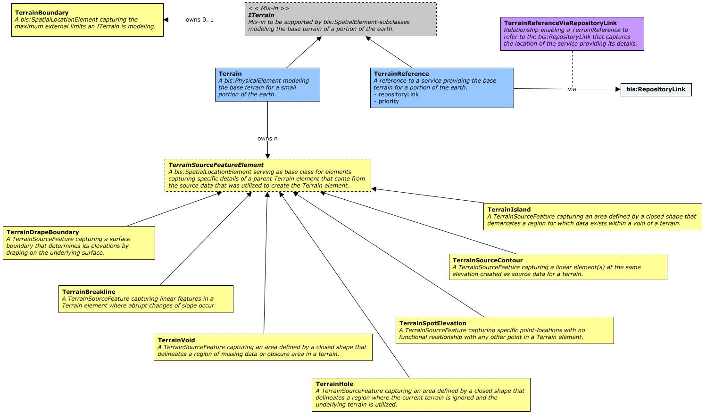
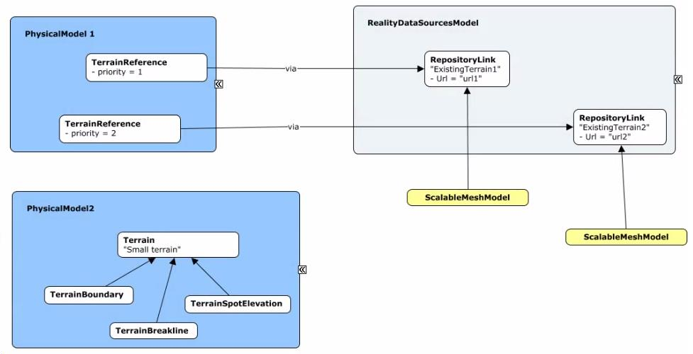

# Terrain

This schema contains classes that are used to provide *context* terrains. Cuts, fills and modifications to terrain are defined in the Earthwork schema.

See the `ITerrain` documentation for details on how terrain is defined in iModels.

## Entity Classes

### ITerrain

`ITerrain` is a common mix-in expected to be implemented by element-classes defining a static *context* for assets and projects.

There are three terrain types in iModels:

1. *Background Default Terrain* (defined in the iModel settings)
2. `TerrainReference`s
3. `Terrain`s

`TerrainReference` and `Terrain` implement `ITerrain`. These three terrain types interact as follows.

The *Background Default Terrain* comes from a service (typically Cesium World Terrain). This background terrain is typically available world-wide. For the iModel, the *Background Default Terrain* is used wherever there is no other terrain defined.

`TerrainReference`s also provide terrain from a service while `Terrain`s fully capture terrain in the iModel itself. 
The terrain defined by `TerrainReference`s and `Terrain`s tends to be from data that was captured specifically for the project or asset under consideration and is generally more accurate and/or more current than the terrain provided by the *Background Default Terrain*.
`TerrainReference`s and `Terrain`s are always used instead of *Background Default Terrain* where they overlap. In many large projects there will be multiple `TerrainReference`s and `Terrain`s provided. For example, one `TerrainReference` may provide a low-resolution terrain for the entire project site and other `Terrain`s may define high-resolution terrain for focused areas where most of the work will occur. Where `TerrainReference`s' and `Terrain`s' overlap, the `Terrain` elements will be used.

In Digital Twins, all three types of terrain can provide the context for the infrastructure or the starting (or current) conditions of the site, but it is more typical for *Background Default Terrain* and `TerrainReference`s to do so.

### TerrainReference

Terrain data in `TerrainReference`s is always provided by a service, but may be locally cached. The location of the service providing the `TerrainReference` is captured by the `RepositoryLink` instance stored in the iModel's global `RealityDataSourcesModel`. Such instance is referenced via the `RepositoryLink` navigation-property.

Where multiple `TerrainReference`s overlap, the `TerrainReference` with the highest `Priority` will be used.

`TerrainReference`s must be contained in `PhysicalModel`s. The choice of the containing `Model` has these repercussions:

- The visibility of the terrain is controlled along with the visibility of other `Element`s in the `Model`.
- There is an implication that the party responsible for the other `Element`s in the `Model` is also responsible for the `TerrainReference`.

Every `TerrainReference` has a *Footprint* captured in an associated `RealityDataMask` element. This *Footprint* is used to clip overlapping areas of `TerrainReference`s with lower priority.

### Terrain

`Terrain` is used to define *context* for assets and projects that may be expected to change and therefore, it is fully contained within an iModel. `Terrain`s are expected to be of small or medium size in order to not negatively impact performance of iModels. Large terrains are expected to be captured by `TerrainReference`s.

Every `Terrain` owns multiple `TerrainSourceFeature`s, which capture details of the `Terrain` that are not calculated, such as its boundary, breaklines or spot elevations. Calculated details such as contours, flow arrows or triangles are not expected to be captured as child elements of a `Terrain`. Instead, they are expected to be calculated at display-time. They can be still captured in iModels as, for instance, `DrawingElement`s in `DrawingModel`s if needed for sheet-production.

`Terrain`s already calculated will have their calculated *Surface* stored in their `GeometryStream` as a *Polyface*.

`Terrain`s must be contained in `PhysicalModel`s. The same repercussions of the choice of the containing `Model` for `TerrainReference` apply to `Terrain`.

Instances of `Terrain`, by default, shall use the Domain-ranked `trrn:Terrain` category.

### TerrainBoundary

One `TerrainBoundary` is expected for every `ITerrain` instance.

An `ITerrain`, if already calculated, has a *Boundary* captured by a single child element of type `TerrainBoundary`, which stores the boundary's geometrical details in its `GeometryStream` as a closed line-string (i.e. no arcs) encoded into a single *LineString3d*. The first and last point of the *LineString3d* shall be the same.

Instances of `TerrainBoundary`, by default, shall use the Domain-ranked `trrn:Boundary` category.

### TerrainSourceFeatureElement

`TerrainSourceFeatureElement`s store its geometrical details in their `GeometryStream`.

### TerrainDrapeBoundary

Up to one `TerrainDrapeBoundary` is expected for every `Terrain` instance, if a terrain's limits were explicitely defined on its source.

A `TerrainDrapeBoundary` stores its geometrical details in its `GeometryStream` as a closed line-string (i.e. no arcs) encoded as a *LineString3d*. Z-coordinates shall be the same (planar). The first and last point of the *LineString3d* shall be the same.

Instances of `TerrainDrapeBoundary`, by default, shall use the Domain-ranked `trrn:DrapeBoundary` category.

### TerrainBreakline

`TerrainBreakline`s are used to designate linear features such as edges of pavement, ditch bottoms, ridges, etc. where an abrupt change of slope occurs. Any longitudinal element may be defined as a break line. One `TerrainBreakline` typically captures one of such linear features, but multiple of them could be captured by a single `TerrainBreakline` instance if they do not capture additional data per breakline feature.

A `TerrainBreakline` stores its geometrical details in its `GeometryStream` as line-strings (i.e. no arcs) which may be open or closed. These line-strings shall be encoded as a *LineString3d*. If a single instance of `TerrainBreakline` is capturing multiple breaklines, each breakline shall be encoded into a separate *LineString3d* in the `GeometryStream`.

Instances of `TerrainBreakline`, by default, shall use the Domain-ranked `trrn:Breakline` category.

### TerrainSourceContour

One `TerrainSourceContour` typically captures one contour, but multiple of them could be captured by a single `TerrainSourceContour` instance if they do not capture additional data per contour.

A `TerrainSourceContour` stores its geometrical details in its `GeometryStream` as an open or closed line-string (i.e. no arcs), encoded into a *LineString3d*. If it is closed then the first and last point of the *LineString3d* shall be the same. If a single instance of `TerrainSourceContour` is capturing multiple contours, each contour shall be encoded into a separate *LineString3d*s in the `GeometryStream`.

Instances of `TerrainSourceContour`, by default, shall use the Domain-ranked `trrn:SourceContour` category.

### TerrainSpotElevation

One `TerrainSpotElevation` typically captures one point, but multiple of them could be captured by a single `TerrainSpotElevation` instance if they do not capture additional data per spot elevation.

A `TerrainSpotElevation` stores its geometrical details in its `GeometryStream` as a *PointString3d*. The elevation captured by a `TerrainSpotElevation` can be read from each point's Z-coordinate in the *PointString3d*. If a single instance of `TerrainSpotElevation` is capturing only one Spot elevation, its `GeometryStream` shall contain a *PointString3d* with one single point in it.

Instances of `TerrainSpotElevation`, by default, shall use the Domain-ranked `trrn:SpotElevation` category.

### TerrainHole

`TerrainHole`s can be used for marking areas of the Terrain that are not used or displayed. TerrainHoles are typically used to mark areas of a design terrain that are not intended for use. One `TerrainHole` typically captures one hole feature, but multiple of them could be captured by a single `TerrainHole` instance if they do not capture additional data per hole feature.

A `TerrainHole` stores its geometrical details in its `GeometryStream` as closed line-strings (i.e. no arcs) encoded into a single *LineString3d*. The first and last point of the *LineString3d* shall be the same. If a single instance of `TerrainHole` is capturing multiple hole features, each hole feature shall be encoded into a separate *LineString3d* in the `GeometryStream`.

Instances of `TerrainHole`, by default, shall use the Domain-ranked `trrn:Hole` category.

### TerrainVoid

`TerrainSpotElevation`s or `TerrainBreakline`s located within a `TerrainVoid` area are ignored. That is, no point or break-line data located within the void area is utilized and no triangles are created inside the void areas. The void coordinates are included in the triangulation and void lines, between successive void coordinates, are inserted as drape lines on the surface. Therefore, they do not change the slope or elevations of the surface. A `TerrainVoid` never overrides a `TerrainIsland`.

One `TerrainVoid` typically captures one void feature, but multiple of them could be captured by a single `TerrainVoid` instance if they do not capture additional data per void feature.

A `TerrainVoid` stores its geometrical details in its `GeometryStream` as closed line-strings (i.e. no arcs) encoded into a *LineString3d*. The first and last point of the *LineString3d* shall be the same. If a single instance of `TerrainVoid` is capturing multiple void features, each void feature shall be encoded into a separate *LineString3d* in the `GeometryStream`.

Instances of `TerrainVoid`, by default, shall use the Domain-ranked `trrn:Void` category.

### TerrainDrapeVoid

The same restrictions described for `TerrainVoid`s are applicable to `TerrainDrapeVoid`s.

A `TerrainDrapeVoid` stores its geometrical details in its `GeometryStream` as closed line-strings (i.e. no arcs) encoded into a *LineString3d*. Z-coordinates shall be the same (planar). The first and last point of the *LineString3d* shall be the same. If a single instance of `TerrainVoid` is capturing multiple void features, each void feature shall be encoded into a separate *LineString3d* in the `GeometryStream`.

Instances of `TerrainVoid`, by default, shall use the Domain-ranked `trrn:Void` category.

### TerrainIsland

One `TerrainIsland` typically captures one island feature, but multiple of them could be captured by a single `TerrainIsland` instance if they do not capture additional data per island feature.

A `TerrainIsland` stores its geometrical details in its `GeometryStream` as closed line-strings (i.e. no arcs) encoded into a *LineString3d*. The first and last point of the *LineString3d* shall be the same. If a single instance of `TerrainIsland` is capturing multiple island features, each island feature shall be encoded into a separate *LineString3d* in the `GeometryStream`.

Instances of `TerrainIsland`, by default, shall use the Domain-ranked `trrn:Island` category.
