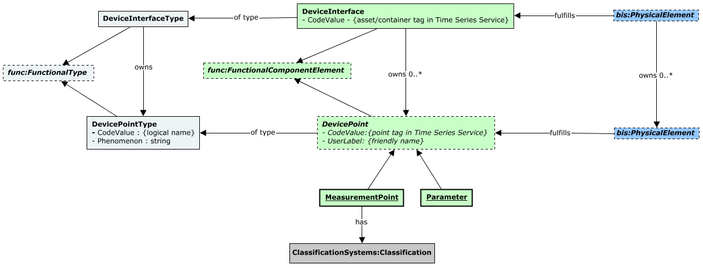
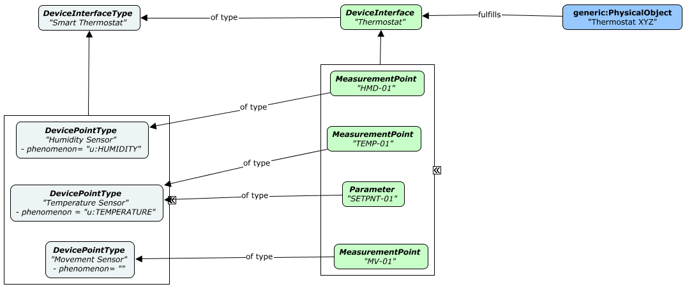

# IoTDeviceFunctional

This schema contains classes that aim at the functional modeling of IoT devices. A separate schema focusing on the physical model of IoT devices is envisioned for the future.

The following class-diagram depicts the overall design of this schema:



The following instance-diagram introduces the case of a Thermostat as an example of the applicability of this schema:



## Entity Classes

### DevicePointType

Instances of `DevicePointType` provide an additional classification that can be applied to `DevicePoint`s. Note that this classification is functional in nature, thus, it is typically driven by the function provided by the referencing `DevicePoint`s. For example, CO-sensor, Fire-sensor or Level-sensor.

Equivalent to [IfcSensorType](http://ifc43-docs.standards.buildingsmart.org/IFC/RELEASE/IFC4x3/HTML/lexical/IfcSensorTypeEnum.htm).

The `Phenomenon` property is expected to capture the equivalent concept in [EC terms](https://www.itwinjs.org/bis/domains/units.ecschema/?#phenomena) as: 

```
"<schema_name | schema_alias>:<phenomenon_name>" 
```

For example, "u:TEMPERATURE" referring to the "TEMPERATURE" phenomenon defined in the [Units schema](https://www.itwinjs.org/bis/domains/units.ecschema/).

### DevicePoint

Sub-classes of `DevicePoint` are expected to capture the involved function and unit of data-point values (if any) by referring to an instance of `DevicePointType` that carries such information.

### MeasurementPoint

Additional classification of `MeasurementPoint` instances can be achieved by using the patterns available in the **ClassificationSystems** schema, more specifically its `ElementHasClassifications` relationship.

This class is sealed by design. Unit of data-point values (if any) can be specified by referring to an instance of `DevicePointType` that carries such information via its **Phenomenon** property.

### Parameter

The example depicted by the instance-diagram above includes a Set-Point on a Thermostat, indicating such `DeviceInterface` has a parameter-base functionality. In this example, it allows the setting of the desired temperature that the Thermostat is meant to maintain.