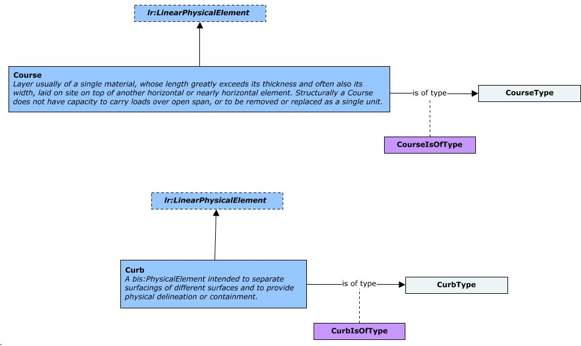

# CivilPhysical

This schema contains classes that are commonly used in various types of Civil projects, including Road, Rail and Site-related.

NOTE: Currently under development. This schema should not be used for production workflows. Data created using this schema is not supported and may not be upgradable.

## Entity Classes

### CourseType

Instances of `CourseType` provide an additional classification that can be applied to `Course`s. Examples include Pavement, Ballast and Protection. An instance of `CourseType` can optionally specify a single *Physical Material* via its `PhysicalMaterial` property.

Equivalent to [IfcCourseType](https://standards.buildingsmart.org/IFC/DEV/IFC4_3/RC2/HTML/link/ifccoursetype.htm).

### Course

A `Course` is distinctive from an earthworks element in that a course is a graded granular material (which can be bound or unbound) that is generally processed in some fashion, where as earthworks elements are soil earthen based structure that can be formed by removal and transport of general ground material. Structurally a `Course` does not have capacity to carry loads over open span, or to be removed or replaced as a single unit.

`Course`s shall have their *Volume* stored in their `GeometryStream` as a *Polyface*. Further classification of `Course` instances can be achieved via instances of `CourseType`. A `Course` instance can override the *Physical Material* specified by its corresponding `CourseType` via its `PhysicalMaterial` property.

`Course`s must be contained in `PhysicalModel`s and can be linearly located, typically along an *Alignment*.

The kind of structure making use of a `Course` can be also understood via its `Category`. e.g. A `Course` instance that is part of a Pavement structure shall use the Domain-ranked `cvphys:Pavement` category.

Equivalent to [IfcCourse](https://standards.buildingsmart.org/IFC/DEV/IFC4_3/RC2/HTML/link/ifccourse.htm).

### CurbType

Instances of `CurbType` provide an additional classification that can be applied to `Curb`s. An instance of `CurbType` can optionally specify a single *Physical Material* via its `PhysicalMaterial` property.

Equivalent to [IfcKerbType](https://standards.buildingsmart.org/IFC/DEV/IFC4_3/RC2/HTML/link/ifckerbtype.htm).

### Curb

A `Curb` is typically a border of stone, concrete or other rigid material formed at the edge of a roadway or footway (Kerb, UK).

`Curb`s shall have their *Volume* stored in their `GeometryStream` as a *Polyface*. Further classification of `Curb` instances can be achieved via instances of `CurbType`. A `Curb` instance can override the *Physical Material* specified by its corresponding `CurbType` via its `PhysicalMaterial` property.

`Curb`s must be contained in `PhysicalModel`s and can be linearly located, typically along an *Alignment*. Instances of `Curb`, by default, shall use the Domain-ranked `cvphys:Curb` category.

Equivalent to [IfcKerb](https://standards.buildingsmart.org/IFC/DEV/IFC4_3/RC2/HTML/link/ifckerb.htm).