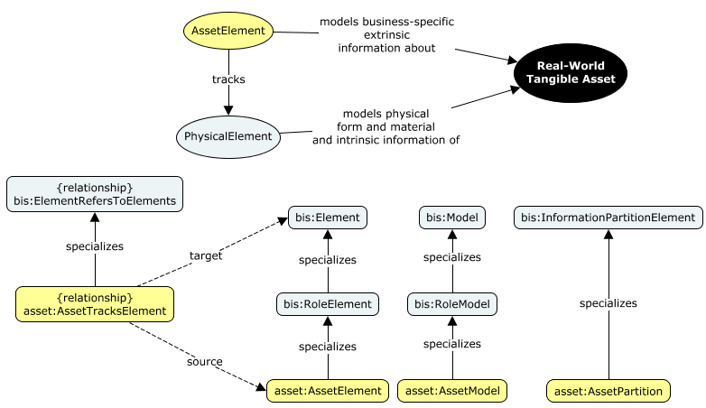

# Asset

The Asset domain schema contains the core classes that define the "Asset" Modeling Perspective.

The definition of a real-world 'asset' is 'Anything tangible or intangible that is capable of being owned or controlled for the purpose of producing or having positive economic value.' Assets are commonly real-world physical Objects. BIS decomposes such a physical Object into multiple Entities representing different Modeling Perspectives.

The "Asset" perspective *sees* an Object not as a physical Entity with form and mass, but as a Asset Entity with economic value or that plays a role in a particular business workflow.

The Asset Modeling Perspective is abstract. Domain authors are expected to specialize [AssetPartition](#Assetpartition), [AssetModel](#Assetmodel), and [AssetElement](#assetelement) for modeling in the Asset Perspective.

## Entity Classes

### AssetPartition

See [Asset](#Asset) for a definition of the "Asset" Modeling Perspective.

### AssetModel

It should be specialized to hold discipline-specific asset Elements.

### AssetElement

Asset Entities are non-geometric in nature, and are considered to be 'roles' played by an Object.
See [Asset](#Asset) for a definition of "Asset".
