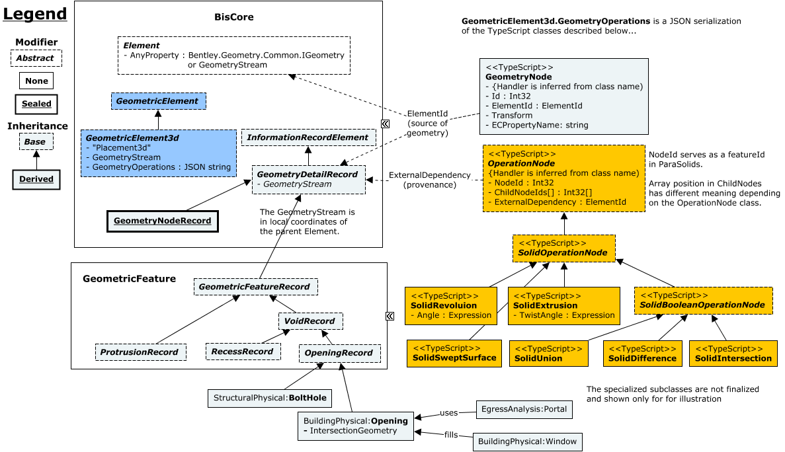

# GeometricFeature

The GeometricFeature "core" domain schema contains abstract classes that define define different kinds of real-world "geometric features".

A "geometric feature" is a *portion* of the geometry of a larger Entity, where the portion is associated with a discipline-specific purpose of interest to the user.

## Entity Classes

### GeometricFeatureRecord

`GeometricFeatureRecord` represents the discipline-specific intent of the geometric feature as well as geometric inputs that describe its geometry. Geometric features may be related to design, manufacturing, or operational requirements. A `GeometricFeatureRecord` tends to have properties of direct interest to the user, e.g. a "bolt hole diameter".

A `GeometricFeatureRecord` is always the "provenance" of an OperationNode in the `GeometryOperations` "feature tree" of its parent `GeometricElement3d`, (though not all OperationNodes need to have a `GeometricFeatureRecord` as their provenance). The `GeometryFeatureRecord`'s GeometryStream may also be the source of geometry for a GeometryNode.

See [GeometricElement3d.GeometryOperations](BisCore.remarks.md#GeometryOperations-Property).

### VoidRecord

A void should be associated with an operation such as "SolidDifference" which "removes" material from the parent Element's basic form.

### ProtrusionRecord

A protrusion should be associated with an operation such as "SolidUnion" which "adds" material to the parent Element's basic form.
