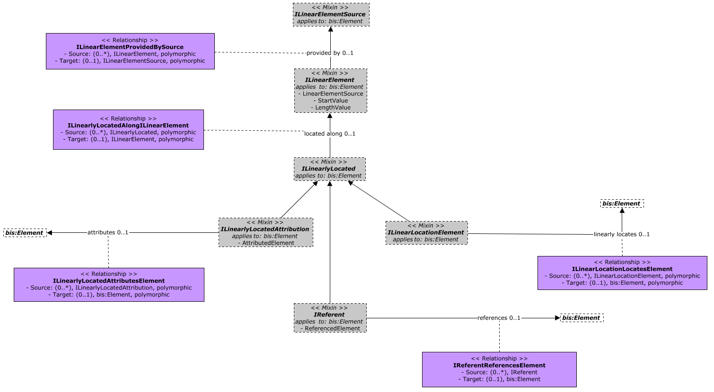
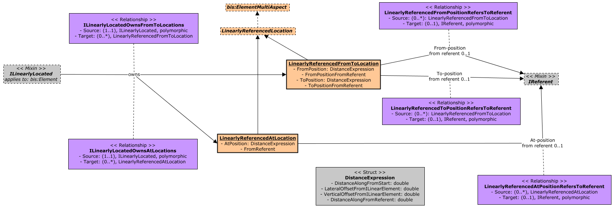

# LinearReferencing

Contains the core classes enabling the specification of positions along linear objects.

## Entity Classes

The following class-diagram depicts the core mix-ins in the LinearReferencing schema:

The following class-diagram depicts the core aspect classes in the LinearReferencing schema:

### ILinearElement

A Linear-Element is a one-dimensional object that serves as the axis along which measurements are made.

Equivalent to [IfcLinearPositioningElement](https://standards.buildingsmart.org/IFC/DEV/IFC4_3/RC2/HTML/link/ifclinearpositioningelement.htm).

### ILinearlyLocated

Implementations of the `ILinearlyLocated` mix-in are equivalent to [IfcLinearPlacement](https://standards.buildingsmart.org/IFC/DEV/IFC4_3/RC2/HTML/link/ifclinearplacement.htm).

### ILinearlyLocatedAlongILinearElement

Equivalent to [IfcProduct.PositionedRelativeTo](https://standards.buildingsmart.org/IFC/DEV/IFC4_3/RC2/HTML/link/ifcproduct.htm) referencing an [IfcLinearPositioningElement](https://standards.buildingsmart.org/IFC/DEV/IFC4_3/RC2/HTML/link/ifclinearpositioningelement.htm) via [IfcRelPositions.RelatingPositioningElement](https://standards.buildingsmart.org/IFC/DEV/IFC4_3/RC2/HTML/link/ifcrelpositions.htm).

Note that IFC further requires an individual reference to the appropriate [IfcCurve](https://standards.buildingsmart.org/IFC/DEV/IFC4_3/RC2/HTML/link/ifccurve.htm) from each [IfcPointByDistanceExpression](https://standards.buildingsmart.org/IFC/DEV/IFC4_3/RC2/HTML/link/ifcpointbydistanceexpression.htm) via its `BasisCurve` attribute. In contrast, the LinearReferencing BIS schema considers such curves an implementation detail behind a concrete `lr:ILinearElement` realization in a particular domain, and therefore, it does not capture it.

### ILinearLocationLocatesElement

Equivalent to [IfcLinearPlacement.PlacesObject](https://standards.buildingsmart.org/IFC/DEV/IFC4_3/RC2/HTML/link/ifcobjectplacement.htm).

### IReferent

Equivalent to [IfcReferent](https://standards.buildingsmart.org/IFC/DEV/IFC4_3/RC2/HTML/link/ifcreferent.htm). Note that IfcReferent is an [IfcLinearPositioningElement](https://standards.buildingsmart.org/IFC/DEV/IFC4_3/RC2/HTML/link/ifclinearpositioningelement.htm), thus references to it use the same [IfcRelPositions.RelatingPositioningElement] than references to [IfcLinearPositioningElement](https://standards.buildingsmart.org/IFC/DEV/IFC4_3/RC2/HTML/link/ifclinearpositioningelement.htm). On the other hand, a `lr:IReferent` is referenced from either a lr:LinearlyReferencedAtLocation or lr:LinearlyReferencedFromToLocation multi-aspects via their corresponding navigation properties.

### LinearlyLocatedAttribution

Instances of subclasses of `LinearlyLocatedAttribution` must be contained in either `PhysicalModel`s or `SpatialLocationModel`s.

### LinearlyReferencedAtLocation

Equivalent to [IfcPointByDistanceExpression](https://standards.buildingsmart.org/IFC/DEV/IFC4_3/RC2/HTML/link/ifcpointbydistanceexpression.htm).

### DistanceExpression

The `DistanceExpression` structure allows measurements to be captured in absolute terms (with respect to the start of the Linear-Element) or relative to an `lr:IReferent`, or both.

The `DistanceExpression` structure is equivalent to [IfcPointByDistanceExpression](https://standards.buildingsmart.org/IFC/DEV/IFC4_3/RC2/HTML/link/ifcpointbydistanceexpression.htm). 

The `LateralOffsetFromILinearElement` and `VerticalOffsetFromILinearElement` values are assumed to be measured perpendicularly from the tangent on the Linear-Element calculated at the location indicated by `DistanceAlongFromStart`.

Values in the `LateralOffsetFromILinearElement` are assumed to be positive for lateral offsets to the right of the Linear-Element and negative for lateral offsets to its left, with respect to its direction from start.

Values in the `VerticalOffsetFromILinearElement` are assumed to be positive for vertical offsets above the Linear-Element and negative for vertical offsets below it.

These assumptions are equivalent to a [IfcAxis2PlacementLinear](https://standards.buildingsmart.org/IFC/DEV/IFC4_3/RC2/HTML/link/ifcaxis2placementlinear.htm) with its `Axis` and `RefDirection` attributes describing a perpendicular to the tangent at the linear location of interest along the [BasisCurve](https://standards.buildingsmart.org/IFC/DEV/IFC4_3/RC2/HTML/link/ifcpointbydistanceexpression.htm).