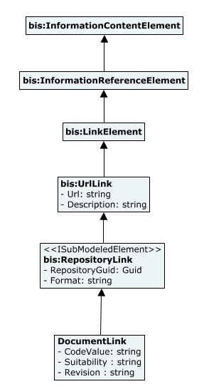

# DocumentMetadata

This schema contains classes serving as the common layer for implementations capturing metadata about persistent sets of information from Common Data Environments (CDE). This schema is meant to be the place to standardize metadata according to [ISO 19650:2018 - Organization and digitization of information about buildings and civil engineering works, including building information modelling (BIM) - Information management using building information modelling](https://www.iso.org/standard/68078.html).

NOTE: Currently under development. This schema should not be used for production workflows. Data created using this schema is not supported and may not be upgradable.

## Entity Classes

### DocumentLink

Instances of `DocumentLink` are typically contained in the `RepositoryModel` of an iModel. Each specific Common Data Environment (CDE) solution shall use an instance of `CodeSpec` and `DocumentLink.CodeValue` identifiers properly setup to ensure uniqueness in such model.

Other metadata attributes specific to a CDE solution can be introduced via a subclass of `DocumentLink` or aspect-classes associated to it.

Equivalent to a link to an [ISO 19650 - Information Container](https://www.iso.org/obp/ui/#iso:std:iso:19650:-1:ed-1:v1:en).