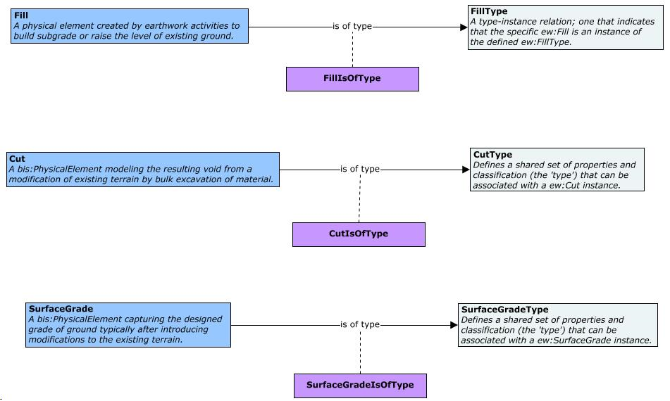

# Earthwork

Contains the classes modeling earthwork activities in BIS. Earthwork involves the work of excavating or building embankments, moving and/or processing of massive quantities of soil or unformed rock. It is done to reconfigure the topography of a site to achieve the design levels.

NOTE: Currently under development. This schema should not be used for production workflows. Data created using this schema is not supported and may not be upgradable.

## Entity Classes

### FillType

Instances of `FillType` provide an additional classification that can be applied to `Fill`s. Examples include Embankment, Slope Fill or Back Fill. An instance of `FillType` can optionally specify a single *Physical Material* via its `PhysicalMaterial` property.

Equivalent to [IfcEarthworksFillTypeEnum](https://standards.buildingsmart.org/IFC/DEV/IFC4_3/RC2/HTML/link/ifcearthworksfilltypeenum.htm).

### Fill

Examples of `Fill` include subgrade or a parts of a structure above it (such as “soft” courses in pavement or ballast). Usually formed by spreading and compacting construction materials such as sand and gravel.

`Fill`s shall have their *Volume* stored in their `GeometryStream` as a *Polyface*. Further classification of `Fill` instances can be achieved via instances of `FillType`. A `Fill` instance can override the *Physical Material* specified by its corresponding `FillType` via its `PhysicalMaterial` property.

`Fill`s must be contained in `PhysicalModel`s. Instances of `Fill`, by default, shall use the Domain-ranked `ew:Volume` category.

Equivalent to [IfcEarthworksFill](https://standards.buildingsmart.org/IFC/DEV/IFC4_3/RC2/HTML/link/ifcearthworksfill.htm).

### CutType

Instances of `CutType` provide an additional classification that can be applied to `Cut`s. Examples include Excavation, Trench or Dredging. An instance of `CutType` can optionally specify a single *Physical Material* to be removed via its `PhysicalMaterial` property.

Equivalent to [IfcEarthworksCutTypeEnum](https://standards.buildingsmart.org/IFC/DEV/IFC4_3/RC2/HTML/link/ifcearthworkscuttypeenum.htm).

### Cut

The material excavated, modeled by `Cut`s, can later be used as fill or discarded as waste. The Earthwork schema does not aim to model such processes, however. A `Cut` instance can override the *Physical Material* to be removed specified by its corresponding `CutType` via its `PhysicalMaterial` property.

`Cut`s shall have their *Volume* stored in their `GeometryStream` as a *Polyface*.

`Cut`s must be contained in `PhysicalModel`s. Instances of `Cut`, by default, shall use the Domain-ranked `ew:Volume` category.

Equivalent to [IfcEarthworksCut](https://standards.buildingsmart.org/IFC/DEV/IFC4_3/RC2/HTML/link/ifcearthworkscut.htm).

### SurfaceGradeType

Instances of `SurfaceGradeType` provide an additional classification that can be applied to `SurfaceGrade`s. An instance of `SurfaceGradeType` can optionally specify a single *Physical Material* via its `PhysicalMaterial` property.

### SurfaceGrade

`SurfaceGrade`s shall have their *Surface* stored in their `GeometryStream` as a *Polyface*. A `SurfaceGrade` instance can override the *Physical Material* specified by its corresponding `SurfaceGradeType` via its `PhysicalMaterial` property.

`SurfaceGrade`s must be contained in `PhysicalModel`s. Instances of `SurfaceGrade`, by default, shall use the Domain-ranked `ew:Grading` category.