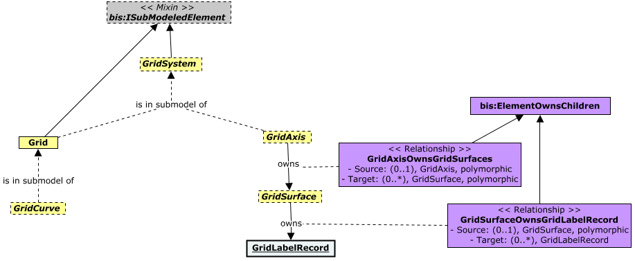
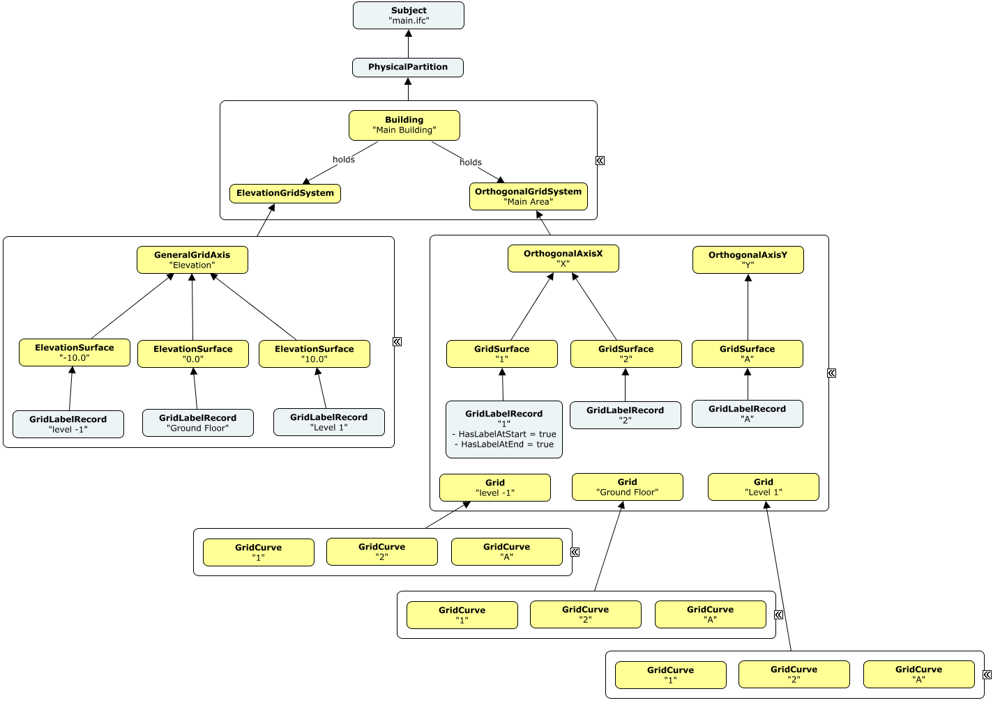
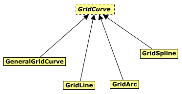
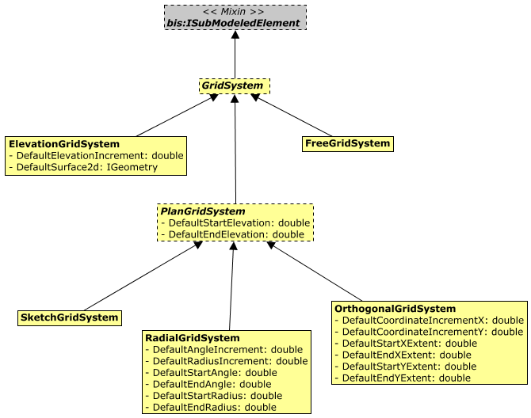
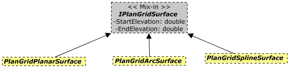
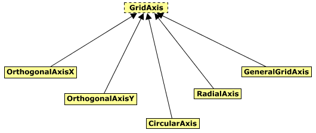
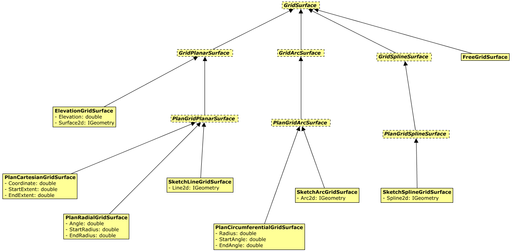

# Grids

Contains classes modelling grids and grid systems.

This class diagram provides an overview for the key concepts for modelling grid systems and grids:

Classes in the Grids schema are used to build `GridSystem`s and `Grid`s for structural, space-planning and other disciplines.

A `Grid` contains (in its submodel) a set of `GridCurves` (in a particular plane or surface) used to locate spatial elements.

A `GridSystem` is a collection of `Grid`s that are logically related.

`GridSystems` may also contain `GridSurface`s. To understand the optional `GridSurface` and `GridAxis` elements, an instance diagram is helpful:

In plain language: Each curve in a grid represents a position along one of its axes. That position is defined by one surface in that axis intersected with the "plane" of the grid. Details follow...

Each `GridSurface` belongs to a `GridAxis`. Each `GridSurface` in an axis is usually parallel other surfaces in that axis, with the notable exception of the surfaces of a radial axis in a radial grid. Every `GridAxis` in a `GridSystem` is an axis of every `Grid` in the `GridSystem`.

If `GridSurfaces` *are* used, each `GridCurve` of each `Grid` should represent the intersection of one `GridSurface` of one of its axes with the "plane" of the `Grid`. The "plane" of the `Grid` is a `GridSurface` from a *different* `GridSystem` such as an "Elevation Grid System".(It is referred to as the "plane" of the `Grid` even though it may be a curved surface, e.g. a curved roof surface could be used as the "plane" of a grid for laying out the structural framing of the roof).

 A `GridSystem` like the "Elevation Grid System" may *only* contain a `GridAxis` and `GridSurfaces` used to define the "planes" of `Grid`s in a *different* `GridSystem` (e.g. one for use in a top-down view). Thus, if `GridSurface`s are used, the iModel will always contain at least two `GridSystem`s--one to define "planes" for `Grid`s in an orthogonal `GridSystem`. Each `GridSystem` may define "planes" for `Grid`s in the other.

Each `GridCurve` marks a position along a particular `GridAxis`, where the position is defined by a `GridSurface` of that `GridAxis`.

Each `GridSurface` owns a `GridLabelRecord` which holds information about the content and positioning of dynamically displayed labels for `GridCurve`s representing that `GridSurface`. The `Code.Value` of the `GridLabelRecord` should correspond to the `Code.Value` of the `GridCurve` that represents it. It will be used as the text of dynamically presented labels. See [Grid Labels](https://docs.bentley.com/LiveContent/web/OpenBuildings%20Designer%20Help-v5/en/GUID-5965684D-5CA4-BF92-3406-A43B5542ED30.html) in OpenBuildings Designer.

There is currently no relationship to indicate which `GridSurface` is serving as the "plane" of a given `Grid` and no relationship between a `GridCurve` and the `GridSurface` that it represents.  These relationships will appear in a future version of this schema designed to support automatic generation of `Grid`s from `GridSurface`s. The relationships have been omitted due to uncertainty in the details of the change-propagation mechanism that will be used. In the meantime, it should normally be obvious to users viewing iModels which `GridSurface`s correspond to which `Grid`s and `GridCurve`s.

A `GridSystem` should be stored in the model it's relevant in. For example, the structural grid for a building should be stored in the same model as the said `BuildingSpatial:Building`. The specific `Building` could be associated via `SpatialComposition:SpatialOrganizerHoldsSpatialElements` relationship.

## Classes

### GridCurve

`GridCurve` is similar to [IfcGridAxis](http://ifc43-docs.standards.buildingsmart.org/IFC/RELEASE/IFC4x3/HTML/lexical/IfcGridAxis.htm) and Grid Curves in `OpenBuildings Designer`.

`GridCurve`s are persisted in the submodel of a `Grid` element.

There are several specializations of `GridCurve`:

<u>Geometry Use:</u>

1.  Open [Path](https://www.itwinjs.org/reference/geometry-core/curve/path/) with a single curve.
2.  Local Coordinates : origin at the start of the curve, aligned to create a `GridSurface` when available.

### GridLine

Instances of `GridLine` can be created by 2 intersecting instances of `GridPlanarSurface`.

<u>Geometry Use:</u>

1.  Open [Path](https://www.itwinjs.org/reference/geometry-core/curve/path/) with a single [LineSegment3d](https://www.itwinjs.org/reference/geometry-core/curve/linesegment3d/).
2.  Inherits from baseclass. Local Coordinates : origin at the start of the curve, aligned to creating `GridSurface`.

### GridArc

Instances of `GridArc` can be created by intersecting instances of `GridPlanarSurface` and `GridArcSurface` together.

<u>Geometry Use:</u>

1.  Open [Path](https://www.itwinjs.org/reference/geometry-core/curve/path/) with a single [Arc3d](https://www.itwinjs.org/reference/geometry-core/curve/arc3d/).
2.  Inherits from baseclass. Local Coordinates : origin at the start of the curve, aligned to creating `GridSurface`.

### GridSpline

Instances of `GridSpline` can be created by intersecting instances of `GridPlanarSurface` and `GridSplineSurface` together.

<u>Geometry Use:</u>

1.  Open [Path](https://www.itwinjs.org/reference/geometry-core/curve/path/) with a single spline
2.  Inherits from baseclass. Local Coordinates : origin at the start of the curve, aligned to creating `GridSurface`.

### GeneralGridCurve

GridCurve representing other geometry (typically 3d splines). Instances of `GeneralGridCurve` can be created by intersecting other pairs of `GridSurface` instances.

<u>Geometry Use:</u>

1.  Open [Path](https://www.itwinjs.org/reference/geometry-core/curve/path/) with a single curve.
2.  Inherits from baseclass. Local Coordinates : origin at the start of the curve, aligned to creating `GridSurface`.

### GridSystem

The `Grids` of a `GridSystem` are logically and geometrically related, e.g. a set of parallel, storey-specific grids in a building that all share the same axes. A `GridSystem` may also contain surfaces (organized into axes) from which the grids can be derived.  See [Grids](#grids) for more detail and context.

A future version of the Grids schema will support software that can automatically derive `Grid`s from the axes and surfaces of a `GridSystem` (and a separate `GridSystem` to define the "planes" of the `Grid`s. )

<u>Geometry Use:</u>

1.  No geometry
2.  Local Coordinates : defines the origin for surfaces
Jonas, Does this "Local Coordinates" note imply something about setting the Origin, Yaw, Pitch, Roll, etc?
### ElevationGridSystem

A collection of ElevationGridSurfaces has one or more `GeneralGridAxis`, typically used to slice a building. Every surface is positioned across the Z axis of `ElevationGridSystem` Placement.

<u>Geometry Use:</u>

1. No geometry
2. Local Coordinates : defines the origin and direction for surfaces.

<u>Properties:</u>

1. DefaultElevationIncrement - suggested elevation increment with which a new surface would be inserted (highest elevation surface + .DefaultElevationIncrement).
1. DefaultSurface2d - a suggested surface for new ElevationGridSurface, could be null.

### FreeGridSystem

A collection of unconstrained surfaces (`FreeGridSurface`).

<u>Geometry Use:</u>

1.  No geometry
2.  Local Coordinates : defines the origin and direction for surfaces.

### PlanGridSystem

A collection of `IPlanGridSurface` elements that are single curve extrusions, sharing the extrusion direction. Extrusion direction is equal to grid Z orientation.

<u>Geometry Use:</u>  

1. No geometry.
2. Local Coordinates : defines the origin and direction for surfaces.

### SketchGridSystem

A collection of surfaces that are **unconstrained** single curve extrusions, sharing the extrusion direction. Extrusion direction is driven by the grid's Z orientation.

<u>Geometry Use:</u>

1.  No geometry.
2.  Local Coordinates : defines the origin and direction for surfaces.

### OrthogonalGridSystem

A collection of `PlanCartesianGridSurface`s. It has 2 axes: one `OrthogonalAxisX` and one `OrthogonalAxisY`. All surfaces in the X direction belong to `OrthogonalAxisX`. All those in the Y direction belong to `OrthogonalAxisY`.

<u>Geometry Use:</u>

1.  No geometry.
1.  Local Coordinates : defines the origin and direction for surfaces.

### RadialGridSystem

A collection of `PlanRadialGridSurface` and `PlanCircumferentialGridSurface` elements. It has 2 axes: one `CircularAxis` and one `RadialAxis`. All `PlanCircumferentialGridSurface` are in the `CircularAxis`, all `PlanRadialGridSurface` in the `RadialAxis`.

<u>Geometry Use:</u>

1.  no geometry.
2.  Local Coordinates : defines the origin and direction for surfaces.

### GridAxis

A subcollection of `GridSurface`s in a `GridSystem`. Typically organized for some common purpose.

### GeneralGridAxis

A subcollection of `GridSurface` instances in a Grid. Used for grouping any kind of grid surfaces together.

### OrthogonalAxisX

A subcollection of `PlanCartesianGridSurface` in an `OrthogonalGrid` X direction.

### OrthogonalAxisY

A subcollection of `PlanCartesianGridSurface` in an `OrthogonalGrid` Y direction.

### CircularAxis

A subcollection of `PlanCircumferentialGridSurface` in a `RadialGrid`.

### RadialAxis

a subcollection of `PlanRadialGridSurface` in a `RadialGrid`

### Grid

The `GridCurve`s associated to a `Grid` are contained within its submodel.

A `Grid` is equivalent to an [IfcGrid](http://ifc43-docs.standards.buildingsmart.org/IFC/RELEASE/IFC4x3/HTML/lexical/IfcGrid.htm).

<u>Geometry Use:</u>

1.  No geometry
2.  Local Coordinates : none.

### GridSurface

A 3-dimensional surface contained in a `GridSystem`. A GridSurface is modeled by combining the information of grid construction line and the elevation extents. `GridSystem`s contain such information in products like `OpenBuildings Designer`.

### GridPlanarSurface

A class for planar `GridSurface` elements.

### ElevationGridSurface

A planar `GridSurface` used in `ElevationGridSystem`. this is the only type of `GridSurface` allowed in an `ElevationGridSystem`.

<u>Geometry Use:</u>

1.  A [Path](https://www.itwinjs.org/reference/geometry-core/curve/path/).
2.  Local Coordinates : grid coordinates + Elevation property in Z axis

### PlanGridPlanarSurface

A class for `GridPlanarSurface` elements used in `PlanGrid`.

<u>Geometry Use:</u>

1.  A `SolidPrimitive` DgnExtrusion containing single line for base, swept from StartElevation to EndElevation
2.  Local Coordinates : defined by subclasses

### PlanCartesianGridSurface

A class for `GridSurface` contained in `OrthogonalGridSystem`

<u>Geometry Use:</u>

1.  "inherit from parent" a `SolidPrimitive` DgnExtrusion containing single line for base, swept from StartElevation to EndElevation
2.  Local Coordinates : `GridSystem` coordinates + Coordinate in X or Y direction depending on the type of axis

### PlanRadialGridSurface

A class for `GridSurface` instances of angular increments contained in `RadialGridSystem`

<u>Geometry Use:</u>

1.  "inherit from parent" a `SolidPrimitive` DgnExtrusion containing single line for base, swept from StartElevation to EndElevation
2.  Local Coordinates : `GridSystem` coordinates rotated by the Angle property from Y direction, clockwise

### SketchLineGridSurface

A class for `GridSurface` instances of sketched line surfaces in `SketchGridSystem`

<u>Geometry Use:</u>

1.  "inherit from parent" a `SolidPrimitive` DgnExtrusion containing single line for base, swept from StartElevation to EndElevation
2.  Local Coordinates : `GridSystem` coordinates

<u>Properties:</u>

1.  Line2d - line geometry used to extrude the surface - a [Path](https://www.itwinjs.org/reference/geometry-core/curve/path/) containing a single [LineSegment3d](https://www.itwinjs.org/reference/geometry-core/curve/linesegment3d/).

### GridArcSurface

A `GridSurface` that is parallel to extruded arc.

### PlanGridArcSurface

A class for `GridArcSurface` elements used in `PlanGridSystem`.

<u>Geometry Use:</u>

1.  A `SolidPrimitive` DgnExtrusion containing single arc for base, swept from StartElevation to EndElevation
2.  Local Coordinates : defined by subclasses

### PlanCircumferentialGridSurface

A class for `GridSurface` instances of circular radius increments contained in `RadialGridSystem`

<u>Geometry Use:</u>

1.  "inherit from parent" a `SolidPrimitive` DgnExtrusion containing single arc for base, swept from StartElevation to EndElevation
2.  Local Coordinates : `GridSystem` coordinates

### SketchArcGridSurface

A class for `GridSurface` instances of sketched arc surfaces in `SketchGridSystem`

<u>Geometry Use:</u>

1.  "inherit from parent" a `SolidPrimitive` DgnExtrusion containing single arc for base, swept from StartElevation to EndElevation
2.  Local Coordinates : `GridSystem` coordinates

<u>Properties:</u>

1.  Arc2d - arc geometry used to extrude the surface - a [Path](https://www.itwinjs.org/reference/geometry-core/curve/path/) containing a single [Arc3d](https://www.itwinjs.org/reference/geometry-core/curve/arc3d/).

### GridSplineSurface

A `GridSurface` that is parallel to an extruded spline.

### PlanGridSplineSurface

A class for `GridSplineSurface` elements used in `PlanGrid`.

<u>Geometry Use:</u>

1.  A `SolidPrimitive` DgnExtrusion containing single spline for base, swept from StartElevation to EndElevation
2.  Local Coordinates : defined by subclasses

### SketchSplineGridSurface

A class for `GridSurface` instances of sketched spline surfaces in `SketchGridSystem`

<u>Geometry Use:</u>

1.  "inherit from parent" a `SolidPrimitive` DgnExtrusion containing single spline for base, swept from StartElevation to EndElevation
2.  Local Coordinates : `Grid` coordinates

<u>Properties:</u>

1.  Spline2d - spline geometry used to extrude the surface - a [Path](https://www.itwinjs.org/reference/geometry-core/curve/path/) containing a single [BSplineCurve3d](https://www.itwinjs.org/reference/geometry-core/bspline/bsplinecurve3d/)spline.

### GridLabelRecord

UserLabel of the `GridLabelRecord` will be used to generate the text annotation while other properties on the class will define other settings for the label.
