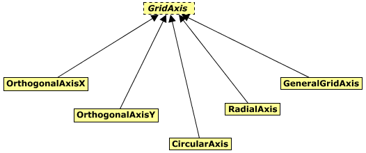

# Grids

Contains classes modelling grids and grid systems.

This class diagram provides an overview for the key concepts for modelling grid systems and grids:

The grids schema support both simple grids (which are sets of curves defined in a particular plane) and grid systems (which contain sets of surfaces organized into axes which can be used to instruct iTwin.js to generate simple `Grid`s). 

Classes in this schema are used to build Structural, Space-planning and other `GridSystem`s and `Grid`s. A `GridSystem` is a collection of GridSurfaces. Every `GridSurface` is associated to a `GridAxis`, which is used for grouping surfaces into subgroups. The intersection of `GridSurface`s may be used to create a `GridCurve`. The constructed `GridCurve` should then inherit the codeValue of a `GridLabelRecord` (if present) of one of the originating `GridSurface`s. Normally, if an Orthogonal `GridSytem` is made to intersect a surface of `ElevetionGridSystem`, then the created `Grid` would inherit the codevalue of the `GridLabelRecord` of `ElevationSurface`, and `GridCurve`s would inherit those of individual (`GridLabelRecord`s of) `GridSurface`s in the orthogonal `GridSystem`. Some viewing applications would show the information of `GridLabelRecord` as a dynamic annotation, similar to [Grid Labels](https://docs.bentley.com/LiveContent/web/OpenBuildings%20Designer%20Help-v5/en/GUID-5965684D-5CA4-BF92-3406-A43B5542ED30.html) in `OpenBuildings Designer`. 

The most common grid surfaces intersection example could be `GridSurface`s in Orthogonal/Radial/Sketch `GridSystem` intersecting a `GridSurface` in an `ElevationGridSystem`. Such intersection could be used to create a `Grid` of `GridCurve`s as we know them in BuildingSMART IFC. The schema, however, supports creation of more complex grids. For example, a complex, non-planar roof intersecting a SketchGrid could create `Grid` with `GridCurve`s required for easily modeling the structural framing of said roof. The `GridSurfaces`s however, are not mandatory in an iModel, `Grid`s could be modeled directly.

A `GridSystem` should be stored in the model it's relevant in. For example, the structural grid for a building should be stored in the same model as the said `BuildingSpatial:Building`. The specific `Building` could be associated via `SpatialComposition:SpatialOrganizerHoldsSpatialElements` relationship. 

The instance diagram below shows an example of such modeling standard:

The `GridSurface`s and `GridAxis` are not getting associated to created `Grid`s and `GridCurve`s in this version of the schema, however if the data is published today, some future application could populate the relationships that will be added in subsequent versions.

## Classes

### GridCurve

`GridCurve` is similar to [IfcGridAxis](http://ifc43-docs.standards.buildingsmart.org/IFC/RELEASE/IFC4x3/HTML/lexical/IfcGridAxis.htm) in that it represents a curve geometry on a (usually planar) surface. It is also similar to Grid Curves as known in `OpenBuildings Designer`. `GridCurve`s can be found in submodels of `Grid` elements.

<u>Geometry Use:</u>

1.  Open [Path](https://www.itwinjs.org/reference/geometry-core/curve/path/) with a single curve.
2.  Local Coordinates : origin at the start of the curve, aligned to create a `GridSurface` when available.

### GridLine

Instances of `GridLine` can be created by 2 intersecting instances of `GridPlanarSurface`.

<u>Geometry Use:</u>

1.  Open [Path](https://www.itwinjs.org/reference/geometry-core/curve/path/) with a single [LineSegment3d](https://www.itwinjs.org/reference/geometry-core/curve/linesegment3d/).
2.  Inherits from baseclass. Local Coordinates : origin at the start of the curve, aligned to creating `GridSurface`.

### GridArc

Instances of `GridArc` can be created by intersecting instances of `GridPlanarSurface` and `GridArcSurface` together.

<u>Geometry Use:</u>

1.  Open [Path](https://www.itwinjs.org/reference/geometry-core/curve/path/) with a single [Arc3d](https://www.itwinjs.org/reference/geometry-core/curve/arc3d/).
2.  Inherits from baseclass. Local Coordinates : origin at the start of the curve, aligned to creating `GridSurface`.

### GridSpline

Instances of `GridSpline` can be created by intersecting instances of `GridPlanarSurface` and `GridSplineSurface` together.

<u>Geometry Use:</u>

1.  Open [Path](https://www.itwinjs.org/reference/geometry-core/curve/path/) with a single spline
2.  Inherits from baseclass. Local Coordinates : origin at the start of the curve, aligned to creating `GridSurface`.

### GeneralGridCurve

GridCurve representing other geometry (typically 3d splines). Instances of `GeneralGridCurve` can be created by intersecting other pairs of `GridSurface` instances.

<u>Geometry Use:</u>

1.  Open [Path](https://www.itwinjs.org/reference/geometry-core/curve/path/) with a single curve.
2.  Inherits from baseclass. Local Coordinates : origin at the start of the curve, aligned to creating `GridSurface`.

### GridSystem

The collection of `GridSurface` instances in a `GridSystem` can be used to instruct iTwin.js to generate simple Grids.

Grids known in other products like BuildingSMART IfcGrid or Grid/GridSystem in `OpenBuildings Designer` do not contain surfaces, instead they contain curves. However, those curves are later referenced over different elevations, which makes those elements conceptually surfaces intersecting those elevations. In BIS a `GridSystem` is a collection of surfaces rather than curves. Curves are the result of surfaces intersecting, known as `GridCurve`. While this approach ensures compatibility with legacy grids it is also more flexible. For instance, by manipulating the *EndElevation* property of individual instances of `IPlanGridSurface` in a `PlanGrid` intersecting `ElevationGrid`, individual `GridCurve` instances could be made not to appear on higher elevations. Number of axes is also unlimited in `SketchGrid`, `ElevationGrid` and `FreeGrid`.

<u>Geometry Use:</u>

1.  No geometry
2.  Local Coordinates : defines the origin for surfaces

### ElevationGridSystem

A collection of ElevationGridSurfaces has one or more `GeneralGridAxis`, typically used to slice a building. Every surface is positioned across the Z axis of `ElevationGridSystem` Placement.

<u>Geometry Use:</u>

1. No geometry
2. Local Coordinates : defines the origin and direction for surfaces.

<u>Properties:</u>

1. DefaultElevationIncrement - suggested elevation increment with which a new surface would be inserted (highest elevation surface + .DefaultElevationIncrement).
1. DefaultSurface2d - a suggested surface for new ElevationGridSurface, could be null.

### FreeGridSystem

A collection of unconstrained surfaces (`FreeGridSurface`).

<u>Geometry Use:</u>

1.  No geometry
2.  Local Coordinates : defines the origin and direction for surfaces.

### PlanGridSystem

A collection of `IPlanGridSurface` elements that are single curve extrusions, sharing the extrusion direction. Extrusion direction is equal to grid Z orientation.

<u>Geometry Use:</u>  

1. No geometry.
2. Local Coordinates : defines the origin and direction for surfaces.

### SketchGridSystem

A collection of surfaces that are **unconstrained** single curve extrusions, sharing the extrusion direction. Extrusion direction is driven by the grid's Z orientation.

<u>Geometry Use:</u>

1.  No geometry.
2.  Local Coordinates : defines the origin and direction for surfaces.

### OrthogonalGridSystem

A collection of `PlanCartesianGridSurface`s. It has 2 axes: one `OrthogonalAxisX` and one `OrthogonalAxisY`. All surfaces in the X direction belong to `OrthogonalAxisX`. All those in the Y direction belong to `OrthogonalAxisY`.

<u>Geometry Use:</u>

1.  No geometry.
1.  Local Coordinates : defines the origin and direction for surfaces.

### RadialGridSystem

A collection of `PlanRadialGridSurface` and `PlanCircumferentialGridSurface` elements. It has 2 axes: one `CircularAxis` and one `RadialAxis`. All `PlanCircumferentialGridSurface` are in the `CircularAxis`, all `PlanRadialGridSurface` in the `RadialAxis`.

<u>Geometry Use:</u>

1.  no geometry.
2.  Local Coordinates : defines the origin and direction for surfaces.

### GridAxis

A subcollection of `GridSurface`s in a `GridSystem`. Typically organized for some common purpose.

### GeneralGridAxis

A subcollection of `GridSurface` instances in a Grid. Used for grouping any kind of grid surfaces together.

### OrthogonalAxisX

A subcollection of `PlanCartesianGridSurface` in an `OrthogonalGrid` X direction.

### OrthogonalAxisY

A subcollection of `PlanCartesianGridSurface` in an `OrthogonalGrid` Y direction.

### CircularAxis

A subcollection of `PlanCircumferentialGridSurface` in a `RadialGrid`.

### RadialAxis

a subcollection of `PlanRadialGridSurface` in a `RadialGrid`

### Grid

The `GridCurve`s associated to a `Grid` are contained within its submodel.

A `Grid` is equivalent to an [IfcGrid](http://ifc43-docs.standards.buildingsmart.org/IFC/RELEASE/IFC4x3/HTML/lexical/IfcGrid.htm).

<u>Geometry Use:</u>

1.  No geometry
2.  Local Coordinates : none.

### GridSurface

A 3-dimensional surface contained in a `GridSystem`. A GridSurface is modeled by combining the information of grid construction line and the elevation extents. `GridSystem`s contain such information in products like `OpenBuildings Designer`.

### GridPlanarSurface

A class for planar `GridSurface` elements.

### ElevationGridSurface

A planar `GridSurface` used in `ElevationGridSystem`. this is the only type of `GridSurface` allowed in an `ElevationGridSystem`.

<u>Geometry Use:</u>

1.  A [Path](https://www.itwinjs.org/reference/geometry-core/curve/path/).
2.  Local Coordinates : grid coordinates + Elevation property in Z axis

### PlanGridPlanarSurface

A class for `GridPlanarSurface` elements used in `PlanGrid`.

<u>Geometry Use:</u>

1.  A `SolidPrimitive` DgnExtrusion containing single line for base, swept from StartElevation to EndElevation
2.  Local Coordinates : defined by subclasses

### PlanCartesianGridSurface

A class for `GridSurface` contained in `OrthogonalGridSystem`

<u>Geometry Use:</u>

1.  "inherit from parent" a `SolidPrimitive` DgnExtrusion containing single line for base, swept from StartElevation to EndElevation
2.  Local Coordinates : `GridSystem` coordinates + Coordinate in X or Y direction depending on the type of axis

### PlanRadialGridSurface

A class for `GridSurface` instances of angular increments contained in `RadialGridSystem`

<u>Geometry Use:</u>

1.  "inherit from parent" a `SolidPrimitive` DgnExtrusion containing single line for base, swept from StartElevation to EndElevation
2.  Local Coordinates : `GridSystem` coordinates rotated by the Angle property from Y direction, clockwise

### SketchLineGridSurface

A class for `GridSurface` instances of sketched line surfaces in `SketchGridSystem`

<u>Geometry Use:</u>

1.  "inherit from parent" a `SolidPrimitive` DgnExtrusion containing single line for base, swept from StartElevation to EndElevation
2.  Local Coordinates : `GridSystem` coordinates

<u>Properties:</u>

1.  Line2d - line geometry used to extrude the surface - a [Path](https://www.itwinjs.org/reference/geometry-core/curve/path/) containing a single [LineSegment3d](https://www.itwinjs.org/reference/geometry-core/curve/linesegment3d/).

### GridArcSurface

A `GridSurface` that is parallel to extruded arc.

### PlanGridArcSurface

A class for `GridArcSurface` elements used in `PlanGridSystem`.

<u>Geometry Use:</u>

1.  A `SolidPrimitive` DgnExtrusion containing single arc for base, swept from StartElevation to EndElevation
2.  Local Coordinates : defined by subclasses

### PlanCircumferentialGridSurface

A class for `GridSurface` instances of circular radius increments contained in `RadialGridSystem`

<u>Geometry Use:</u>

1.  "inherit from parent" a `SolidPrimitive` DgnExtrusion containing single arc for base, swept from StartElevation to EndElevation
2.  Local Coordinates : `GridSystem` coordinates

### SketchArcGridSurface

A class for `GridSurface` instances of sketched arc surfaces in `SketchGridSystem`

<u>Geometry Use:</u>

1.  "inherit from parent" a `SolidPrimitive` DgnExtrusion containing single arc for base, swept from StartElevation to EndElevation
2.  Local Coordinates : `GridSystem` coordinates

<u>Properties:</u>

1.  Arc2d - arc geometry used to extrude the surface - a [Path](https://www.itwinjs.org/reference/geometry-core/curve/path/) containing a single [Arc3d](https://www.itwinjs.org/reference/geometry-core/curve/arc3d/).

### GridSplineSurface

A `GridSurface` that is parallel to an extruded spline.

### PlanGridSplineSurface

A class for `GridSplineSurface` elements used in `PlanGrid`.

<u>Geometry Use:</u>

1.  A `SolidPrimitive` DgnExtrusion containing single spline for base, swept from StartElevation to EndElevation
2.  Local Coordinates : defined by subclasses

### SketchSplineGridSurface

A class for `GridSurface` instances of sketched spline surfaces in `SketchGridSystem`

<u>Geometry Use:</u>

1.  "inherit from parent" a `SolidPrimitive` DgnExtrusion containing single spline for base, swept from StartElevation to EndElevation
2.  Local Coordinates : `Grid` coordinates

<u>Properties:</u>

1.  Spline2d - spline geometry used to extrude the surface - a [Path](https://www.itwinjs.org/reference/geometry-core/curve/path/) containing a single [BSplineCurve3d](https://www.itwinjs.org/reference/geometry-core/bspline/bsplinecurve3d/)spline.

### GridLabelRecord

UserLabel of the `GridLabelRecord` will be used to generate the text annotation while other properties on the class will define other settings for the label.
