# **Profiles**

Profiles schema defines classes that represent two dimensional cross sections, used to define geometric shapes. Profiles may be used to extrude structural components like beams and columns.

## **Entity Classes**

### **Profile**

Base class of all profile definitions.
Profile may be a [SinglePerimeterProfile](#singleperimeterprofile) or [CompositeProfile](#compositeprofile).

### **StandardCatalogCodeAspect**

Optional aspect that holds required information to reference a catalog (database) entry defining a standard profile.
Standard catalog profiles are defined by four components:
- `Name` - Name of the [Profile](#profile) (also called designation) e.g. "W16x40"
- `Manufacturer` - Name of the manufacturer for the [Profile](#profile). This is usually a country code e.g. "US"
- `StandardsOrganization` - Name of the standards organization that defines the [Profile](#profile), e.g. "AISC"
- `Revision` - Name of the edition or version of the standards organization, e.g. "14"

A Code will automatically be created for [Profiles](#profile) that have this aspect in the form:
`"<Manufacturer> <StandardsOrganization> <Revision> <Name>"`. Example Code: `"US AISC 14 W16x40"`.

Applications will be able to use this information to query detailed properties and geometry of catalog (database) profile.
Applications that don't have access to catalogs will still be able to render the Profiles as they contain their own geometry constructed from available properties - this geometry may not match the detailed geometry from a catalog.

### **SinglePerimeterProfile**

This profile subclass is used to denote a [Profile](#profile) that is composed out of a single perimeter (area). SinglePerimeterProfiles can be referenced by [CompositeProfile](#compositeprofile) to form a [Profile](#profile) with multiple disjoint areas.

### **ParametricProfile**

[Profile](#profile) whose geometry is defined by a set of properties such as ``Width``, ``Depth``, ``Thickness`` etc.
In addition, such Profiles have a bounding box which is centered at the center of the coordinate system i.e. (x: 0, y: 0).

### **CShapeProfile**
**Derivative properties:**
- `FlangeInnerEdgeLength` = `FlangeWidth` - `WebThickness`
- `FlangeSlopeHeight` = `FlangeInnerEdgeLength` * Tan(`FlangeSlope`)
- `WebInnerEdgeLength` = `Depth` - `FlangeThickness` * 2

**Constraints:**
- `FlangeWidth` must be greater than zero
- `Depth` must be greater than zero
- `FlangeThickness`:
  - must be greater than zero
  - must be less than half `Depth`
- `WebThickness`:
  - must be greater than zero
  - must be less than `FlangeWidth`
- `FilletRadius` (if set):
  - must be greater or equal to zero
  - must be less or equal to half of `FlangeInnerEdgeLength`
  - must be less or equal to half of `WebInnerEdgeLength` minus `FlangeSlopeHeight`
- `FlangeEdgeRadius` (if set):
  - must be greater or equal to zero
  - must be less or equal to half of `FlangeInnerEdgeLength`
  - must be less or equal to `FlangeThickness`
- `FlangeSlope` (if set):
  - must be greater or equal to zero
  - must be less than ninety degrees
  - `FlangeSlopeHeight` must be less or equal to half of `WebInnerEdgeLength`

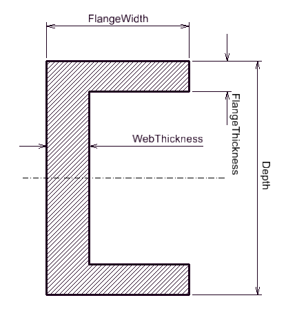

### **AsymmetricIShapeProfile**
**Derivative properties:**
- `WebEdgeLength` = `Depth` - `TopFlangeThickness` - `BottomFlangeThickness`
- `TopFlangeInnerEdgeLength` = (`TopFlangeWidth` - `WebThickness`) / 2
- `BottomFlangeInnerEdgeLength` = (`BottomFlangeWidth` - `WebThickness`) / 2
- `TopFlangeSlopeHeight` = `TopFlangeInnerEdgeLength` * Tan(`TopFlangeSlope`)
- `BottomFlangeSlopeHeight` = `BottomFlangeInnerEdgeLength` * Tan(`BottomFlangeSlope`)

**Constraints:**
- `TopFlangeWidth` must be greater than zero
- `BottomFlangeWidth` must be greater than zero
- `Depth` must be greater than zero
- `TopFlangeThickness`
  - must be greater than zero
  - `TopFlangeThickness` plus `BottomFlangeThickness` must be less than `Depth`
- `BottomFlangeThickness`
  - must be greater than zero
  - `TopFlangeThickness` plus `BottomFlangeThickness` must be less than `Depth`
- `WebThickness`
  - must be greater than zero
  - must be less than `TopFlangeWidth`
  - must be less than `BottomFlangeWidth`
- `TopFlangeFilletRadius` (if set):
  - must be greater or equal to zero
  - must be less or equal to half `WebEdgeLength` minus `TopFlangeSlopeHeight`
  - must be less or equal to half `TopFlangeInnerEdgeLength`
- `TopFlangeEdgeRadius` (if set):
  - must be greater or equal to zero
  - must be less or equal to `TopFlangeThickness`
  - must be less or equal to half `TopFlangeInnerEdgeLength`
- `TopFlangeSlope` (if set):
  - must be greater or equal to zero
  - must be less than ninety degrees
  - `TopFlangeSlopeHeight` must be less or equal to half `WebEdgeLength`
- `BottomFlangeFilletRadius` (if set):
  - must be greater or equal to zero
  - must be less or equal to half `WebEdgeLength` minus `BottomFlangeSlopeHeight`
  - must be less or equal to half `BottomFlangeInnerEdgeLength`
- `BottomFlangeEdgeRadius` (if set):
  - must be greater or equal to zero
  - must be less or equal to `BottomFlangeThickness`
  - must be less or equal to half `BottomFlangeInnerEdgeLength`
- `BottomFlangeSlope` (if set):
  - must be greater or equal to zero
  - must be less than ninety degrees
  - `BottomFlangeSlopeHeight` must be less or equal to half `WebEdgeLength`

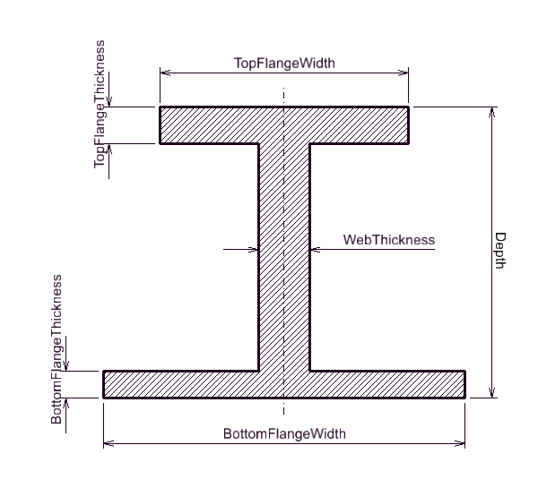

### **IShapeProfile**
**Derivative properties:**
- `FlangeInnerEdgeLength` = (`FlangeWidth` - `WebThickness`) / 2
- `FlangeSlopeHeight` = `FlangeInnerEdgeLength` * Tan(`FlangeSlope`)
- `WebEdgeLength` = `Depth` - `FlangeThickness` * 2

**Constraints:**
- `FlangeWidth` must be greater than zero
- `Depth` must be greater than zero
- `FlangeThickness`:
  - must be greater than zero
  - must be less than half `Depth`
- `WebThickness`:
  - must be greater than zero
  - must be less than `FlangeWidth`
- `FilletRadius` (if set):
  - must be greater or equal to zero
  - must be less or equal to half `FlangeInnerEdgeLength`
  - must be less or equal to half `WebEdgeLength` minus `FlangeSlopeHeight`
- `FlangeEdgeRadius` (if set):
  - must be greater or equal to zero
  - must be less or equal to half `FlangeInnerEdgeLength`
  - must be less or equal 
- `FlangeSlope` (if set):
  - must be greater or equal to zero
  - must be less than ninety degrees
  - `FlangeSlopeHeight` must be less or equal to half `WebEdgeLength`

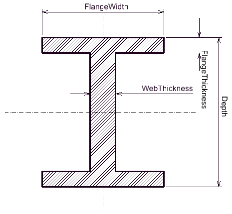

### **TShapeProfile**
**Derivative properties:**
- `FlangeInnerEdgeLength` = (`FlangeWidth` - `WebThickness`) / 2
- `FlangeSlopeHeight` = `FlangeInnerEdgeLength` * Tan(`FlangeSlope`)
- `WebEdgeLength` = `Depth` - `FlangeThickness`
- `WebSlopeHeight` = `WebEdgeLength` * Tan(`WebSlope`)

**Constraints:**
- `FlangeWidth` must be greater than zero
- `Depth` must be greater than zero
- `FlangeThickness`
  - must be greater than zero
  - must be less than `Depth`
- `WebThickness`
  - must be greater than zero
  - must be less than `FlangeWidth`
- `FilletRadius` (if set):
  - must be greater or equal to zero
  - must be less or equal to half `FlangeInnerEdgeLength` minus `WebSlopeHeight`
  - must be less or equal to half `WebEdgeLength` minus `FlangeSlopeHeight`
- `FlangeEdgeRadius`
  - must be greater or equal to zero
  - must be less or equal to half `FlangeInnerEdgeLength`
  - must be less or equal to `FlangeThickness`
- `FlangeSlope` (if set):
  - must be greater or equal to zero
  - must be less than ninety degrees
  - `FlangeSlopeHeight` must be less or equal to half `WebEdgeLength`
- `WebEdgeRadius` (if set):
  - must be greater or equal to zero
  - must be less or equal to half `WebEdgeLength`
  - must be less or equal to half `WebThickness`
- `WebSlope` (if set):
  - must be greater or equal to zero
  - must be less than ninety degrees
  - `WebSlopeHeight` must be less or equal to half `FlangeInnerEdgeLength`

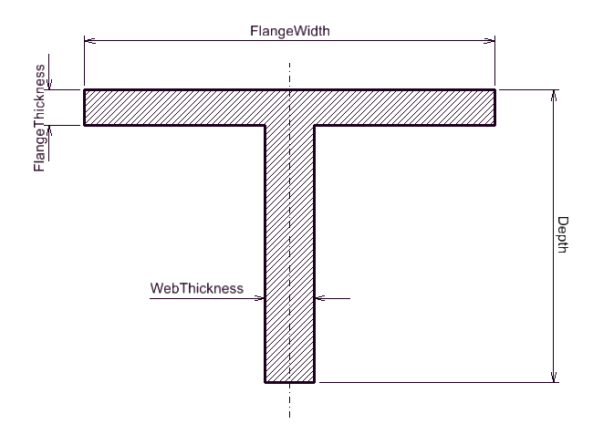

### **LShapeProfile**
**Derivative properties:**
- `HorizontalLegInnerEdgeLength` = `Width` - `Thickness`
- `HorizontalLegSlopeHeight` = `HorizontalLegInnerEdgeLength` * Tan(`LegSlope`)
- `VerticalLegInnerEdgeLength` = `Depth` - `Thickness`
- `VerticalLegSlopeHeight` = `VerticalLegInnerEdgeLength` * Tan(`LegSlope`)

**Constraints:**
- `Width` must be greater than zero
- `Depth` must be greater than zero
- `Thickness`
  - must be greater than zero
  - must be less than `Depth`
  - must be less than `Width`
- `FilletRadius` (if set):
  - must be greater or equal to zero
  - must be less or equal to half `HorizontalLegInnerEdgeLength` minus `VerticalLegSlopeHeight`
  - must be less or equal to half `VerticalLegInnerEdgeLength` minus `HorizontalLegSlopeHeight`
- `EdgeRadius` (if set):
  - must be greater or equal to zero
  - must be less or equal to `Thickness`
  - must be less or equal to half `HorizontalLegInnerEdgeLength` minus `VerticalLegSlopeHeight`
  - must be less or equal to half `VerticalLegInnerEdgeLength` minus `HorizontalLegSlopeHeight`
- `LegSlope` (if set):
  - must be greater or equal to zero
  - must be less than ninety degrees
  - `HorizontalLegSlopeHeight` must be less or equal to half `VerticalLegInnerEdgeLength`
  - `VerticalLegSlopeHeight` must be less or equal to half `HorizontalLegInnerEdgeLength`

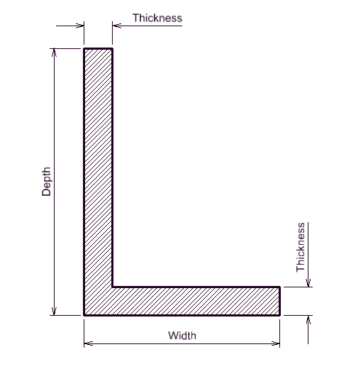

### **TTShapeProfile**
**Derivative properties:**
- `FlangeInnerFaceLength` = (`FlangeWidth` - 2 * `WebThickness` - `WebSpacing`) / 2
- `FlangeSlopeHeight` = `FlangeInnerFaceLength` * Tan(`FlangeSlope`)
- `WebOuterFaceLength` = `Depth` - `FlangeThickness`
- `WebInnerFaceLength` = `WebOuterFaceLength` - `FlangeSlopeHeight`
- `WebOuterSlopeHeight` = `WebOuterFaceLength` * Tan(`WebSlope`)
- `WebInnerSlopeHeight` = `WebInnerFaceLength` * Tan(`WebSlope`)

**Constraints:**
- `FlangeWidth` must be greater than zero
- `Depth` must be greater than zero
- `FlangeThickness`
  - must be greater than zero
  - must be less than `Depth`
- `WebThickness`
  - must be greater than zero
  - two times `WebThickness` plus `WebSpacing` must be less than `FlangeWidth`
- `WebSpacing`
  - must be greater than zero
  - must be less than `FlangeWidth` minus two times `WebThickness`
- `FilletRadius` (if set):
  - must be greater or equal to zero
  - must be less or equal to half `FlangeInnerFaceLength` minus `WebOuterSlopeHeight`
  - must be less or equal to half `OuterFaceLength` minus `FlangeSlopeHeight`
- `FlangeEdgeRadius` (if set):
  - must be greater or equal to zero
  - must be less or equal to `FlangeThickness`
  - must be less or equal to half `FlangeInnerFaceLength`
- `FlangeSlope` (if set):
  - must be greater or equal to zero
  - must be less than ninety degrees
  - `FlangeSlopeHeight` must be less or equal to half `WebOuterFaceLength`
- `WebEdgeRadius` (if set):
  - must be greater or equal to zero
  - must be less or equal to half `WebThickness`
  - must be less or equal to half `WebOuterFaceLength`
- `WebSlope` (if set):
  - must be greater or equal to zero
  - must be less than ninety degrees
  - `WebOuterSlopeHeight` must be less or equal to half `FlangeInnerFaceLength`
  - `WebInnerSlopeHeight` must be less or equal to half `WebSpacing`

### **SchifflerizedLShapeProfile**
**Constraints:**
- `LegLength` must be greater than zero
- `Thickness`
  - must be greater than zero
  - must be less than `LegLength` divided by square root of three
- `LegBendOffset` (if set):
  - must be greater or equal to `Thickness`
  - must be less than `LegLength` minus `Thickness`
- `FilletRadius` (if set):
  - must be greater or equal to zero
  - must be less or equal to `LegBendOffset` minus `Thickness`
- `EdgeRadius` (if set):
  - must be greater or equal to zero
  - must be less or equal to `Thickness`
  - must be less or equal to `LegLength` minus `LegBendOffset` minus `Thickness` multiplied by the tangent of fifteen degrees

### **ZShapeProfile**
**Derivative properties:**
- `FlangeInnerEdgeLength` = (`FlangeWidth` - `WebThickness`) / 2
- `FlangeSlopeHeight` = `FlangeInnerEdgeLength` * Tan(`FlangeSlope`)
- `WebEdgeLength` = `Depth` - `FlangeThickness` * 2

**Constraints:**
- `FlangeWidth` must be greater than zero
- `Depth` must be greater than zero
- `FlangeThickness`
  - must be greater than zero
  - must be less than half `Depth`
- `WebThickness`
  - must be greater than zero
  - must be less than `FlangeWith`
- `FilletRadius` (if set):
  - must be greater or equal to zero
  - must be less or equal to half `FlangeInnerEdgeLength`
  - must be less or equal to half `WebEdgeLength` minus `FlangeSlopeHeight`
- `FlangeEdgeRadius` (if set):
  - must be greater or equal to zero
  - must be less or equal to `FlangeThickness`
  - must be less or equal to half `FlangeInnerEdgeLength`
- `FlangeSlope` (if set):
  - must be greater or equal to zero
  - must be less than ninety degrees
  - `FlangeSlopeHeight` must be less or equal to half `WebEdgeLength`

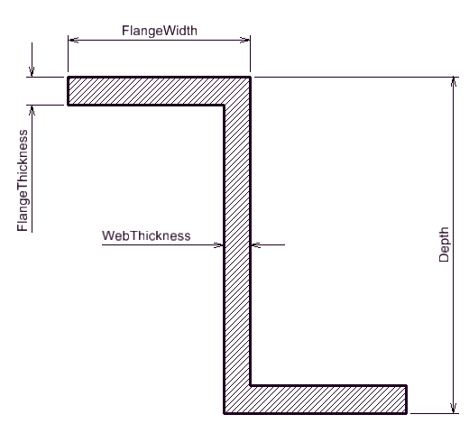

### **DerivedProfile**
[SinglePerimeterProfile](#singleperimeterprofile) that is based on another [SinglePerimeterProfile](#singleperimeterprofile) with applied standard transformations (scale, rotation, translation, mirror). This [Profile](#profile) is defined for compatibility reasons with [IFC](#https://standards.buildingsmart.org/IFC/RELEASE/IFC4/FINAL/HTML/) and its **usage is not recommended**.

Note that deletion of the referenced [SinglePerimeterProfile](#singleperimeterprofile) is prohibited if there are [DerivedProfiles](#derivedprofile) that reference it.

### **CenterLineCShapeProfile**
**Constraints:**
- `FlangeWidth` must be greater than zero
- `Depth` must be greater than zero
- `WallThickness`
  - must be greater than zero
  - must be less than half `FlangeWidth`
  - must be less than half `Depth`
- `FilletRadius` (if set):
  - must be greater or equal to zero
  - must be less or equal to half `FlangeWidth` minus `WallThickness`
  - must be less or equal to half `Depth` minus `WallThickness`
- `Girth` (if set):
  - must be greater or equal to `WallThickness` plus `FilletRadius`
  - must be less than half `Depth`

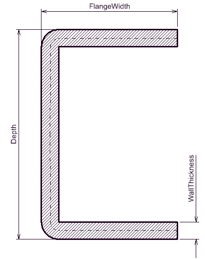
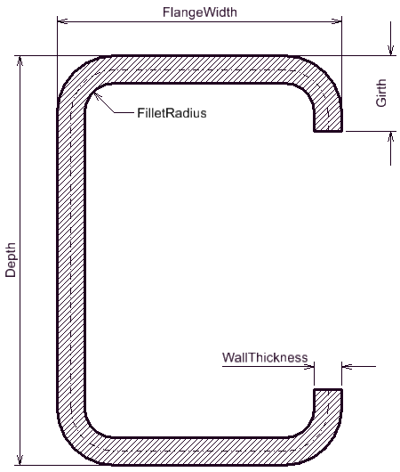

### **CenterLineLShapeProfile**
**Constraints:**
- `Width` must be greater than zero
- `Depth` must be greater than zero
- `WallThickness`
  - must be greater than zero
  - must be less than half `Width`
  - must be less than half `Depth`
- `FilletRadius` (if set):
  - must be greater or equal to zero
  - must be less or equal to half `Width` minus `WallThickness`
  - must be less or equal to half `Depth` minus `WallThickness`
- `Girth` (if set):
  - must be greater than `WallThickness` plus `FilletRadius`
  - must be less than `Depth` minus `WallThickness`

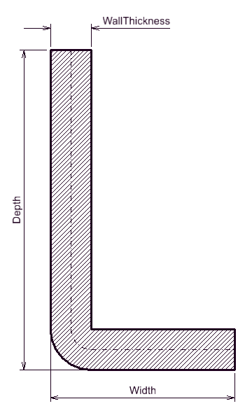
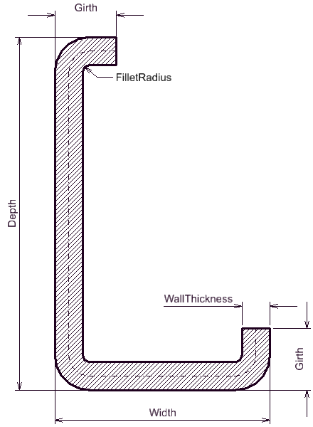

### **CenterLineZShapeProfile**
**Constraints:**
- `FlangeWidth` must be greater than zero
- `Depth` must be greater than zero
- `WallThickness`
  - must be greater than zero
  - must be less than half `Width`
  - must be less than half `Depth`
- `FilletRadius` (if set):
  - must be greater or equal to zero
  - must be less or equal to half `Depth` minus `WallThickness`
  - if `Girth` is set:
    - must be less or equal to half `FlangeWidth` minus `WallThickness`
    - must be less or equal to `Girth` minus `WallThickness`
  - if `Girth` is not set:
    - must be less or equal to `FlangeWidth` minus `WallThickness`
- `Girth` (if set):
  - must be greater than `WallThickness`

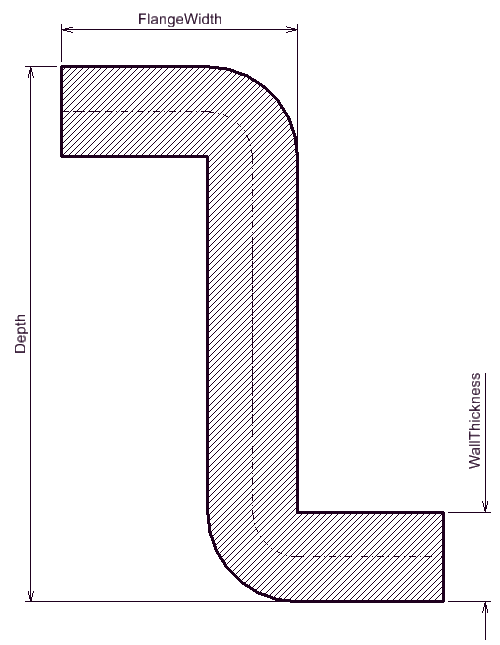
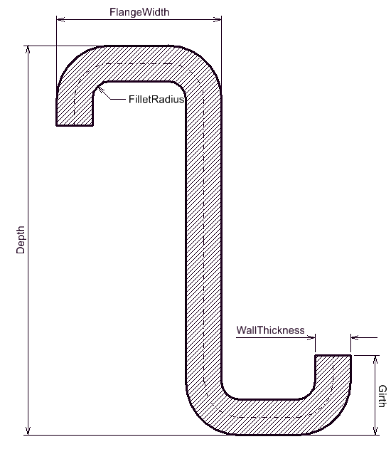

### **BentPlateProfile**
**Derivative properties:**
- `MaximumWallThickness` = Min(`Width` - `BendOffset`, `BendOffset`) * Tan(`BendAngle` / 2) * 2

**Constraints:**
- `Width` must be greater than zero
- `WallThickness`
  - must be greater than zero
  - must be less than `MaximumWallThickness`
- `BendAngle`
  - must be greater than zero
  - must be less than one hundred eighty degrees
- `BendOffset`
  - must be greater than zero
  - must be less than `Width`
- `FilletRadius`
  - must be greater than zero
  - must be less or equal to half `MaximumWallThickness` minus half `WallThickness`

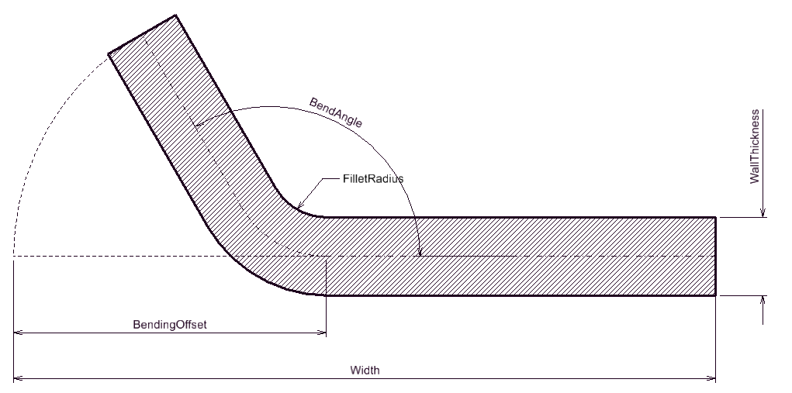

### **CompositeProfile**

Abstract [Profile](#profile) class that is comprised of multiple [SinglePerimeterProfiles](#singleperimeterprofile). See [ArbitraryCompositeProfile](#arbitrarycompositeprofile), [DoubleLShapeProfile](#doublelshapeprofile) and [DoubleCShapeProfile](#doublecshapeprofile) for instantiable composite [Profiles](#profile).

### **ArbitraryCompositeProfile**
Instantiable [CompositeProfile](#compositeprofile) that is used to define an arbitrary [Profile](#profile) with multiple areas.

This Profile is constructed by inserting [ArbitraryCompositeProfileAspects](#arbitrarycompositeprofileaspects) that reference and transform [SinglePerimeterProfiles](#singleperimeterprofile). [ArbitraryCompositeProfile](#arbitrarycompositeprofile) can reference the same [SinglePerimeterProfile](#singleperimeterprofile) multiple times, but apply different transformations.

[TODO Examples]()

### **ArbitraryCompositeProfileAspect**

Aspect that is used by [ArbitraryCompositeProfile](#arbitrarycompositeprofile) to reference [SinglePerimeterProfile](#singleperimeterprofile) from which it is composed.

This aspect also includes fields for transforming the referenced [SinglePerimeterProfile](#singleperimeterprofile) when creating the geometry of [ArbitraryCompositeProfile](#arbitrarycompositeprofile).

### **DoubleLShapeProfile**

Instantiable [CompositeProfile](#compositeprofile) that models a Double L shape profile where the single [LShapeProfiles](#lshapeprofile) are placed back to back with specified gap between them. This [Profile](#profile) references and requires a [LShapeProfile](#lshapeprofile) to exist in the iModel.

Note that deletion of the referenced [LShapeProfile](#lshapeprofile) is prohibited if there are [DoubleLShapeProfiles](#doublelshapeprofile) that reference it.

**Constraints:**
- `Spacing` must be equal or greater than zero

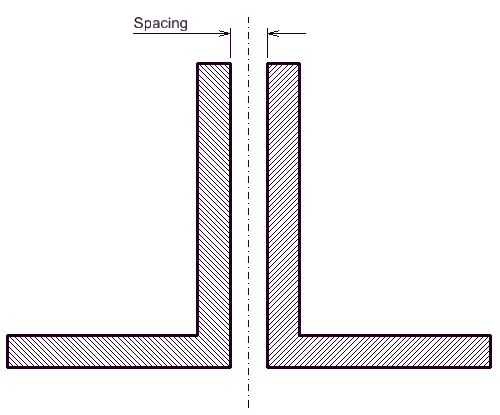
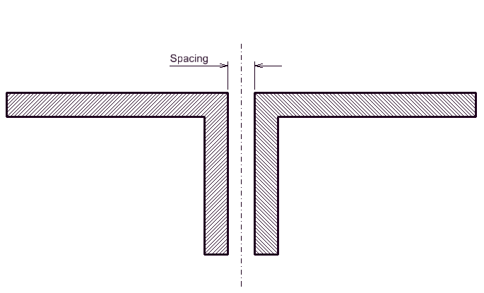

### **DoubleCShapeProfile**
Instantiable [CompositeProfile](#compositeprofile) that models a Double C shape profile where the single [CShapeProfiles](#cshapeprofile) are placed back to back with specified gap between them. This [Profile](#profile) references and requires a [CShapeProfile](#cshapeprofile) to exist in the iModel.

Note that deletion of the referenced [CShapeProfile](#cshapeprofile) is prohibited if there are [DoubleCShapeProfiles](#doublelshapeprofile) that reference it.

**Constraints:**
- `Spacing` must be equal or greater than zero

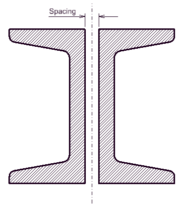

### **ArbitraryShapeProfile**

A [SinglePerimeterProfile](#singleperimeterprofile) whose geometry is defined by an arbitrary single perimeter.

**Constraints:**
- `Shape`
  - must be closed
  - must be of a single perimeter
  - must not self intersect
  - must be planar and lie on the XY plane

### **ArbitraryCenterLineProfile**

Extended [ArbitraryShapeProfile](#arbitraryshapeprofile) with an additional constraint that the defined single perimeter (area) must have a non self intersecting centerline.Geometry of such [Profile](#proflile) is created by applying a constant thickness to the centerline.

[ArbitraryCenterLineProfiles](#arbitrarycenterlineprofile) are often used to model cold-formed sections.

TODO Detailed meaning and usage of properties "ArcAngle" and "ChamferAngle", this text should reference pictures/examples to better denote the effects of these properties.

[TODO Examples]()

**Constraints:**
- `WallThickness` must be greater than zero
- `Centerline`
  - must be continuous
  - must not self intersect
  - must be planar and lie on the XY plane

### **EllipseProfile**
**Constraints:**
- `XRadius` must be greater tan zero
- `YRadius` must be greater tan zero

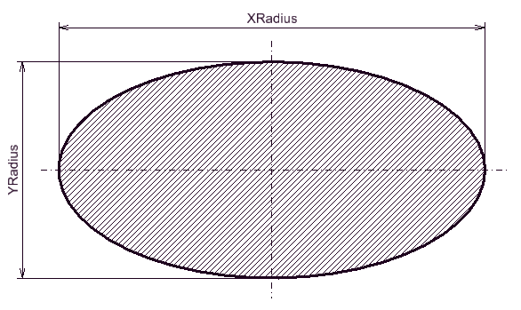

### **CircleProfile**
**Constraints:**
- `Radius` must be greater tan zero

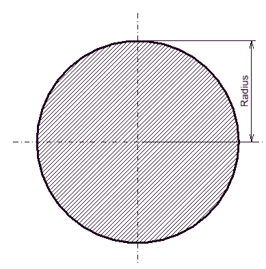

### **HollowCircleProfile**
**Constraints:**
- `Radius` must be greater than zero
- `WallThickness`
  - must be greater than zero
  - must be less than `Radius`

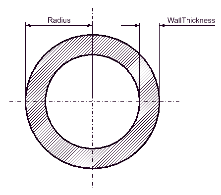

### **RectangleProfile**
**Constraints:**
- `Width` must be greater than zero
- `Depth` must be greater than zero

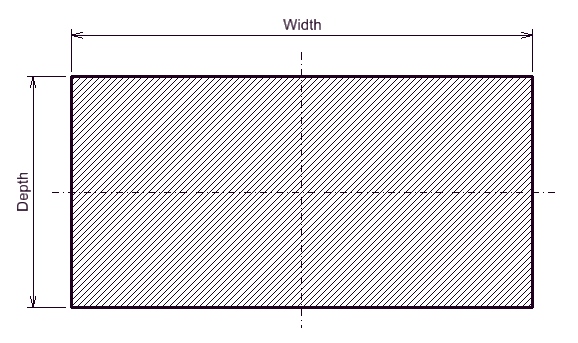

### **RoundedRectangleProfile**
**Constraints:**
- `Width` must be greater than zero
- `Depth` must be greater than zero
- `RoundingRadius`
  - must be greater than zero
  - must be less than half `Width`
  - must be less than half `Depth`

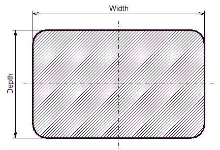

### **HollowRectangleProfile**
**Constraints:**
- `Width` must be greater than zero
- `Depth` must be greater than zero
- `WallThickness`
  - must be greater than zero
  - must be less than half `Width`
  - must be less than half `Depth`
- `InnerFilletRadius` (if set):
  - must be greater or equal to zero
  - must be less or equal to half `Width` minus `WallThickness`
  - must be less or equal to half `Depth` minus `WallThickness`
- `OuterFilletRadius` (if set):
  - must be greater or equal to zero
  - must be less or equal to half `Width`
  - must be less or equal to half `Depth`
  - must be greater than `InnerFilletRadius` plus `WallThickness` multiplied by `2 * Sqrt(2)`

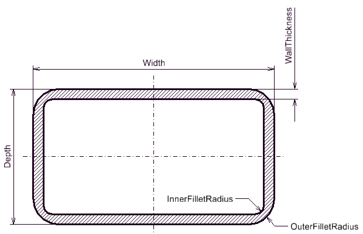

### **TrapezoidProfile**
**Constraints:**
- `TopWidth` must be greater than zero
- `BottomWidth` must be greater than zero
- `Depth` must be greater than zero

### **RegularPolygonProfile**
**Constraints:**
- `SideCount` must be greater or equal to `3` and less or equal to `32`
- `SideLength` must be greater than zero

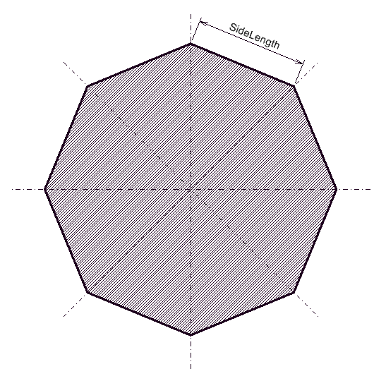

### **CapsuleProfile**
**Constraints:**
- `Width` must be greater than zero
- `Depth` must be greater than zero

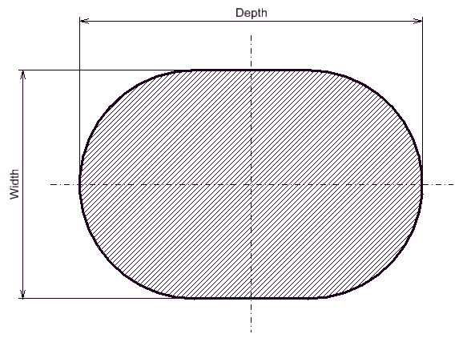

## **Mixin Classes**

### **ICenterLineProfile**

Mixin class used to define [Profiles](#profile) with a non self intersecting centerline and a constant thickness. These [Profiles](#profile) are often used to model cold-formed sections. See [CenterLineCShapeProfile](#centerlinecshapeprofile), [CenterLineLShapeProfile](#centerlinelshapeprofile), [CenterLineZShapeProfile](#centerlinezshapeprofile).

## **Struct Classes**

### **CardinalPoint**

All [Profiles](#profile) have an array of CardinalPoints containing 19 predefined standard cardinal points. In addition, users may define their own custom cardinal points and append them to the end of the array - in such case the name of the custom CardinalPoint must not clash with names of standard cardinal points.

Standard Cardinal points are:
- **BottomLeft** - Bottom left corner of the profiles bounding box
- **BottomCenter** - Middle point of bottom line of the profiles bounding box
- **BottomRight** - Bottom right corner of the profiles bounding box
- **MidDepthLeft** - Middle point of left line of the profiles bounding box
- **MidDepthCenter** - Center point of the profiles bounding box
- **MidDepthRight** - Middle point of right line of the profiles bounding box
- **TopLeft** - Top left corner of the profiles bounding box
- **TopCenter** - Middle point of top line of the profiles bounding box
- **TopRight** - Top right corner of the profiles bounding box
- **GeometricCentroid** - Geometric centroid of the profiles geometry
- **BottomInLineWithGeometricCentroid** - Most bottom point of the profiles geometry thats in-line with **GeometricCentroid**
- **LeftInLineWithGeometricCentroid** - Most left point of the profiles geometry thats in-line with **GeometricCentroid**
- **RightInLineWithGeometricCentroid** - Most right point of the profiles geometry thats in-line with **GeometricCentroid**
- **TopInLineWithGeometricCentroid** - Most top point of the profiles geometry thats in-line with **GeometricCentroid**
- **ShearCenter** - Shear center of the profiles geometry
- **BottomInLineWithShearCenter** - Most bottom point of the profiles geometry thats in-line with **ShearCenter**
- **LeftInLineWithShearCenter** - Most left point of the profiles geometry thats in-line with **ShearCenter**
- **RightInLineWithShearCenter** - Most right point of the profiles geometry thats in-line with **ShearCenter**
- **TopInLineWithShearCenter** - Most top point of the profiles geometry thats in-line with **ShearCenter**

## **Enumerations**

### **DoubleLShapeProfileType**

Enumeration used to specify how [DoubleLShapeProfiles](#doublelshapeprofile) geometry is created - which "legs" of the [LShapeProfile](#lshapeprofile) are placed back to back.
